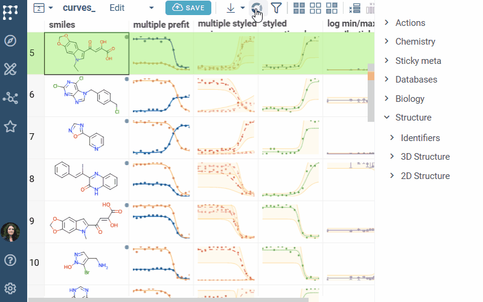

  
 Multi curve viewer displays multiple in-cell curves on one chart, making it easy to compare fitted curves from different data series.
  
## Overview  
  
The multi curve viewer is part of the [Curves](https://github.com/datagrok-ai/public/tree/master/packages/Curves) package and provides interactive visualization of dose-response curves and other fitted data. It allows you to overlay curves from multiple columns or rows, making it ideal for comparing experimental results, analyzing trends across conditions, or visualizing plate reader data.  
  
## Key features  
  
- **Multiple curve overlay**: Display curves from selected rows (current, mouse-over, selected) and multiple columns simultaneously.   
- **Trellis plot integration**: Can be used as an inner viewer in trellis plots for multi-dimensional analysis.
- **Interactive controls**: Supports logarithmic scales, axis configuration, plot bounds, and series merging.   
- **Statistics**: Draws them per series, summarized across series, or both.   
- **Dynamic updates**: Automatically responds to selection, filtering, and current row changes.   
  
## Creating a multi curve viewer

1. On the menu ribbon, click the **Add viewer** icon. A dialog opens.
2. In the dialog, select  **MultiCurve Viewer**.

> Developers: To add the viewer from the console, use:
`grok.shell.tv.addViewer('MultiCurveViewer');`

## Configuring a multi curve viewer  
  
To configure a multi curve viewer, click the **Gear** icon on top of the viewer and
use info panels on the **Context Panel**. You can:  
  
* Select the columns containing curve data using the **Curves** dropdown (columns must have `curve` semantic type).
* Control the visibility of curves for selected, current, or hovered rows using the **Show Selected Rows Curves**, **Show Current Row Curve**, and **Show Mouse Over Row Curve** checkboxes.
* Enable merging of series from different columns or individual cells with the **Merge Column Series** and **Merge Cell Series** checkboxes.
* Enable logarithmic scales for the X / Y axes using the **log X** / **log Y** checkboxes.
* Name the curves from a column using the **Legend** dropdown, and control the legend itself with **Show Legend** and **Show Column Label**.
* Set the **Title**, **X Axis Name**, and **Y Axis Name**, and bound the plot with **Min X**, **Max X**, **Min Y**, and **Max Y**. Whatever falls outside the bounds is left out of view.
* Draw the statistics per series, summarized across series, or both with **Statistics Mode**, and choose the summary with **Aggr Type**.
* Show or hide the points marked as outliers with **Show Outliers**.

For the fit functions themselves, including how to register a custom one, see the
[Curves](https://github.com/datagrok-ai/public/tree/master/packages/Curves) package documentation.

### In trellis plot  
  
The multi curve viewer is particularly useful as an inner viewer in [trellis plot](trellis-plot.md), allowing you to compare curves across different categories or conditions. This enables multi-dimensional analysis of dose-response data or other fitted curves.
  
## See also  
  
- [Viewers](viewers.md)
- [Trellis plot](trellis-plot.md)  
- [Curves](https://github.com/datagrok-ai/public/tree/master/packages/Curves)