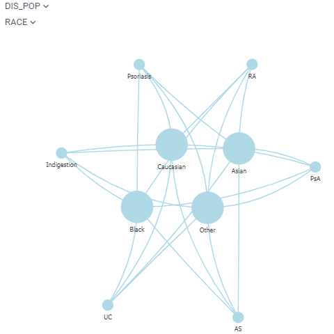

<!-- TITLE: Network diagram -->
<!-- SUBTITLE: -->

# Network diagram

Network diagram is used to visualize graphs, where values of the specified two columns become nodes, and rows become
edges. It is possible to color-code and size-code nodes and columns by choosing the aggregate function that would apply
to the values that represent an edge or a Node.js.

General:

|             |              |
|-------------|--------------|
| Right click | Context menu |

## Videos

See also:

* [Viewers](../viewers.md)
* [Table view](../../overview/table-view.md)
* [JS API: Network diagram](https://public.datagrok.ai/js/samples/ui/viewers/types/network-diagram)
