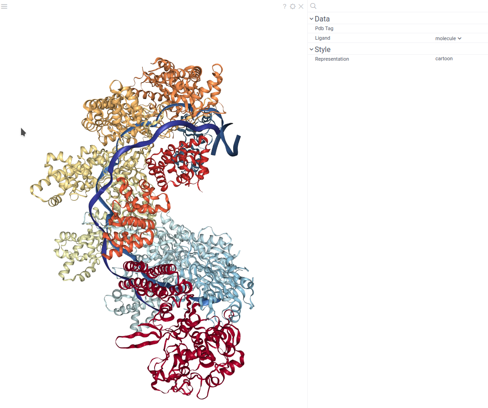

NglViewer is a Datagrok JsViewer
derived component based on the [NGL Viewer](nglviewer.org) library developed by Alexander Rose.
It renders 3D structure of bio macromolecules
like proteins and DNA/RNA with a variety of representations.

You can use Datagrok to explore docking results.
In this case the NglViewer displays macromolecule structure together with
structure of ligands

## Creating an NGL viewer

To create a **NGL** viewer, navigate to the **Main Menu**
and select **Add > Javascript Viewers > NGL**.

Then you need to load the macromolecule file by using the "**Open...**"
link in the center of the viewer.

**Note**: User interface for macromolecule loading from a file share
is not implemented. You have to same macromolecule to your local device
before opening it in the NGL Viewer.

The NglViewer detects a column of semantic type 'Molecule' in the table
and displays its data along with the structure.

## Configuring a NGL viewer

You can set the source column for the small molecules
and customize visualization options.
To do that, click the **Gear** icon on top of the viewer and use the **Data**
and **Style** info panes on the **Context Panel**.

You can:

* Change the column with small molecules 3D structures via **Ligand** control.
* Change macromolecule representation mode via **Representation** control.

## Interaction with other viewers

The **NGL** viewer shows small molecules (ligands) together with the macromolecule
when you select it or just hover mouse over it.

If only one ligand is selected,
the ligand is displayed with a full-color ball+stick representation.
If there are multiple selected ligands,
then the ligand of the current row is displayed in 'green',
the mouse-over row ligand is displayed in 'light gray',
and selected rows ligands are displayed in orange.

## Viewer controls

| Action                             | Control                   |
|------------------------------------|---------------------------|
| View info for the specific atom    | Hover mouse over the atom |
| Move the atom to the viewer center | Click on the atom         |

## See also

* [Viewers](../viewers/viewers.md)
* [NGLView library](https://github.com/nglviewer/nglview)
* [MolStar](https://molstar.org/)
