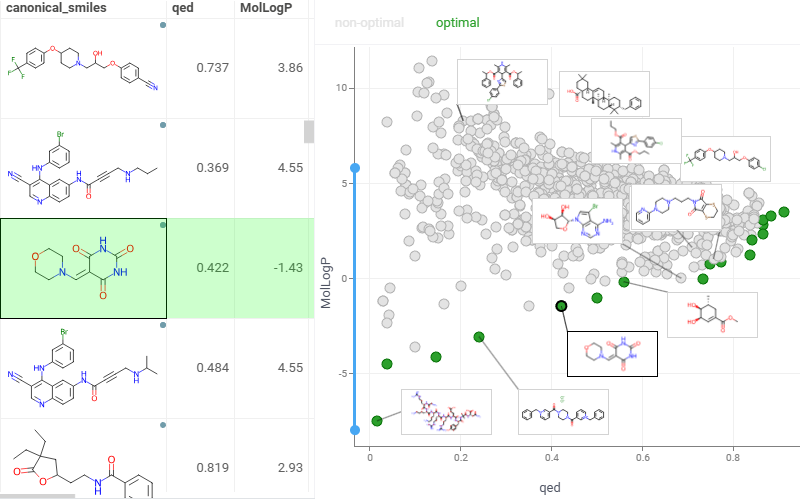
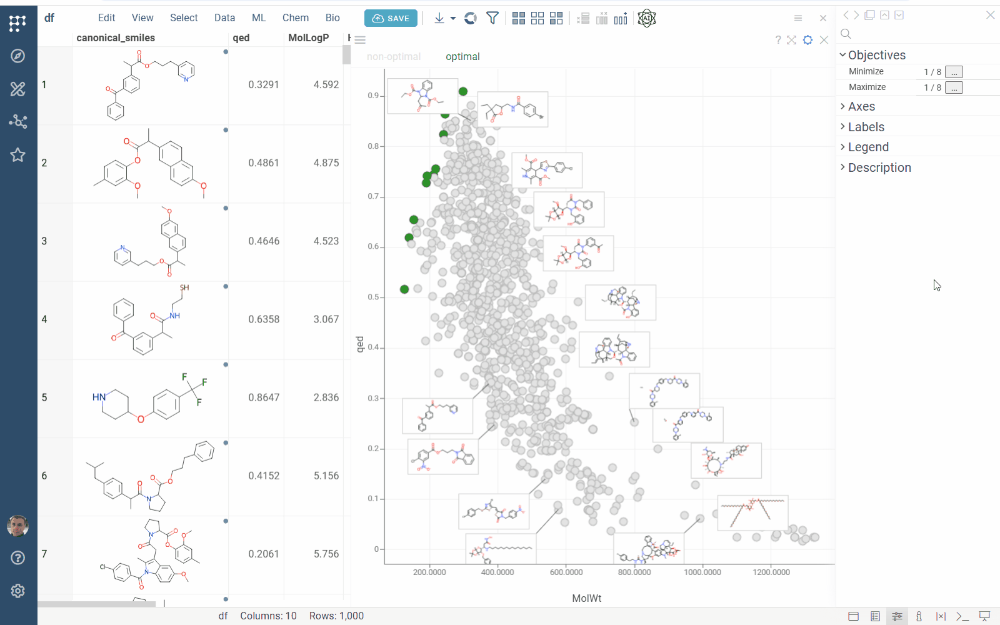
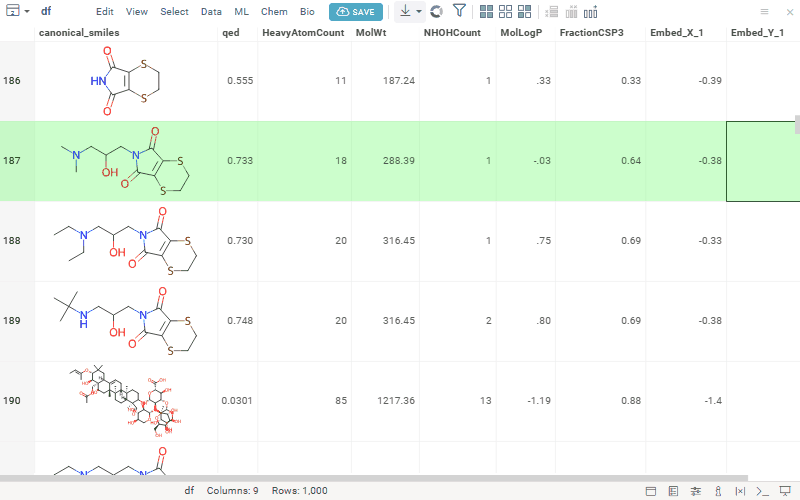

[Pareto Front](https://en.wikipedia.org/wiki/Pareto_front) highlights a set of non-dominated solutions in a [multi-objective optimization](https://en.wikipedia.org/wiki/Multi-objective_optimization) problem, where improving one objective will necessarily degrade at least one other objective. It represents the optimal trade-offs between conflicting goals, such as speed versus power consumption or production rate versus energy use.

>Note: To use the Pareto front viewer, install the package
[EDA](https://github.com/datagrok-ai/public/tree/master/packages/EDA).

## Add a Pareto front viewer

1. On the menu ribbon, click the **Add viewer** icon. A dialog opens.
2. In the dialog, select **Pareto Front**.

> Developers: To add the viewer from the console, use:
 `grok.shell.tv.addViewer('Pareto front');`

Initially, the viewer selects two numerical columns as objectives to be minimized. The resulting Pareto-optimal points are displayed on the scatter plot in green. By default, the viewer uses:

* The columns corresponding to the optimized features for the axes
* Category columns with unique values for the labels

## Configuring the Pareto front viewer

To configure the Pareto front, click the **Gear** icon on top of the viewer and use
the info panels on the **Context Panel**. For example, you can:

* **Specify the columns with objectives to minimize** using the `Minimize` property.
* **Select the columns representing objectives to maximize** using the `Maximize` property.
* **Customize the chart axes** using the `X Axis` and `Y Axis` properties.
* **Customize the label columns** to display next to the markers using the `Label Columns` property.

## Interactivity

The Pareto front viewer responds to row selection and data filtering. When you change the target columns, it performs multi-objective optimization and displays the resulting points on the chart.

## Application

The Pareto Front application streamlines multi-parameter optimization by helping you identify optimal trade-offs between conflicting objectives.

To run the application:

1. **Open a table** containing the parameters you want to optimize.
2. Run **Top Menu > ML > Pareto Front...**. A view opens.
3. **Configure optimization:** In the left-side input panel, select the parameters to optimize and specify the type of optimization for each (e.g., maximize or minimize).
4. **Explore results:** The app automatically recalculates the results in real time. The optimization results are visualized using:

   * The **Pareto Front viewer**, highlighting non-dominated solutions.
   * **PC plot**, enabling analysis of trade-offs across all parameters.

## See also

* [Viewers](../viewers/viewers.md)
* [Scatter plot](../viewers/scatter-plot.md)
* [PC plot](../viewers/pc-plot.md)
