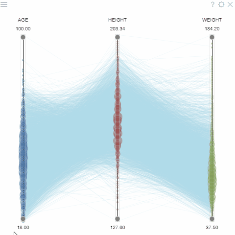

Parallel coordinates is a common way of visualizing high-dimensional geometry and analyzing multivariate data. To show a
set of points in an n-dimensional space, a backdrop is drawn consisting of n parallel lines, typically vertical and
equally spaced. A point in n-dimensional space is represented as a polyline with vertices on the parallel axes; the
position of the vertex on the i-th axis corresponds to the i-th coordinate of the point. This visualization is closely
related to time series visualization, except that it is applied to data where the axes do not correspond to points in
time, and therefore do not have a natural order. Therefore, different axis arrangements may be of interest.

To change columns, set "Column Names" via the context panel. To rearrange columns, drag column name into the desired
location.

> Developers: To add the viewer from the console, use:
`grok.shell.tv.addViewer('PC plot');`

General:

|                    |                     |
|--------------------|---------------------|
| Right click        | Context menu        |
| Alt+F              | Show in full screen |
| Drag column name   | Rearrange columns   |
| Drag column filter | Filter data         |

## Videos

## Properties

| Property | Type | Description |
|----------|------|-------------|
| **Data** | | |
| Show Filtered Out Lines | boolean | Whether the filtered out values are shown. See also *Filtered Out Line Color* |
| Transformation | string |  |
| Filter | string | Formula that filters out rows to show. Examples: `${AGE}` > 20 or `${WEIGHT / 2)}` > 100, `${SEVERITY}` == ''Medium'', `${RACE}`.endsWith(''sian'') |
| Table | string |  |
| **Value** | | |
| Column Names | list | Columns to use |
| Log Columns Column Names | list | Columns where logarithmic axis is used. Should be a subset of *Column Names*. |
| Normalize Each Column | boolean | Determines the way a value is mapped to the vertical scale. TRUE: bottom is column minimum, top is column maximum. Use when columns contain values in different units FALSE: uses the same scale. This lets you compare values across columns if units are the same (for instance, use it for tracking change over time).'' |
| **Color** | | |
| Color Column Name | string |  |
| Color Map | string | Categorical coloring time unit map function (applicable to dates only). |
| Show Color Selector | boolean |  |
| Color Axis Type | string |  |
| Invert Color Scheme | boolean |  |
| Color Min | number |  |
| Color Max | number |  |
| **Selection** | | |
| Show Current Line | boolean |  |
| Show Mouse Over Line | boolean |  |
| Show Mouse Over Row Group | boolean |  |
| Show All Lines | boolean | Either all lines are shown or only current line, mouse over line, selected ones. |
| **General** | | |
| Show Filters | boolean | Whether the in-chart filters are visible |
| Back Color | number |  |
| Selected Rows Color | number |  |
| Filtered Out Line Color | number |  |
| Missing Value Color | number |  |
| Line Color | number |  |
| Current Line Color | number |  |
| Mouse Over Line Color | number |  |
| Show Density | boolean |  |
| Show Min Max | boolean |  |
| Show Labels | boolean |  |
| Horz Margin | number |  |
| Legend Visibility | visibilitymode |  |
| Legend Position | flexautoposition |  |
| Row Source | string | Determines the rows shown on the plot. |
| Allow Dynamic Menus | boolean |  |
| Show Context Menu | boolean | Properties common for all viewers todo: use code generation |
| Title | string |  |
| Description | string | Viewer description that gets shown at the *Descriptor Position*. Markup is supported. |
| Help | string | Help to be shown when user clicks on the ''?'' icon on top. Could either be in markdown, or a URL (starting with ''/'' or ''http''). |
| Description Position | flexposition |  |
| Description Visibility Mode | visibilitymode |  |
| **Style** | | |
| Current Line Width | number |  |
| Auto Layout | boolean |  |
| Line Width | number |  |
| Mouse Over Line Width | number |  |
| Min Max Height | number |  |
| Labels Orientation | textorientation |  |
| Min Max Orientation | textorientation |  |
| Axis Font | string |  |
| Linear Color Scheme | list |  |
| Categorical Color Scheme | list |  |
| Whisker Color | number |  |
| Controls Font | string | Viewer controls elements font. |
| **Box Plot** | | |
| Density Style | string |  |
| Show Interquartile Range | boolean |  |
| Show Upper Dash | boolean |  |
| Show Lower Dash | boolean |  |
| Show Mean Cross | boolean |  |
| Show Median | boolean |  |
| Show Circles | boolean |  |
| Whisker Line Width | number |  |
| Interquartile Line Width | number |  |
| Bins | number |  |
| **Description** | | |
| Show Title | boolean |  |

See also:

* [Viewers](../viewers/viewers.md)
* [Table view](../table-view-1.md)
* [JS API: PC plot](https://public.datagrok.ai/js/samples/ui/viewers/types/pc-plot)
* [Community: Visualization-related updates](https://community.datagrok.ai/t/visualization-related-updates/521)