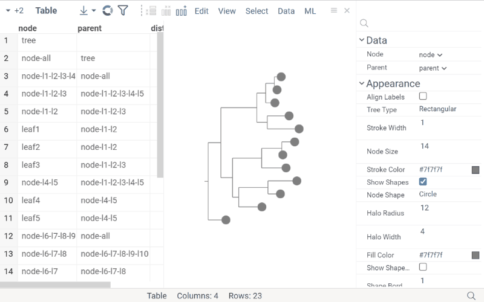

[_Phylocanvas.gl_](https://www.phylocanvas.gl/) is a WebGL-based viewer enhanced to scale to hundreds of thousands
of leaves.

## Tree Types

_Phylocanvas.gl_ supports a variety of tree types:

* Radial
* Rectangular
* Polar
* Diagonal
* Orthogonal

## See also

* [Viewers](../viewers/viewers.md)
* [Network diagram](network-diagram.md) viewer
* [Dendrogram](dendrogram.md) viewer
