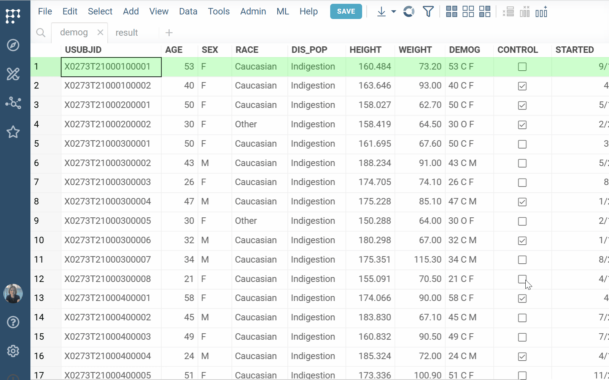

Aggregate and summarize your data using a pivot viewer. 

To add the pivot viewer, click the **Top Menu**, click the **Add a viewer**
() icon and select
**Pivot Table** from the viewer options. The pivot table is added to the view.

To configure your pivot table, use these fields:
* **Group by**: Choose one or more columns to group rows 
* **Aggregate** Choose both
   * An aggregation function (e.g., `sum`, `count`, `avg`)
   * A column to aggregate (e.g., `avg(AGE)`) 
* **Pivot**: Select one or more columns whose unique values will become columns in the pivot table

For general viewer controls and interactions, see the [Table View](../../datagrok/navigation/views/table-view.md) page.