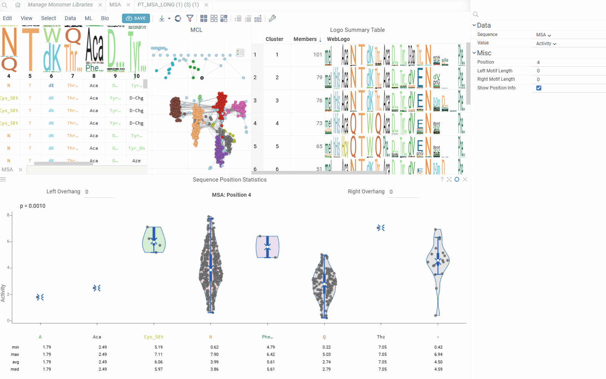

The Position Statistics viewer displays statistical distributions of values at specific sequence positions using violin/box plots. This viewer helps analyze how values vary across different monomers at a selected position, with optional motif context visualization.

## Features

- **Position Selection**: Choose any position in the sequence for statistical analysis
- **Motif Context**: Configure left and right overhang lengths to include neighboring positions
- **Value Distribution**: Visualize value distributions using violin plots with statistical summaries
- **Interactive Navigation**: Easy position switching with automatic updates
- **Configurable Display**: Option to show/hide position and other statistical information in the viewer header and footer.

## Customization

You can modify the Position Statistics Viewer through the **Context Panel**:

- **Sequence**: The column containing sequence data in any notation
- **Value**: The column containing numeric values for statistical analysis
- **Position**: The position in the sequence to analyze (1-based indexing)
- **Left Motif Length**: Number of positions to include left of the selected position (0-10)
- **Right Motif Length**: Number of positions to include right of the selected position (0-10)
- **Show Position Info**: Toggle display of position and overhang controls in the header

## Data requirements

The viewer requires:
- A sequence column with macromolecule data (FASTA, HELM, or separated format)
- A numeric column with values for statistical analysis

## Position context

The viewer creates motif representations by combining monomers from multiple positions:
- **Center Position**: The primary position being analyzed
- **Left Overhang**: Positions to the left of the center (configurable 0-10)
- **Right Overhang**: Positions to the right of the center (configurable 0-10)

Monomers from all positions in the motif are joined to create unique combinations for statistical analysis.

## Statistical display

The viewer shows statistics for each monomer(s) combination:
- **Min/Max**: Minimum and maximum values
- **Average**: Mean value across sequences
- **Median**: Median value
- **Count**: Number of sequences with each monomer combination
- **Standard Deviation**: Measure of value dispersion

## Interactivity

The Position Statistics Viewer follows standard Datagrok patterns:

- **Position Controls**: Use the header controls to adjust left/right overhang lengths
- **Value Column Selection**: The viewer automatically updates when you change the value column
- **Responsive Layout**: Automatically adjusts to show/hide position information based on settings

## Integration with Peptides SAR analysis

When used within [Peptides SAR analysis](../../datagrok/solutions/domains/bio/peptides-sar.md), the Position Statistics Viewer automatically:
- Synchronizes with the selected position from other viewers
- Uses the same sequence column as the main analysis
- Updates position selection based on sequence column metadata

For standalone use, the viewer generates position columns automatically from the sequence data.

## Position selection

The viewer can automatically detect the current position from sequence column metadata. When integrated with other sequence analysis tools, position changes are synchronized across viewers for consistent analysis.

