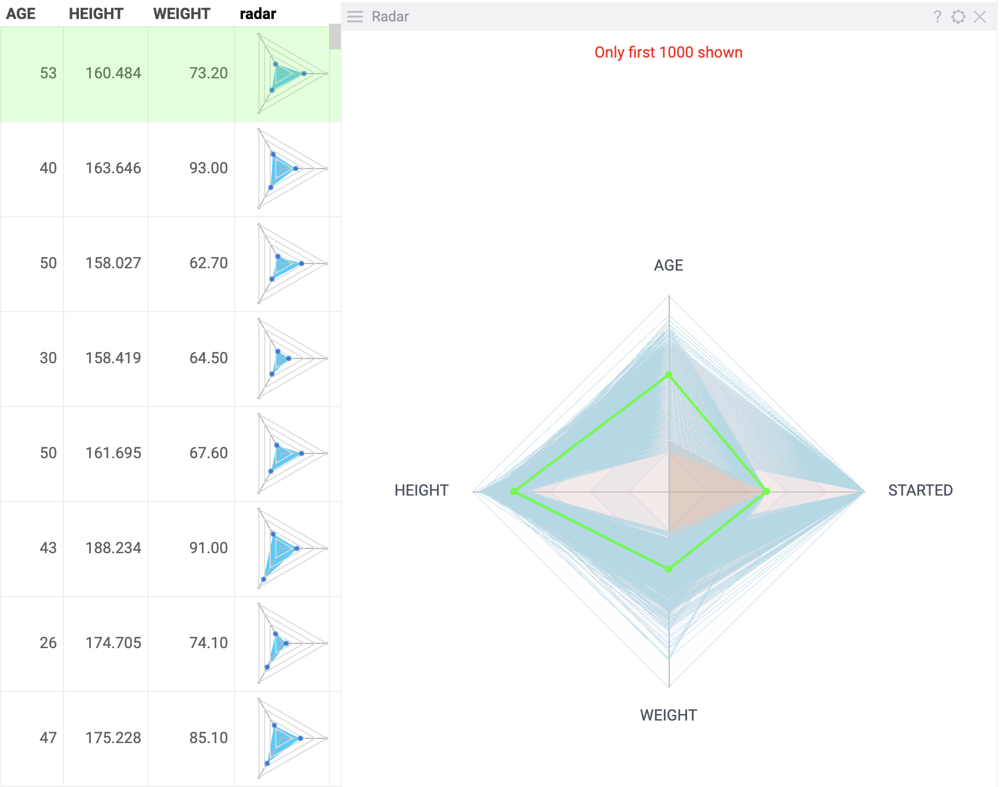

Radar viewer (a spider chart) compares multivariate data across several
dimensions. It plots numerical values of the table columns on axes that radiate
out of a center: the higher value is, the further it is from the center. The
values from the same table row are connected across axes with lines.

On radar viewer, you can compare the numerical values of different columns
within a row and rows' values within a dataset. Radar viewer is commonly used in
the comparison, decision-making, and analysis, for example, in [elemental analysis in cheminformatics](../../datagrok/solutions/domains/chem/chem.md#elemental-analysis).

You can use a radar viewer as a standalone chart or as an [inline viewer in summary column](grid.md#summary-columns) of [grid](grid.md).

>Note: To use a radar viewer, install the package
[Charts](https://github.com/datagrok-ai/public/tree/master/packages/Charts).

## Add a radar viewer

* As a standalone viewer:
  1. On the menu ribbon, click the **Add viewer** icon. A dialog opens.
  1. In the dialog, select **Radar viewer**.
* As an inline viewer:
  1. Right-click a grid viewer. The context menu appears.
  1. Select **Add** > **Summary columns** > **Radar**.

> Developers: To add the viewer from the console, use:
 `grok.shell.tv.addViewer('Radar');` 

Initially, a radar viewer selects the first 20 numerical columns from the corresponding table and displays up to 1000 rows, along with the current row. Percentiles (5th and 95th) can be toggled on or off and are represented as color-filled areas across the axes. Both the colors and values of these percentiles can be configured for better visualization.

## Configuring a radar viewer

To configure a radar viewer, click the **Gear** icon on top of the viewer and
use the **Misc** and **Color** info panels on the **Context Pane**.

For example, you can:

- Set the min and max percentiles by selecting their values from the **Min** and **Max** dropdown lists.
- Toggle the display of percentiles using the **Show Min** and **Show Max** checkboxes.
- Set the background color for the percentiles' areas using the **Background Min Color** and **Background Max Color** options.
- Toggle value labels on or off with the **Show values** checkbox.
- Configure the color for the current row using the **Current Row Color** setting, as well as **Mouse Over Row Color** for highlighting rows under the cursor.
- Control the visibility of key elements with the **Show Current Row**, **Show Mouse Over Row**, and **Show Mouse Over Row Group** options.

## Interaction with other viewers

A radar viewer responds to the current row selection and doesn't respond to data
filters.

## See also

* [Viewers](viewers.md)
* [PC plot](pc-plot.md)
* [Barchart](bar-chart.md)
* [Piechart](pie-chart.md)
* [Sparklines](grid.md#cell-renderers)
