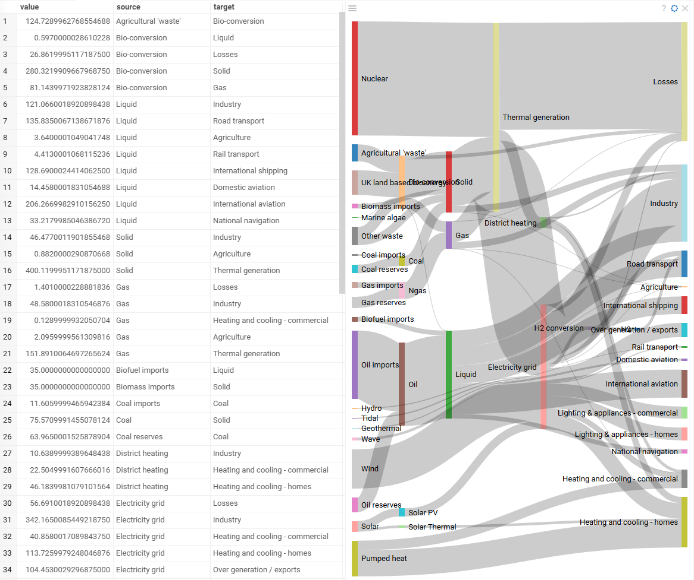

A Sankey plot is a type of flow diagram that visualizes the distribution and
proportional relationships between different categories within a dataset. It uses
directed arrows, or "flows," whose widths are proportional to the flow quantity,
effectively illustrating the magnitude of connections between entities. This
visualization is particularly useful for displaying energy flows, material
transfers, or financial transactions, providing clear insights into how resources
or values move through a system.

## Creating a Sankey viewer

To create a **Sankey** viewer, navigate to the **Main Menu**
and select **Add > Javascript Viewers > Sankey**.

> Developers: To add the viewer from the console, use:
`grok.shell.tv.addViewer('Sankey')`

When you add a sankey viewer in Datagrok, the platform selects three columns:

* A categorical "Source" column
* A categorical "Target" column
* A numeric "Value" column representing the flow strength between source
and target categories.

Datagrok uses several heuristic rules to select the most appropriate columns.
The "Source" and "Target" columns should contain categorical values representing
entities between which flows exist. They do not have to be identical but must
be relevant to the flow structure. Additionally, Datagrok prioritizes column
names such as "source", "target", and "value" when auto-detecting inputs.

## Configuring a Sankey viewer

You can set the "Source", "Target", and "Value" columns. To do that, click the
**Gear** icon on top of the viewer and use the **Data** and **Misc** info pane
on the **Context Panel** to manage the viewer's settings.

## Interaction with other viewers

The **sankey** viewer responds to data filters but row selection is limited.
Clicking a connection or category in the viewer selects the corresponding rows
in the grid. However, selecting rows in the grid or other viewers doesn't impact
the representation of the sankey viewer.

## Viewer controls

| Action                                                  | Control                            |
|---------------------------------------------------------|------------------------------------|
| Select all rows containing the category                 | Click the category                 |
| Select rows connected by a flow between two categories  | Click on the connection            |
| Add connection/category to selection                    | Shift+click the connection/category|
| Toggle connection/category selection                    | Ctrl+click the connection/category |

## See also

* [Viewers](../viewers/viewers.md)
* [Network viewer](network-diagram.md)
* [Chord viewer](chord.md)
