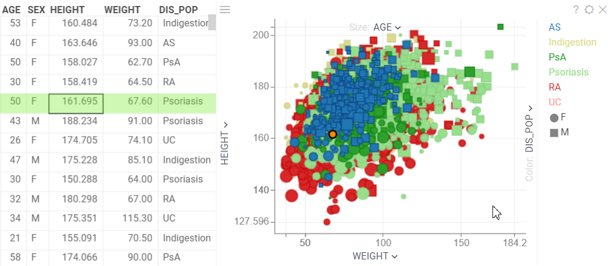

A scatterplot displays data points on the horizontal (X) and vertical (Y) axes to show the relationship between two variables. By using marker color, shape, and size, you can show up to three additional data dimensions. Use the scatterplot to explore patterns and relationships between variables in your data.

>Note: To show the relationship between three variables, use [3D Scatterplot](3d-scatter-plot.md).

To add a scatterplot, click the **Scatterplot** icon on the **Sidebar**.

>Developers: To add the viewer from the console, use: grok.shell.tv.addViewer('Scatterplot');

## Configuring a scatterplot

Click the **Gear** icon on the top of the viewer to access scatterplot settings in the **Context Pane**. Select data for the **X** and **Y** axes and adjust color, marker shape, and size to make the scatterplot visually appealing and informative. You can also configure these settings directly through the viewer's selectors.

### Axes

You can customize scatterplot axes using settings from the **X** and **Y** info panels: 

* Apply **X** (**Y**) **Axis Type** to switch between `linear` and `logarithmic`
  scales. Log scale is aplicable for positive numeric values only.
* Set **Min** and **Max** values for the axes.
* Enable **Invert X** (**Y**) **Axis**  to reverse the direction of the axis on
  a viewer. 

>Note: The key settings from the **Context Panel** are replicated in the context
>menu for scatterplot axes.

#### Molecular rendering

A scatterplot renders molecular structures on the axes. When you hover over a structure, a tick mark shows its position on the axis, and its label appears above the others on the axis.

<!--rewrite Gif, show axes, size, marker, color, mol rendering-->

### Advanced features

Once you've set up your scatterplot, consider enhancing it with advanced features that improve data presentation:

* Formula lines (**Context Menu** > **Tools** > **Formula Lines…**) enable you to visually represent mathematical formulas or equations on the plot. This can help illustrate trends, relationships, or patterns between variables in the data. 

>Developers: Learn more about how to [Show formula lines](https://datagrok.ai/help/develop/how-to/show-formula-lines)

* Regression line. Hit 'R' to toggle the regression line.

### Filtering

A scatterplot can respond to filters and apply filters to other viewers (**Context Pane** > **Data**):

* Use **Row Source** to define the rows to display on the scatterplot. Choices are: `All`, `Filtered`, `Selected`, `SelectedOrCurrent`, `FilteredSelected`, `MouseOverGroup`, `CurrentRow`, `MouseOverRow`.
* Apply **Zoom and Filter** to define how the scatterplot responds during zooming. Сhoices include: `zoom by filter`, `filter by zoom`, `pack and zoom by filter`.

### Selection

A scatterplot offers two data selection modes: **Rectangle Marquee** (by default)
and **Lasso** (**L** or **Misc** > **Lasso tool**).  By default, to select points on a
scatterplot, you need to use **Shift + Mouse Drag**. To enable selecting an area
using only mouse drag, switch the **Mouse Drag** setting to `select`. 

### Tooltip

By default, a scatterplot inherits a tooltip from the grid. You can set a
custom tooltip for the scatterplot  from the **Tooltip** info panel:

1. Set **Show tooltip** to `show custom tooltip`.
1. In **Row Tooltip**, select the desired columns.
1. Select the suitable choice for **Data Values** to combine values from the
   axes and **Data Values** in the tooltip.

>Note: The key settings from the **Context Panel** are replicated in the context
>menu for the scatterplot (**Context Menu** > **Tooltip**).

Learn also about [Goup tooltip](https://datagrok.ai/help/visualize/viewers/#group-tooltips)

<!---->

## Viewer controls

| Action                 | Control              |
|------------------------|----------------------|
| Zoom                   | Alt+Mouse Drag       |
| Zoom in  | Mouse Wheel Up or Plus |
| Zoom out  | Mouse Wheel Down or Minus  |
| Select | Shift+Mouse Drag       |
| Invert selected | Ctrl+Mouse Click        |
| Scroll  |  Up, Down, Left, Right       |
| Toggle lasso tool | L        |
| Toggle regression line | R       |
| Show in full screen | Alt+F        |

## Videos

See also:

* [Column selectors](column-selectors.md)
* [Viewers](../viewers/viewers.md)
* [Table view](../../datagrok/navigation/table-view.md)
* [JS API: Scatterplot](https://public.datagrok.ai/js/samples/ui/viewers/types/scatter-plot)
