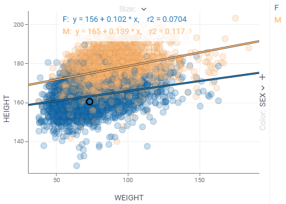
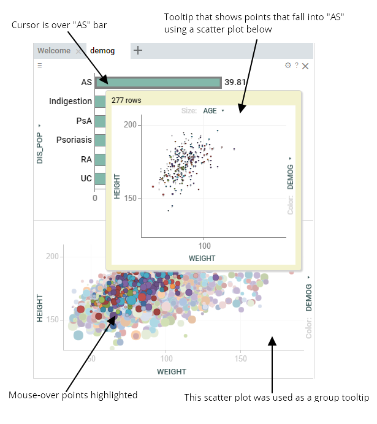
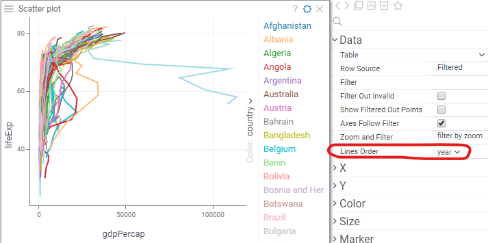

A scatterplot displays data points on the horizontal (X) and vertical (Y) axes
to show the relationship between two variables. By using marker color, shape,
and size, you can show up to three additional data dimensions. Use the
scatterplot to explore patterns and relationships between variables in your
data.

A scatterplot is a [chemically-aware viewer](../../datagrok/solutions/domains/chem/chemically-aware-viewers#scatter-plot)
 and can be used to explore a chemical space.

:::tip

To show the relationship between three variables, use a [3D Scatterplot](3d-scatter-plot.md).

::: 

## Controls

|                        |                                           |
|------------------------|-------------------------------------------|
| Context menu           | Right-click                               |
| Zoom                   | Alt+Mouse Drag                            |
| Zoom in                | Mouse Wheel Up or Plus                    |
| Zoom out               | Mouse Wheel Down or Minus                 |
| Double-click           | Reset view                                |
| Select                 | Shift+Mouse Drag, Ctrl+Click, Shift+Click |
| Invert selected        | Ctrl+Mouse Click                          |
| Scroll                 | Up, Down, Left, Right                     |
| Toggle lasso tool      | L                                         |
| Toggle regression line | R                                         |
| Show in full screen    | Alt+F                                     |

## Adding and configuring a scatterplot

To add a scatterplot, click the **Scatterplot** icon on the **Toolbox**.

Use the viewer controls to select columns for each axis and marker color and
size. For additional configurations, click the **Gear** icon on top of the
viewer and set your preferences in the **Context Panel**. Here, you can change
the background, adjust the legend position, add or remove labels, show drop
lines, and more. You can also access key settings from the context menu by
right-clicking.

### Data source

To specify the rows to show on the scatter plot, use the "Table" and "Row Source" properties in the **Data** 
section on the **Context Panel**. 
* "Table" to visualize a table other than the current one
* "Row Source" to visualize a subset of data: 
  * "Filtered" (the default value) - scatter plot follows view filter
  * "All", "Selected", "SelectedOrCurrent", "FilteredSelected", "MouseOverGroup", "CurrentRow", "MouseOverRow" - 
    other options useful for providing interactivity

You can further filter visible rows by setting the "Filter" property to an 
expression, such as `${AGE} > 18`.

### Filtering

In addition to visualizing filtered rows, scatter plot can also be used to filter the table, which
in turn affects what you see on other viewers on this view. This behavior is controlled by the
"Zoom and Filter" property:

* "filter by zoom" (default): as you zoom in, global view filter changes to show only rows that are 
  visible on the scatterplot. In this mode, "Filter Out Invalid" property defined whether rows that
  could not be visualized on the scatter plot (such as negative values on log scales) should be
  filtered out. 
* "no action": zooming in does not affect view filter
* "zoom by filter": as the view filter changes, scatter plot zooms in to the minimum area containing
  filtered points. This is useful for analyzing clusters of data.
* "pack and zoom by filter": mostly same as "zoom by filter", but in case categorical values 
  are shown on an axis and some categories are completely filtered out, these categories get removed
  (packed) from the axis. Useful when visualizing data that has a large number of categories.

### Selection

To switch between lasso and rectangular selection modes, press `L` or click `Lasso Tool` 
from the context menu. 

### Regression lines

To show a regression line, press `R` or check the "Show Regression Line" property
on the context panel. To hide the equation, uncheck "Show Regression Line Equation".

### Formula lines

A scatterplot can show reference lines that represent formulas or equations.
These lines are used to emphasize specific areas on the chart or data. Common
examples include a regression line, value bands, and so on.

To toggle a regression line, press the **R** key.

To show a custom formula line, right-click a scatterplot, then choose **Tools**
> **Formula Lines...** This action opens a **Formula Lines** dialog. Here, enter
your formula and configure the line settings. Your formula should refer to the
columns on the **X** and **Y** axes. The syntax for the formula is similar to
that used to [Add New Column](../../transform/add-new-column.md).

:::note developers

You can [add formula lines programmatically](https://datagrok.ai/help/develop/how-to/show-formula-lines).

:::

### Tooltip

By default, a scatterplot inherits the tooltip from the grid. However, you can
customize the scatterplot's tooltip to show the data you want using the
**Tooltip** info panel or via the context menu.

In addition, a scatterplot itself can be used as a 
[group tooltip](../../datagrok/navigation/views/table-view.md#group-tooltips), which may be especially useful when 
dealing with grouped or clustered data or when the screen space is limited.

To use this feature: 

1. Add and configure a scatterplot.
1. From the context menu, select **Tooltip** > **Use as Group Tooltip**.
1. Optional. Close the scatterplot.

### Connecting lines

You can set a column that defines order in which points are connected. 
Below, we see the (gdp, life expectancy) trajectory of different countries over time.

### WebGPU acceleration

WebGPU acceleration allows you to quickly render massive datasets (10 millions rows and more).
To get the maximum performance, set **Zoom and Filter** property to "no action".

This feature is currently in beta. To enable it, check **Settings** > **Beta** > **Enable Scatter Plot Web GPU Acceleration**

## Videos

See also:

* [Column selectors](column-selectors.md)
* [Viewers](viewers.md)
* [Table view](../../datagrok/navigation/views/table-view.md)
* [JS API:
  Scatterplot](https://public.datagrok.ai/js/samples/ui/viewers/types/scatter-plot)
