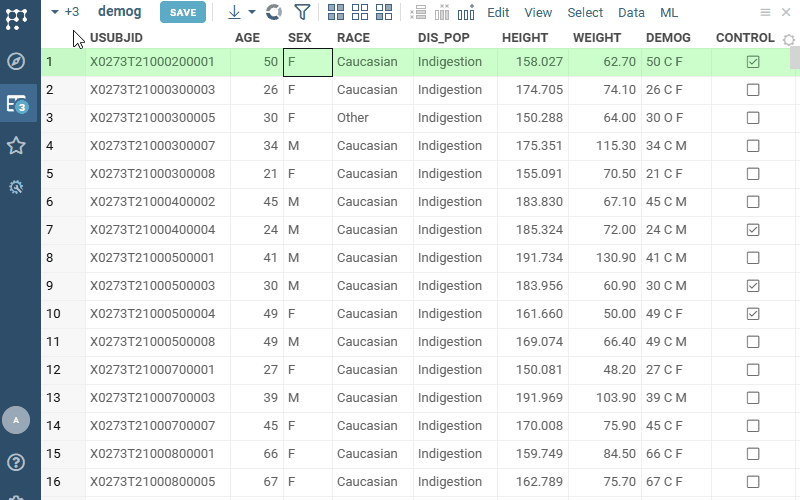
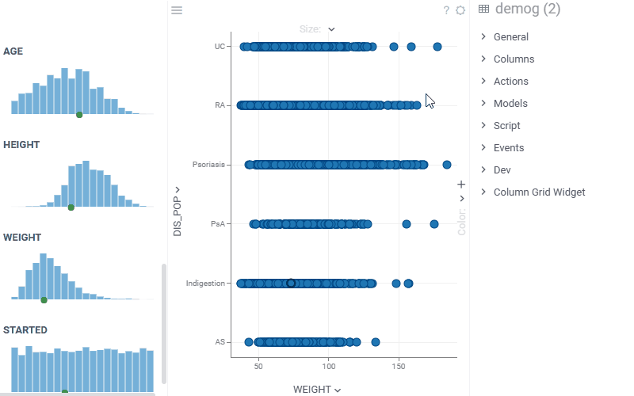
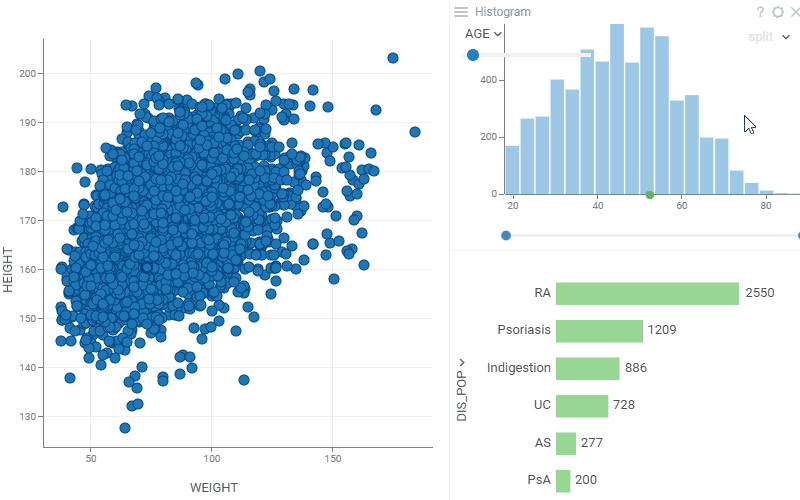
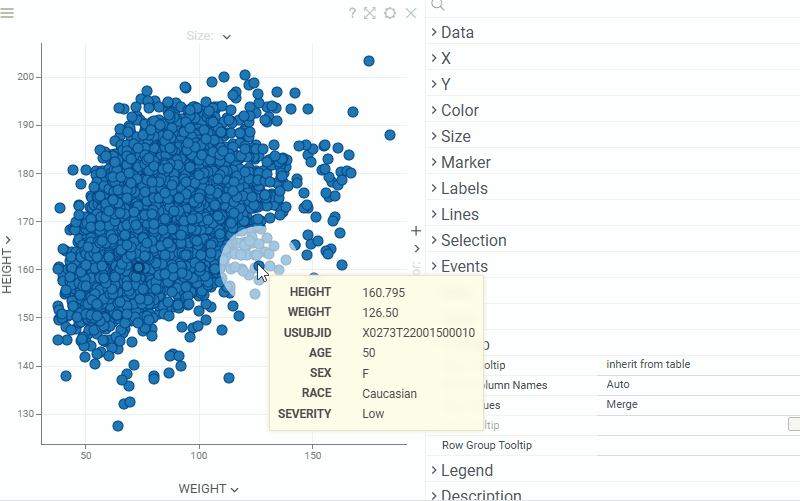
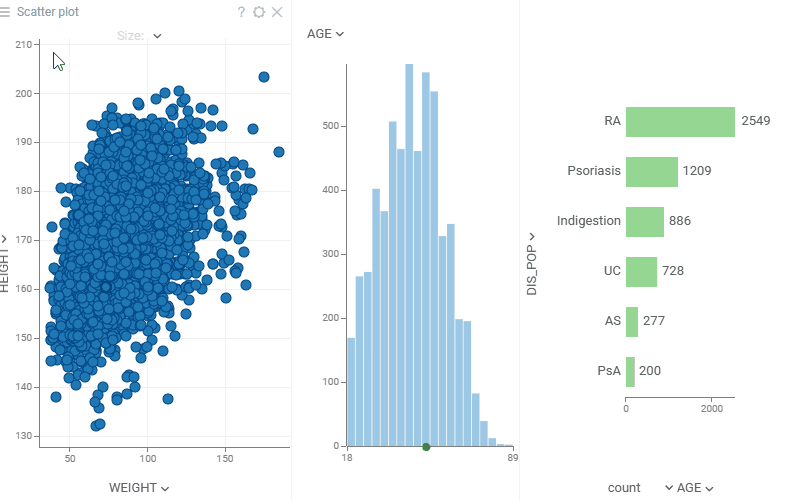
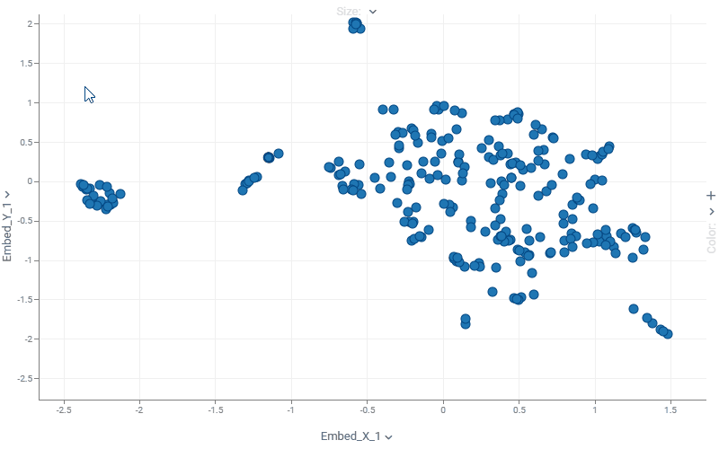
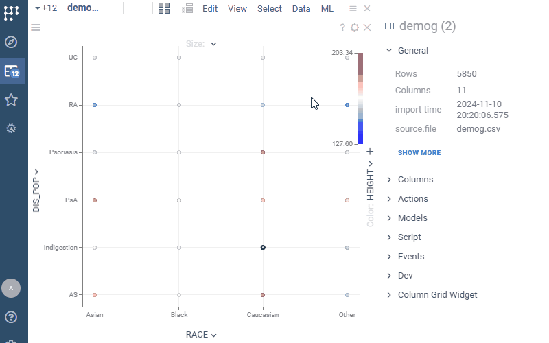
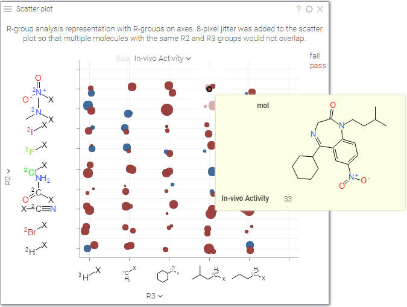

A scatterplot displays data points on the X and Y axes
to show the relationship between two variables. By using marker color, shape,
and size, you can show up to three additional data dimensions. 
A scatterplot is a [chemically-aware viewer](../../datagrok/solutions/domains/chem/chemically-aware-viewers#scatter-plot) and is a great choice to visualize 
[chemical space](../../datagrok/solutions/domains/chem/chem.md#chemical-space) or 
[activity cliffs](../../datagrok/solutions/domains/chem/chem.md#activity-cliffs).
 
## Controls

|                        |                                           |
|------------------------|-------------------------------------------|
| Context menu           | Right-click                               |
| Zoom                   | Alt+Mouse Drag                            |
| Zoom in                | Mouse Wheel Up or Plus                    |
| Zoom out               | Mouse Wheel Down or Minus                 |
| Double-click           | Reset view                                |
| Select                 | Shift+Mouse Drag, Ctrl+Click, Shift+Click |
| Invert selected        | Ctrl+Mouse Click                          |
| Scroll                 | Up, Down, Left, Right                     |
| Toggle lasso tool      | L                                         |
| Toggle regression line | R                                         |
| Show in full screen    | Alt+F                                     |

## Adding and configuring a scatterplot

To add a scatterplot, click the **Scatterplot** icon on the **Toolbox**.

Use the viewer controls to select columns for each axis and marker color and
size. You can also drag-and-drop columns from the grid into the scatter plot. 
For additional configurations, click the **Gear** icon on top of the
viewer and set your preferences in the **Context Panel**. 

You can also access key settings from the context menu by right-clicking.
Element-specific context menus appear when you click on legend, axis, or label.  

## Data source

To specify the rows to show on the scatter plot, use the "Table" and "Row Source" properties in the **Data** 
section on the **Context Panel**. 
* "Table" to visualize a table other than the current one
* "Row Source" to visualize a subset of data: 
  * "Filtered" (the default value) - scatter plot follows view filter
  * "All", "Selected", "SelectedOrCurrent", "FilteredSelected", "MouseOverGroup", "CurrentRow", "MouseOverRow" - 
    other options useful for providing interactivity

You can further filter visible rows by setting the "Filter" property to an 
expression, such as `${AGE} > 18`.

## X, Y, Colors, Sizes, Markers

Use the column selectors on top of the scatterplot, and the popup menu 
to setup basic properties:

## Filtering

In addition to visualizing filtered rows, scatter plot can also be used to filter the table, which
in turn affects what you see on other viewers on this view. This behavior is controlled by the
"Zoom and Filter" property:

* "filter by zoom" (default): as you zoom in, global view filter changes to show only rows that are 
  visible on the scatterplot. In this mode, "Filter Out Invalid" property defined whether rows that
  could not be visualized on the scatter plot (such as negative values on log scales) should be
  filtered out. 
* "no action": zooming in does not affect view filter
* "zoom by filter": as the view filter changes, scatter plot zooms in to the minimum area containing
  filtered points. This is useful for analyzing clusters of data.
* "pack and zoom by filter": mostly same as "zoom by filter", but in case categorical values 
  are shown on an axis and some categories are completely filtered out, these categories get removed
  (packed) from the axis. Useful when visualizing data that has a large number of categories.

## Selection

Scatterplot highlights selected rows in yellow, and lets you select points as well:

* To select area: Shift + mouse-drag
* To unselect area: Ctrl + Shift + mouse-drag
* To toggle point selection: Ctrl + click

To switch between lasso and rectangular selection modes, press `L` or click `Lasso Tool` 
from the context menu. 

## Regression lines

To show a regression line, press `R` or check the "Show Regression Line" property
on the context panel. To hide the equation, uncheck "Show Regression Line Equation".

## Formula lines

A scatterplot can show reference lines that represent formulas or equations.
These lines are used to emphasize specific areas on the chart or data. Common
examples include a regression line, value bands, and so on.

To show a custom formula line, right-click a scatterplot, then choose **Tools** > **Formula Lines...** 
This action opens a **Formula Lines** dialog. Here, enter
your formula and configure the line settings. Your formula should refer to the
columns on the **X** and **Y** axes. The syntax for the formula is similar to
that used to [Add New Column](../../transform/add-new-column.md).

:::note developers

You can [add formula lines programmatically](../../develop/how-to/viewers/show-formula-lines.md)
 
:::

## Tooltip

By default, a scatterplot inherits the tooltip from the grid. However, you can
customize the scatterplot's tooltip to show the data you want using the
**Tooltip** info pane on the **Context Panel**. To configure a custom tooltip:

1. **Enable custom tooltip**: Set **Show Tooltip** to `Show custom tooltip`.

2. **Choose which columns to display**: In **Row Tooltip**, select the columns whose values you want to show in the tooltip.

3. **Control axis values in the tooltip**: In **Data Values**, specify how axis values should appear:  
   * To exclude axis values from the tooltip, choose `Do not add`.  
   * To show only axis values, choose `Data values only`.  
   * To add axis values, choose `Merge`.

In addition, a scatterplot itself can be used as a 
[group tooltip](../table-view-1.md#group-tooltips), which may be especially useful when 
dealing with grouped or clustered data or when the screen space is limited.

To make scatterplot appear in a tooltip when you hover over a row group, 
right-click on the scatterplot and select **Tooltip** > **Use as Group Tooltip**. 

## Labels

To show values next to the markers, set the **Labels** settings either from context menu or from
the properties panel:
* To select columns to show, expand **Label Form** and check or drag-and-drop columns
* To select a subset of rows to show, use **Show Labels For**
  * You can drag-and-drop labels to exact positions in the **Selected** or **Current** modes   
* **Use Label as Marker** renders centered label instead of the marker. This is 
  particularly useful for zooming in on molecular datasets (points become molecules).
* Check **Show Column Names** to show column names next to the values 

To quickly adjust settings for labels, right-click on the label.

## Jitter

Many points in your dataset might fall into the same X and Y coordinates (often happens
with integer or categorical columns). To spread them out on the plot, set **Jitter Size**:

## Connecting lines

You can set a column that defines order in which points are connected. 
Below, we see the (gdp, life expectancy) trajectory of different countries over time.

## Cheminformatics

Scatterplot supports custom value renderers, and in particular it's very useful for
visualizing high-dimensional chemical data. If you choose to do so, molecules could 
be rendered on axes, as labels, or on tooltips.
To learn more, check out [cheminformatics](../../datagrok/solutions/domains/chem/chem.md).

## WebGPU acceleration

WebGPU acceleration allows you to quickly render massive datasets (10 millions rows and more).
To get the maximum performance, set **Zoom and Filter** property to "no action".

This feature is currently in beta. To enable it, check **Settings** > **Beta** > **Enable Scatter Plot Web GPU Acceleration**

## Videos

## Properties

| Property | Type | Description |
|----------|------|-------------|
| **Data** | | |
| Filter Out Invalid | boolean | Invalid are null values and not positive numbers if axis is logarithmic. |
| Show Filtered Out Points | boolean | When true, filtered out points are rendered using *Filtered Out Rows Color*. |
| Axes Follow Filter | boolean | When true, scatter plot will zoom to an area defined by the range filters for X and Y columns, even if *Zoom And Filter* property is not set to Zoom by Filter. |
| Zoom And Filter | string | Determines the relationship between table filter and scatter plot area: * No action: they are disconnected * Filter by zoom: scatter plot acts as a filter; as you zoom in, points get filtered out * Zoom by filter: scatter plot focuses on the filtered points as the filter changes * Pack and zoom by filter: removes filtered out categories and focuses on the filtered points as the filter changes. |
| Filter | string | Formula that filters out rows to show. Examples: `${AGE}` > 20 or `${WEIGHT / 2)}` > 100, `${SEVERITY}` == ''Medium'', `${RACE}`.endsWith(''sian'') |
| Table | string |  |
| **X** | | |
| X Column Name | string | A column to use on the X axis. Could be numerical or categorical. |
| X Map | string | Time unit map function for x column (applicable to dates only). |
| X Axis Type | string |  |
| Invert X Axis | boolean |  |
| X Min | number |  |
| X Max | number |  |
| Show Vertical Grid Lines | boolean |  |
| Show X Axis | boolean |  |
| Show X Selector | boolean |  |
| X Whisker Min Column Name | string | Point lower bound for x axis whiskers. Selecting it disables *X Whisker Range*. |
| X Whisker Max Column Name | string | Point upper bound for x axis whiskers. Selecting it disables *X Whisker Range*. |
| X Whisker Range Column Name | string | Point range for x axis whiskers. Applied only if *X Whisker Min* and *X Whisker Max* are not set. |
| X Axis Label Orientation | string |  |
| **Y** | | |
| Y Column Name | string | A column to use on the Y axis. Could be numerical or categorical. |
| Y Map | string | Time unit map function for y column (applicable to dates only). |
| Y Axis Type | string |  |
| Invert Y Axis | boolean |  |
| Y Min | number |  |
| Y Max | number |  |
| Show Horizontal Grid Lines | boolean |  |
| Show Y Axis | boolean |  |
| Show Y Selector | boolean |  |
| Y Whisker Min Column Name | string | Point lower bound for y axis whiskers. Selecting it disables *Y Whisker Range*. |
| Y Whisker Max Column Name | string | Point upper bound for y axis whiskers. Selecting it disables *Y Whisker Range*. |
| Y Whisker Range Column Name | string | Point range for y axis whiskers. Applied only if *Y Whisker Min* and *Y Whisker Max* are not set. |
| **Color** | | |
| Color Column Name | string | A column to be used for color-coding. Could be numerical or categorical. If not set, *Filtered Rows Color* is used for markers that pass the filter. Color palettes could defined either for columns in the column context panel, or via *Linear Color Scheme* and *Categorical Color Scheme* properties. |
| Color Map | string | Categorical coloring time unit map function (applicable to dates only). |
| Show Color Selector | boolean |  |
| Color Axis Type | string |  |
| Invert Color Scheme | boolean |  |
| Color Min | number |  |
| Color Max | number |  |
| **Size** | | |
| Size Column Name | string | A numerical column to use for size-coding markers. See also *Marker Min Size* and *Marker Max Size*. |
| Show Size Selector | boolean |  |
| **Marker** | | |
| Markers Column Name | string | A categorical column that determines the shape of the markers. |
| Markers Map | string | Marker category time unit map function (applicable to dates only). |
| Marker Type | string |  |
| Marker Default Size | number | By default - automatic sizing based on current dataframe |
| Marker Opacity | number |  |
| Jitter Size | number | Randomly shift (x, y) marker position up to the *Jitter Size* pixels. Useful when multiple points fall on the same exact position. If *Jitter Size Y* is defined, then *Jitter Size* shifts x only. |
| Jitter Size Y | number | Randomly shift y marker position up to the *Jitter Size Y* pixels. |
| Marker Draw Border | boolean |  |
| Marker Border Width | number |  |
| Marker Min Size | number |  |
| Marker Max Size | number |  |
| **General** | | |
| Lines Order Column Name | string | When defined, a line would be drawn for each series (defined by the categorical color column) using the order specified by Lines Order |
| Lines Width | number | Defines the width of the lines connecting the markers. See **Lines Width**. |
| Show Min Max Tickmarks | boolean | Shows tickmarks and labels for minimum and maximum value on each axis. |
| Show Drop Lines | boolean | Shows exact X and Y coordinates for the mouse cursor. |
| Mouse Drag | string |  |
| Lasso Tool | boolean | When true, lasso area selector is used instead of the rectangular one. Toggle this option by pressing L. |
| Allow Zoom | boolean |  |
| Legend Visibility | visibilitymode |  |
| Legend Position | flexautoposition |  |
| Row Source | string | Determines the rows shown on the plot. |
| Allow Dynamic Menus | boolean |  |
| Show Context Menu | boolean | Properties common for all viewers todo: use code generation |
| Title | string |  |
| Description | string | Viewer description that gets shown at the *Descriptor Position*. Markup is supported. |
| Help | string | Help to be shown when user clicks on the ''?'' icon on top. Could either be in markdown, or a URL (starting with ''/'' or ''http''). |
| Description Position | flexposition |  |
| Description Visibility Mode | visibilitymode |  |
| **Labels** | | |
| Label Column Names | list | Label columns to show next to the markers. |
| Show Labels For | string | Determines the rows shown on the scatter plot. |
| Display Labels | visibilitymode | Determines how to show marker label: * Always - show labels for all visible markers * Auto - show labels only for markers where enough space is available * Never - show no labels. |
| Show Label Named Columns | visibilitymode | Determines whether to show column names next to label values. |
| Use Label As Marker | boolean | If checked, display a label content as marker. |
| Label Color As Marker | boolean | To display labels separately or as markers (works for non-text labels). |
| Label As Marker Size | number | Marker size in which label is inscribed. |
| Label Content Size | number | Label inner content size. |
| **Lines** | | |
| Show Regression Line | boolean | Regression line visibility (toggle by pressing R) |
| Show Regression Line Equation | boolean |  |
| Show Spearman Correlation | boolean |  |
| Show Pearson Correlation | boolean |  |
| Show Mean Absolute Error | boolean |  |
| Show Root Mean Square Error | boolean |  |
| Regression Per Category | boolean |  |
| Show Dataframe Formula Lines | boolean | Control the visibility of dataframe-originated formula lines. Edit formula lines by right-clicking and selecting Tools \| Formula Lines from the popup menu. Requires the PowerPack plugin. |
| Show Viewer Formula Lines | boolean | Control the visibility of dataframe-originated formula lines. Edit formula lines by right-clicking and selecting Tools \| Formula Lines from the popup menu. Requires the PowerPack plugin. |
| **Selection** | | |
| Show Current Point | boolean | Controls the indication of the current row |
| Show Mouse Over Point | boolean | Controls the indication of the mouse-over row |
| Show Mouse Over Row Group | boolean | Highlight ''mouse-over'' rows (such as the ones that fall into a histogram bin that the mouse is currently hovering over). |
| Show Selected Rows | boolean | When true, selected markers are highlighted using the selected rows color. When false, selected markers use their regular color coding. |
| **Style** | | |
| Auto Layout | boolean |  |
| Back Color | number |  |
| Filtered Rows Color | number |  |
| Filtered Out Rows Color | number |  |
| Selected Rows Color | number |  |
| Missing Value Color | number |  |
| Label Color | number |  |
| Axis Line Color | number |  |
| Axis Text Color | number |  |
| Grid Line Color | number |  |
| Regression Line Color | number |  |
| Whisker Color | number |  |
| Regression Line Transparency | number |  |
| Linear Color Scheme | list |  |
| Categorical Color Scheme | list |  |
| Axes Use Column Format | boolean | Determines whether the axes should follow the non-precision-related format (such as money) set for the corresponding column. |
| Auto Axis Size | boolean | If true, *X Axis Height* and *Y Axis Width* are calculated automatically to fit the required precision. If false, the specified *X Axis Height* and *Y Axis Width* properties are used. |
| X Axis Height | number | Requires *Auto Axis Size* to be turned off. |
| Y Axis Width | number | Requires *Auto Axis Size* to be turned off. |
| Axis Font | string |  |
| Label Font | string |  |
| Formula Font | string |  |
| Annotation Font | string |  |
| Controls Font | string | Viewer controls elements font. |
| **Annotation regions** | | |
| Show Viewer Annotation Regions | boolean |  |
| Show Dataframe Annotation Regions | boolean |  |
| **Tooltip** | | |
| Show Tooltip | string | Controls scatter plot tooltip visibility |
| Show Labels | visibilitymode |  |
| Data Values | string | Controls whether columns on X and Y axes are displayed in tooltip * Do not add: they are not shown * Data values only: only they are shown * Merge: standard behavior |
| Row Tooltip | string | Newline-separated list of column names to be used in a tooltip. Requires *showTooltip* to be enabled. |
| Row Group Tooltip | string |  |
| **Description** | | |
| Show Title | boolean |  |

See also:

* [3D Scatterplot](3d-scatter-plot.md)
* [Column selectors](column-selectors.md)
* [Viewers](viewers.md)
* [Table view](../table-view-1.md)
* [JS API: Scatterplot](https://public.datagrok.ai/js/samples/ui/viewers/types/scatter-plot)
* Community:
    * [Scatterplot updates](https://community.datagrok.ai/t/scatterplot-updates/625)
    * [Visualization-related updates](https://community.datagrok.ai/t/visualization-related-updates/521)
