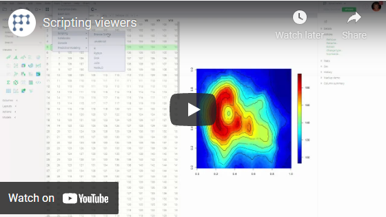

**Scripting viewers** are viewers implemented in R, Python, or Julia. Internally, they
use [scripting](../../compute/scripting.md) for integration with the Datagrok platform.

While not as interactive as the core Datagrok [viewers](../viewers/viewers.md), they allow to easily use thousands of
visualizations already developed for these languages.

To add an existing viewer to a table view, select it from the
`Add | Scripting Viewers` menu.

To edit the rest of the properties, either click on the `gear` icon on top of the viewer, or press F4 when the viewer
has focus, or open the hamburger menu and select `Viewer | Properties`.

## Customize scripting viewer scripts

Since all scripting viewers are based on [scripts](../../compute/scripting.md), it is easy to customize the existing
ones or create your own viewer. To customize the script's code, open it by clicking on `Edit script` in the hamburger
menu. To add a new scripting viewer to the main menu, add the `viewers`
tag to the script header.

## Scripting viewer code example

The following example shows code for a simple scatter plot written on R, using the `ggplot2`
library.

```r
#name: Scatter plot
#language: r
#tags: demo, viewers
#input: dataframe t
#input: column xColumnName
#input: column yColumnName
#input: column colorColumnName
#output: graphics

require(ggplot2)

# Compose input columns into data frame with required names
data <- data.frame(x=t[[xColumnName]], y=t[[yColumnName]], color=t[[colorColumnName]])

# Plots
plotScatter <- ggplot(data,
  aes(x, y, colour=color), xlab=x, ylab=y) +
  labs(x=xColumnName, y=yColumnName) +
  geom_point()
print(plotScatter)
```

## Demo project

Open [Time Series Decomposition](https://public.datagrok.ai/p/demo.timeseriesdecomposition) project as an example of
scripting viewer usage for time series decomposition.

### Videos

[](https://www.youtube.com/watch?v=jHRpOnhBAz4)

See also:

* [Scripting](../../compute/scripting.md)
* [Viewers](../viewers/viewers.md)
