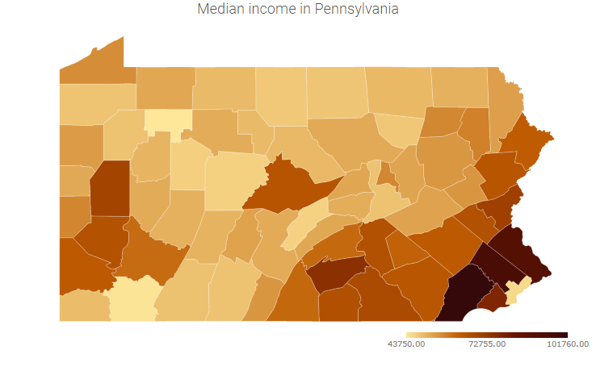
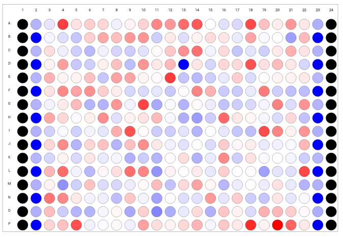
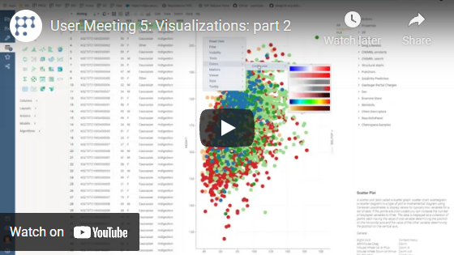

Shows a map applicable to the specified dataset. Typically, the map represents a geographical area (countries,
states, counties, etc), but it also supports arbitrary shapes (such as a store floor plan, brain regions, or EEG
electrodes).

When opened, the viewer automatically determines the best map for the current dataset. If more than one
map fits the data, the viewer selects one arbitrarily. Right-click and choose the one you want from the pop-up menu.

Geographical regions can be represented by different names (such as Pennsylvania and PA), and an elaborate
system understands synonyms and abbreviations. However, sometimes it can't map names to the regions. To
identify these records, select
"Select not matching rows" from the popup menu.

## Videos

See also:

* Applicable tables: #\{x.demo:germany_grp_by_state}, #\{x.demo:pa_income_by_county}, #\{x.demo:
  ua_population}
* [Viewers](../viewers/viewers.md)
* [JS API: Shape map](https://public.datagrok.ai/js/samples/ui/viewers/types/shape-map)
