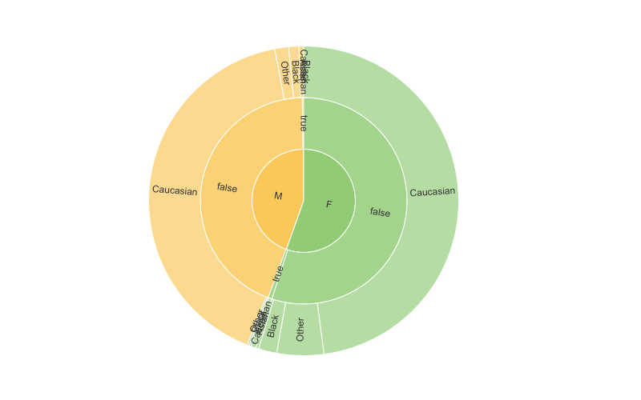

A sunburst viewer shows hierarchical data. Use a sunburst to understand data composition and explore patterns in multi-level categories.

The center represents the top hierarchy, with each outer ring representing subsequent levels. The segment size within a ring shows its relative proportion compared to other categories at that level. Hover over any segment to see details or click it to drill down. To go back to the previous view, click the area in the center. To reset the viewer, press Ctrl+Shift+A.

Sunburst viewer also works with molecules. For example, you can use it to analyze structures based on shared R-groups.

To add a sunburst, on the **Top Menu**, click the **Add viewer** icon and select **Sunburst**.

> Developers: To add the viewer from the console, use:
`grok.shell.tv.addViewer('Sunburst');`

:::note

To use the sunburst viewer, your data must have at least 2 levels of categorization.

:::

## Configuring sunburst

To configure a sunburst, hover over the viewer's top and click the **Gear** icon. The **Context Panel** on the right updates to show the viewer settings.

* To select which columns to show, use the **Data** > **Hierarchy** control.
* To set the hierarchy for a column, adjust the order by dragging it within the **Select columns...** window. The first row represents the highest hierarchy level; the second row sets the subsequent hierarchy level, and so forth.

<!--replace gif with nicer colors later-->

By default, each hierarchy branch has its own distinct color. However, if a grid column is color-coded, those colors transfer to the corresponding segments in the ring for that column.

## Interaction with other viewers

A sunburst responds to data filters and works in sync with other viewers. To select a segment within sunburst, Ctrl+Click it. This action automatically updates other viewers to mirror your selection.

<!--replace gif so that it also shows filters-->

:::note 

The sunburst will only reflect selections from other viewers when all data points in the specified segment are selected.

:::

## Viewer controls

| Action                    | Control                             |
|---------------------------|-------------------------------------|
| Drill down                | Click                               |
| Select                    | Ctrl+Click                          |
| Go back                   | Click the center area of the viewer |
| Reset the view            | Ctrl+Shift+A                        |

## See also

* [Viewers](../viewers/viewers.md)
* [Pie Chart](pie-chart.md)
* [Community: Visualization-related updates](https://community.datagrok.ai/t/visualization-related-updates/521)
