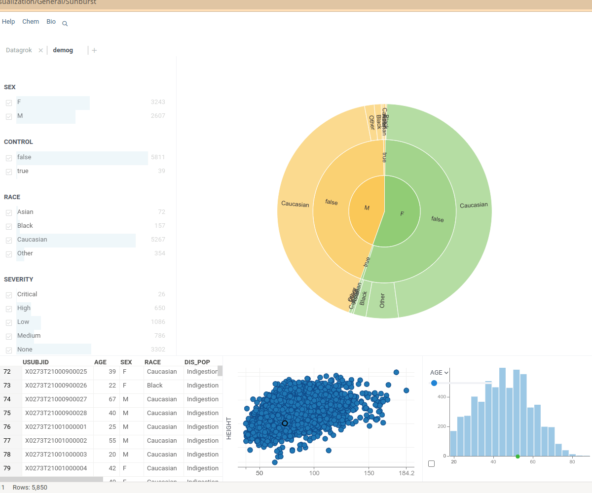
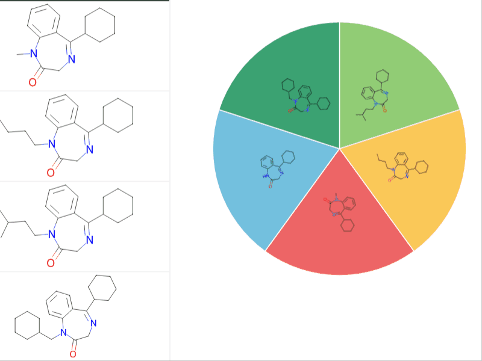

A [sunburst diagram](https://en.wikipedia.org/wiki/Pie_chart#Ring) organizes categories into rings, revealing a hierarchy. It is also known as a Ring Chart or Multi-Level Pie Chart.

## Structure

The middle circle represents the root node. Categories spread out in rings around it.

Every ring stands for a particular trait or column.

We split and cut the rings based on their hierarchy in relation to the parent slice. Each sector on the outer rings displays a combination from the inner rings.

The sectors’ size reflects category correlation within the dataset. 

In the example below, you can see that the prominent yellow sector on the outer ring shows people who are `Caucasian`, have a `False` control status and are labeled as `Male`.

## Creation

To create a **Sunburst** viewer, navigate to the **Main Menu**
and select **Add > Javascript Viewers > Charts > Sunburst**

Columns with categorical data are automatically added to the sunburst viewer.

## Data exploration

Use the Sunburst viewer to explore the hierarchical nature of your dataset:

* To **zoom** to a category, click it.
* To **zoom out**, click the blue circle in the middle.
* To **reset view**, double click on the empty area outside the chart.

## Selection 

Sunburst viewer offers several selection options:

* To **select** a category, use `Shift` + `Click`.
* To **invert** selection, use `Ctrl` + `Shift` + `Click`.

Other viewers respond to the data selection and dynamically update the representation.

## Molecule rendering

A sunburst viewer renders molecular structures on the rings. When you hover over the structure, a label appears above. 

If the number of structures to show is excessive, only a part of the structures is visible. 

## Configuring a Sunburst viewer

To configure a sunburst viewer, click on the Gear icon on top of the viewer. Context Pane with settings opens.

## Interaction with other viewers

The **Sunburst** viewer responds to data filters and instantly changes the visualization.

## Viewer controls

| Action                                   | Control                                       |
|------------------------------------------|-----------------------------------------------|
| Zoom | Click the category                            |
| Zoom out                   | Click the blue circle in the middle |
| Select           | Shift + Click                            |
| Invert selection | Shift + Ctrl + CLick |
| Reset view | Double click outside the chart |

## See also

* [Viewers](../viewers/viewers.md)
* [Pie Chart](pie-chart.md)
