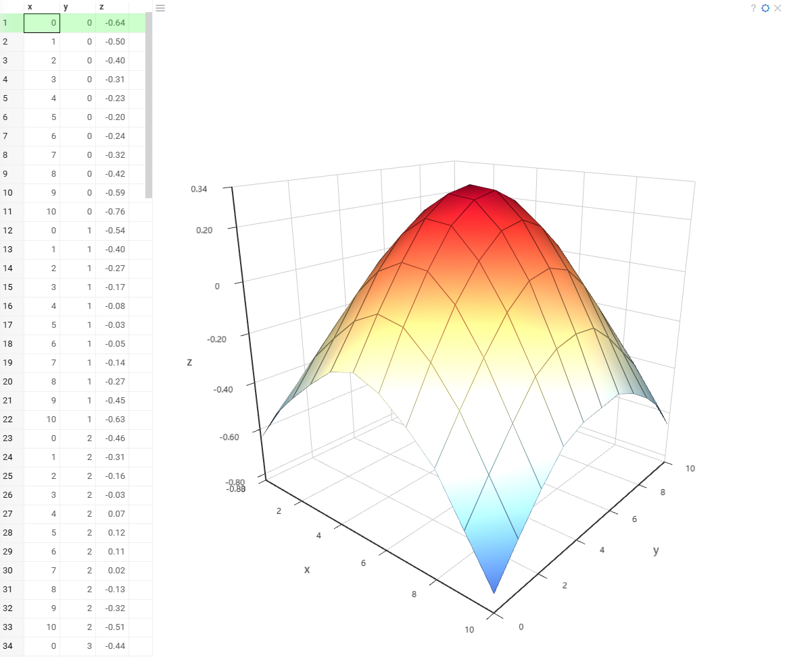

A Surface plot is a 3D visualization that shows how three continuous variables
interact within a dataset. It displays data as a smooth or faceted surface where
the X and Y axes define the independent variables, and the Z axis represents the dependent variable.

This visualization is particularly useful for:

* Topographical mapping – representing elevation or terrain data.
* Mathematical functions – visualizing 3D functions and their variations.
* Scientific and engineering data – analyzing heat distribution, fluid dynamics, or other continuous data relationships.

The surface plot allows users to identify patterns, peaks, and valleys within a dataset,
making it a valuable tool for understanding complex three-dimensional relationships.

## Creating a Surface plot

To create a **Surface plot** viewer, navigate to the **Main Menu**
and select **Add > Javascript Viewers > Surface plot**.

> Developers: To add the viewer from the console, use:
`grok.shell.tv.addViewer('Surface plot')`

When you add a surface plot in Datagrok, the platform automatically detects three
numerical columns: X and Y as independent variables and Z as the dependent variable.
If the detection is incorrect, you can manually set them in the viewer settings.

## Configuring a Surface plot

You can set the "X", "Y", and "Z" columns, and customize visualization options.
To do that, click the **Gear** icon on top of the viewer and use the **Data**
and **Misc** info pane on the **Context Panel** to manage the viewer's settings.

In the Gear menu, you can configure:

* Grid and axes – Toggle visibility and label settings.
* Legend and background – Control legend display and background color.
* Surface rendering – Enable/disable wireframes and adjust projection type.

## Interaction with other viewers

The **surface plot** responds to data filters but row selection is limited. Clicking a
data point in the surface plot highlights the corresponding row in the grid. However,
selecting rows in the grid or other viewers does not modify the surface plot's display.

## Viewer controls

| Action                                  | Control               |
|-----------------------------------------|-----------------------|
| Select the row corresponding to a point | Click the point       |
| Add a point to the selection            | Shift+click the point |
| Toggle point selection                  | Ctrl+click the point  |

## See also

* [Viewers](../viewers/viewers.md)
* [Chord viewer](chord.md)
* [Sankey viewer](sankey.md)
