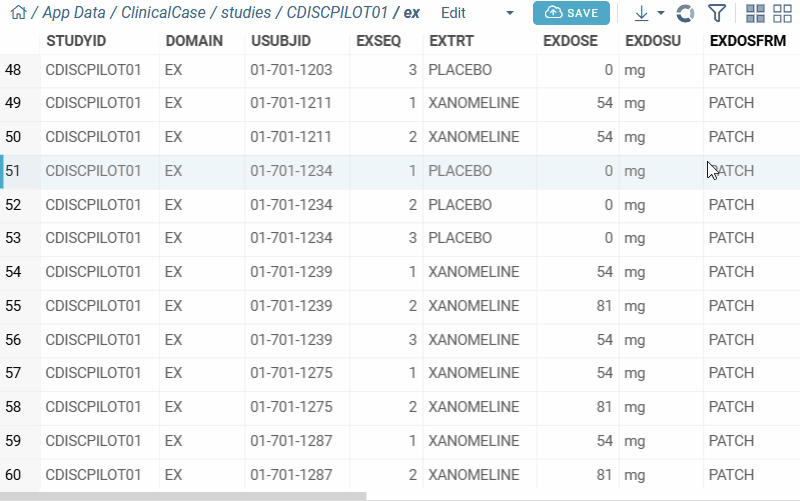

---  
title: "Timelines"  
---  
  
Timelines viewer displays the flow of events over time. Each row represents a subject, with events shown as bars or points along the time axis. The viewer is commonly used for clinical data visualization.
  
>Note: To use a timelines viewer, install the package [Charts](https://github.com/datagrok-ai/public/tree/master/packages/Charts). 
  
## Create a timelines viewer

1. On the menu ribbon, click the **Add viewer** icon. A dialog opens.
1. In the dialog, select **Timelines**.

> Developers: To add the viewer from the console, use:
`grok.shell.tv.addViewer('Timelines');`

> Note: You can use this viewer with clinical data. When you add a timelines viewer, it automatically selects appropriate columns based on [SDTM](https://www.cdisc.org/standards/foundational/sdtm) vocabulary and data characteristics.

## Configuring a timelines viewer

To customize a timelines viewer, click the **Gear** icon on top of the viewer and use
the **Context Panel** to adjust its settings.

For example, you can:

* **Group events** vertically by subject or category using **Split By**.  
* **Show event durations** along the timeline with **Start** and **End** columns.  
* **Display single-point events** as markers using **Events**.  
* **Include events with missing dates** by enabling **Show Open Intervals**.  
* **Color-code events** by selecting a column in **Color**.  
* **Show detailed event info** in tooltips with **Event** and **Show Event In Tooltip** enabled.  
* **Customize marker appearance**:
  * Change shape with **Marker**
  * Adjust size with
  **Marker Size**
  * Set placement with **Marker Position** (`main line`, `above`,
  `scatter`).
 
 

## See also
  
* [Clinical Case](https://github.com/datagrok-ai/public/tree/master/packages/ClinicalCase)  
* [Charts](https://github.com/datagrok-ai/public/tree/master/packages/Charts)
* [Viewers](viewers.md)
* [Community: Visualization-related updates](https://community.datagrok.ai/t/visualization-related-updates/521)