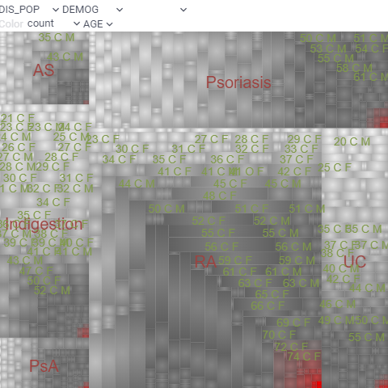

<!-- TITLE: Treemap -->
<!-- SUBTITLE: -->

# Treemap

Treemap displays hierarchical (tree-structured) data as nested rectangles. The
branches are rectangles, then tiled with smaller rectangles representing
sub-branches. Rectangles have areas proportional to a specified dimension of the
data using the specified aggregation function (`count` by default).

Treemap displays all data simultaneously and shows a part-to-whole relationship
among many categories. Use a treemap to spot irregularities or patterns.

## Adding

1. Go to **Tables** and expand the **Viewers** panel.
1. Locate the **Treemap** icon and click it.

Initially, the viewer picks up the first categorical column in the corresponding
table and builds a treemap.

## Settings

You can set the hierarchy and customize a treemap viewer. To do that, click the
**Gear** icon on top of the viewer and use settings on the **Context Pane**. For
example, you can:

* **Set tree hierarchy**
  * Choose the desired column using the drop-downs on top of the viewer.
  * Or, edit the `Split by` property (drag-and-drop columns to change their
    order).
* **Select the rows for the treemap display** using the **Row source** dropdown
  list.
* **Size-code nodes** using `Size` and `Size Aggr Type` properties.
* **Color-code nodes** using `Color` and `Color Aggr Type` properties.

## Interactivity

* Shows a subset of rows specified by the `Row Source` property
* Shows selected rows in orange
* Synchronizes current record upon clicking on the point
* Click on the rectangle selects rows

## Viewer controls

|      Action                           |         Control             |
|-------------------------------------|-----------------------|
| Add node to selection           | Shift+click the node|
| Toggle node selection           | Ctrl+click the node |

## Videos

## See also

* [Viewers](../viewers.md)
* [Table view](../../datagrok/table-view.md)
* [JS API: Tree map](https://public.datagrok.ai/js/samples/ui/viewers/types/tree-map)
