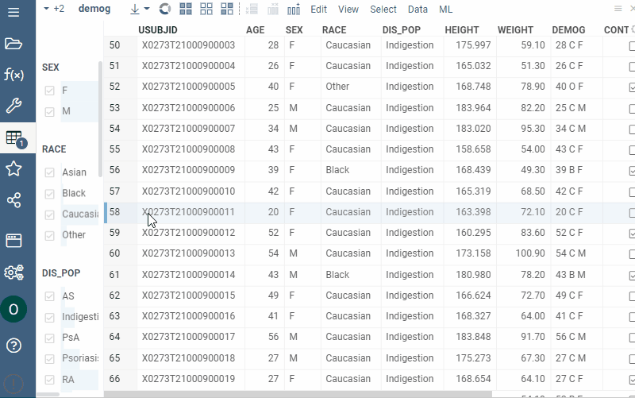

Treemap displays hierarchical (tree-structured) data as nested rectangles. The
branches are rectangles, then tiled with smaller rectangles representing
sub-branches. Rectangles have areas proportional to a specified dimension of the
data using the specified aggregation function (`count` by default).

Treemap displays all data simultaneously and shows a part-to-whole relationship
among many categories. Use a treemap to spot irregularities or patterns.

## Adding

1. Go to **Tables** and expand the **Viewers** panel.
1. Locate the **Treemap** icon and click it.

> Developers: To add the viewer from the console, use:
`grok.shell.tv.addViewer('Treemap');`

Initially, the viewer picks up the first categorical column in the corresponding
table and builds a treemap.

## Settings

You can set the hierarchy and customize a treemap viewer. To do that, click the
**Gear** icon on top of the viewer and use settings on the **Context Panel**. For
example, you can:

* **Set tree hierarchy**
  * Choose the desired column using the drop-downs on top of the viewer.
  * Or, edit the `Split by` property (drag-and-drop columns to change their
    order).
* **Select the rows for the treemap display** using the **Row source** dropdown
  list.
* **Size-code nodes** using `Size` and `Size Aggr Type` properties.
* **Color-code nodes** using `Color` and `Color Aggr Type` properties.

## Interactivity

* Shows a subset of rows specified by the `Row Source` property
* Shows selected rows in orange
* Synchronizes current record upon clicking on the point
* Click on the rectangle selects rows

## Viewer controls

|      Action                           |         Control             |
|-------------------------------------|-----------------------|
| Add node to selection           | Shift+click the node|
| Toggle node selection           | Ctrl+click the node |

## Properties

| Property | Type | Description |
|----------|------|-------------|
| **General** | | |
| Split By Column Names | list |  |
| Color Column Name | string |  |
| Color Aggr Type | string |  |
| Size Column Name | string |  |
| Size Aggr Type | string |  |
| Default Color | number |  |
| Show Column Selection Panel | boolean |  |
| Outer Margin Left | number |  |
| Outer Margin Right | number |  |
| Outer Margin Top | number |  |
| Outer Margin Bottom | number |  |
| Row Source | string | Determines the rows shown on the plot. |
| Allow Dynamic Menus | boolean |  |
| Show Context Menu | boolean | Properties common for all viewers todo: use code generation |
| Title | string |  |
| Description | string | Viewer description that gets shown at the *Descriptor Position*. Markup is supported. |
| Help | string | Help to be shown when user clicks on the ''?'' icon on top. Could either be in markdown, or a URL (starting with ''/'' or ''http''). |
| Description Position | flexposition |  |
| Description Visibility Mode | visibilitymode |  |
| **Style** | | |
| Auto Layout | boolean |  |
| Controls Font | string | Viewer controls elements font. |
| **Data** | | |
| Filter | string | Formula that filters out rows to show. Examples: `${AGE}` > 20 or `${WEIGHT / 2)}` > 100, `${SEVERITY}` == ''Medium'', `${RACE}`.endsWith(''sian'') |
| Table | string |  |
| **Description** | | |
| Show Title | boolean |  |

## Videos

## See also

* [Viewers](../viewers/viewers.md)
* [Table view](../table-view-1.md)
* [JS API: Tree map](https://public.datagrok.ai/js/samples/ui/viewers/types/tree-map)
* [Community: Visualization-related updates](https://community.datagrok.ai/t/visualization-related-updates/521)