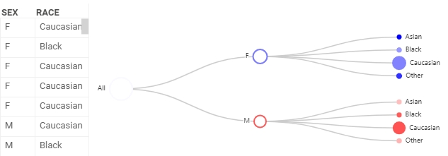

<!-- TITLE: Tree viewer -->
<!-- SUBTITLE: -->

# Tree viewer

Tree viewer shows the hierarchical structure of categorical data. It groups
table rows into nodes by categories in columns. Each column forms a new
hierarchy level. For example, a tree viewer is commonly used to display sales by
location.

>Note: To use a tree viewer, install the package [Charts](https://github.com/datagrok-ai/public/tree/master/packages/Charts).

## Create a tree viewer

1. On the menu ribbon, click the **Add viewer** icon. A dialog opens.
1. In the dialog, select **Tree viewer**.

When you add a tree viewer, Datagrok chooses two categorical columns with the
least number of categories. They form the initial hierarchy of the tree viewer.

## Configuring a tree viewer

You can set the tree hierarchy and customize a tree viewer. To do that, click
the **Gear** icon on top of the viewer and use the **Data** and **Misc** info
panels on the **Context Pane** to manage the tree viewer’s settings.

For example, you can:

* **Set tree hierarchy**. Add and delete new levels or change their order using
  the **Hierarchy** setting.
* **Size-code nodes**. Define a column for aggregation in **Size** and select an
  aggregation function in **Size Aggr Type**.
* **Color-code nodes**. Define a column for aggregation in **Color** and select
  an aggregation function in **Color Aggr Type**.
* **Expand and collapse** the whole tree hierarchy by switching **Expand and
  Collapse**.
* **Change the number of levels displayed**. The viewer automatically collapses
  a tree according to the **Initial Tree Depth** value.
* **Customize a tree viewer** by setting the tree **Layout** as either
  `orthogonal` or `radial`. For `orthogonal` layout, you can also:
  * Define the tree **direction** using the **Orient** setting.
  * Change the **shape of the branches** using the **Edge Shape** setting.

## Interaction with other viewers

A tree viewer responds to data filters but has limited interaction in rows
selection. For the node to be selected, you need to select all rows comprising
the node.

## Viewer controls

|      Action                           |         Control             |
|-------------------------------------|-----------------------|
| Expand/collapse branch        | Click the node       |
| Add node to selection           | Shift+click the node|
| Toggle node selection           | Ctrl+click the node |

## See also

* [Viewers](../viewers.md)
* [Network viewer](network-diagram.md)
* BiostructureViewer
* PhyloTreeViewer
