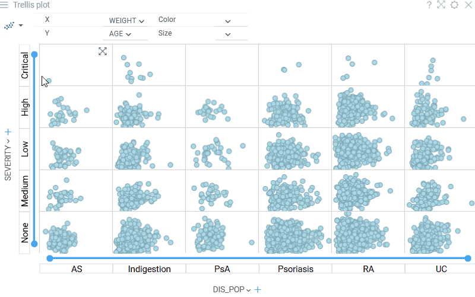
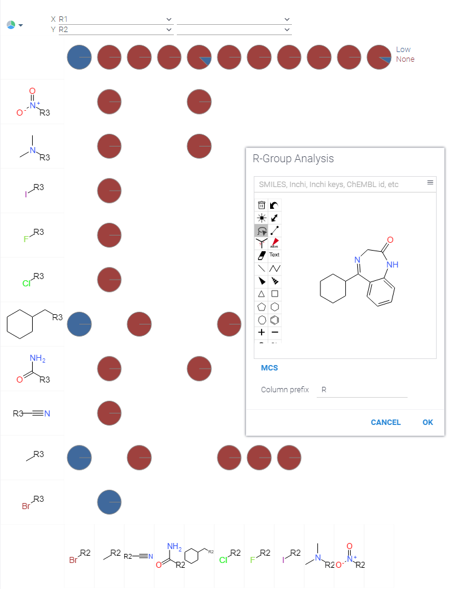

Trellis plot is useful for finding the structure and patterns in complex data. A trellis plot is a layout of smaller
charts in a grid with consistent scales. Each smaller chart represents rows that belong to a corresponding category. The
grid layout looks similar to a garden trellis, hence the name trellis plot.

There are two ways to add a trellis plot, visualized below:

* click on the **Trellis plot** icon in the toolbox, and then customize the inner chart by clicking on the "gear" icon on
  the left
* create a viewer that you want to eventually become an inner chart, customize it the way you like, and then click
  on `Viewer | Use in Trellis`

> Developers: To add the viewer from the console, use:
`grok.shell.tv.addViewer('Trellis plot');`

Typically, you want the data split by one or two columns. Use combo boxes on top of the control for that. Note that you
can split data by one column per dimension.

To change the inner viewer type, click on the viewer icon in the left top corner. To edit inner viewer's settings, use
the "gear" icon next to it.

Trellis Plot automatically picks up element renderers for rendering categories. For instance, this is how it looks for
chemical structures after performing [R-Group Analysis](../../datagrok/solutions/domains/chem/chem.md#r-groups-analysis):

## Videos

## Properties

| Property | Type | Description |
|----------|------|-------------|
| **General** | | |
| X Column Names | list |  |
| Y Column Names | list |  |
| Allow Viewer Full Screen | boolean | if false, full screen icon will not be shown on inner viewer hover |
| Y Labels Orientation | textorientation |  |
| X Labels Orientation | textorientation |  |
| Category Label Font | string |  |
| Inner Viewer Look | lookandfeel |  |
| Show Gridlines | string |  |
| Show X Selectors | boolean |  |
| Show Y Selectors | boolean |  |
| Show X Labels | boolean |  |
| Show Y Labels | boolean |  |
| Show Control Panel | boolean |  |
| Sync Mouse Over Row | boolean |  |
| On Click | string | Action to be performed when you click on a trellis cell |
| Pack Categories | boolean |  |
| Use Tiled View | boolean |  |
| Tiles Per Row | number |  |
| Back Color | number |  |
| Legend Visibility | visibilitymode |  |
| Legend Position | flexautoposition |  |
| Row Source | string | Determines the rows shown on the plot. |
| Allow Dynamic Menus | boolean |  |
| Show Context Menu | boolean | Properties common for all viewers todo: use code generation |
| Title | string |  |
| Description | string | Viewer description that gets shown at the *Descriptor Position*. Markup is supported. |
| Help | string | Help to be shown when user clicks on the ''?'' icon on top. Could either be in markdown, or a URL (starting with ''/'' or ''http''). |
| Description Position | flexposition |  |
| Description Visibility Mode | visibilitymode |  |
| **Axes** | | |
| Show X Axes | visibilitymode | Shows horizontal axis for each inner viewer row. Depending on selected inner viewer, axis may be hidden automatically. |
| Show Y Axes | visibilitymode | Shows vertical axis for each inner viewer column. Depending on selected inner viewer, axis may be hidden automatically. |
| Global Scale | boolean | If checked, all inner viewers use the same axis scales. |
| Show Range Sliders | boolean | Shows range sliders for inner viewer axis. Available only if corresponding axes (X or Y) are shown. |
| **Style** | | |
| Auto Layout | boolean |  |
| Controls Font | string | Viewer controls elements font. |
| **Data** | | |
| Filter | string | Formula that filters out rows to show. Examples: `${AGE}` > 20 or `${WEIGHT / 2)}` > 100, `${SEVERITY}` == ''Medium'', `${RACE}`.endsWith(''sian'') |
| Table | string |  |
| **Description** | | |
| Show Title | boolean |  |

See also:

* [Viewers](viewers.md)
* [Table view](../table-view-1.md)
* [R-Group analysis](../../datagrok/solutions/domains/chem/chem.md#r-groups-analysis)
* [JS API: Trellis plot](https://public.datagrok.ai/js/samples/ui/viewers/types/trellis-plot)
* [Community: Visualization-related updates](https://community.datagrok.ai/t/visualization-related-updates/521)