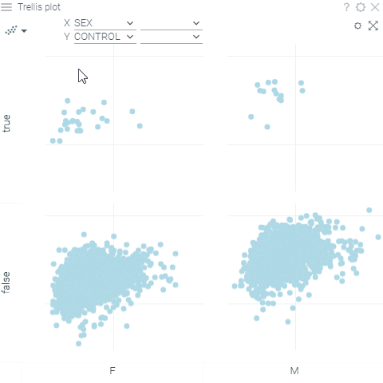
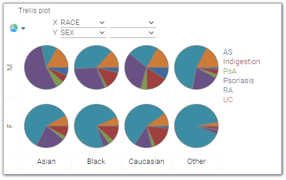

<!-- TITLE: Trellis Plot -->
<!-- SUBTITLE: -->

# Trellis Plot

Trellis Charts are useful for finding the structure and patterns in complex data.
A Trellis Chart is a layout of smaller charts in a grid with consistent scales. Each smaller chart
represents rows that belong to a corresponding category.  The grid layout looks similar to a garden trellis, 
hence the name Trellis Chart.

Typically, you want the data split by one or two columns. Use combo boxes on top of the control for that. Note
that you can split data by one column per dimension.  

To change the inner viewer type, click on the viewer icon in the left top corner. To edit inner
viewer's settings, use the "gear" icon next to it.

Trellis Plot automatically picks up element renderers for rendering categories. For instance,
this is how it looks for chemical structures after performing [R-Group Analysis](../domains/chem/r-group-analysis.md):

See also: 
  
  * [Viewers](../viewers.md)
  * [Table View](../../overview/table-view.md)
  * [R-Group Analysis](../domains/chem/r-group-analysis.md)
  * [JS API: Trellis Plot](https://public.datagrok.ai/js/samples/ui/viewers/trellis-plot)
