A _viewer_ is a visual component associated with a
[table](../../datagrok/concepts/table.md). They are [extremely fast and interactive](../../develop/under-the-hood/performance.md#viewers), handling
datasets with tens of millions of rows (or millions of columns).

To learn how to use viewers, including creation, managing properties,
filtering, row selection, tooltips, and more, see [Table View](../../datagrok/navigation/views/table-view.md#viewer-properties).

| 

        |  

                                                                                                                                                                                                                                                                                                                                                                                                                     |
|----------------------------------------|-----------------------------------------------------------------------------------------------------------------------------------------------------------------------------------------------------------------------------------------------------------------------------------------------------------------------------------------------------------------------------------------------------------------------|
|<h4>[Grid](grid.md)</h4>A high-performance, customizable spreadsheet optimized for interactive exploration of data.   Provides color-coding, filtering, sorting, custom cell types, and hundreds of other features.                                     |             |
|<h4>[Scatterplot](scatter-plot.md)</h4>Displays data points on the X and Y axes to show the relationship between two variables. Show up to three additional data dimensions by using marker color, shape, and size.    Supports regression lines, and data annotations.                         |     | 
|<h4>[Histogram](histogram.md)</h4> Shows the distribution of the numerical data. Supports multiple distribution, with a few normalization options. Use the slider below to filter the dataset.                                                                                                                                                                              |        | 
| <h4>[Line chart](line-chart.md)</h4>Shows points connected by lines. Points are ordered by the X component, with multiple values for the same X aggregated.     Supports multiple charts, multiple axes, different normalization and aggregation options.   Chart types: lines, area, stacked bar chart, stacked area chart.                                                                                                                                                                                |       |
| <h4>[Bar chart](bar-chart.md)</h4>Shows grouped data with rectangular bars with lengths proportional to the values that they represent.     Supports multiple data type-dependent aggregation functions for values. Works with dates as a category, converting them to year, Q1-Q4, or month.    To create a stacked bar chart, use the **Stack** selector.                                                                                                                                                                             |       |
|<h4>[Box plot](box-plot.md)</h4>Summarizes distributions of values by showing minimum, first quartile, median, third quartile, and maximum.     Shows each point and lets you color-code them.     When comparing multiple sets, automatically tests for statistical significance and calculates p-values.                                                                                                                                                                             |         | 
|<h4>[Pie chart](pie-chart.md)</h4>Shows proportions by dividing data into slices.                                                                                                                                                                                                                                                                                                                      |         | 
|<h4>[Trellis plot](trellis-plot.md)</h4>Lets you analyze multiple dimensions of your data simultaneously.     For categorical columns, unique values along the X and Y axes create subsets of data. Each intersecting cell visualizes rows belonging to the corresponding subset.     Supports multiple columns per axis and multiple chart options.                                                                                                                                                                                |         |
|<h4>[Parallel coordinates plot](pc-plot.md)</h4>Shows each row as a trajectory, where each column value gets mapped to the corresponding axis.     Useful for analyzing multidimensional data.                                                                                                                                                                                |              | 
|<h4>[3D scatterplot](3d-scatter-plot.md)</h4>Shows the relationship between three variables in 3d space.      You can color-code points, size-code points, and display labels next to markers.                                                                                                                                                                             |      | 
|<h4>[Calendar](calendar.md)</h4>Lets you analyze longitudinal data. Requires at least one column of type DateTime.                                                                                                                                                                            |             | 
|<h4>[Tree map](tree-map.md)</h4>Displays hierarchical data as a set of nested rectangles. A leaf node's rectangle has an area proportional to a specified dimension of the data.                                                                                                                                                                                |             | 
|<h4>[Form](form.md)</h4>Lets you customize the appearance of the row by manually positioning the fields, and adding other visual elements, such as pictures or panels.     A form can be used either as a standalone viewer, or as a row template of the [Tile Viewer](tile-viewer).                                                                                                                                                                        |                 | 
|<h4>[Tile viewer](tile-viewer.md)</h4>Visualizes rows as [forms](form.md) positioned as tiles.     Useful for reviewing the contents of each row.                                                                                                                                                                                 |          |
|<h4>[Pivot table](pivot-table.md)</h4>Displays grouped values with customizable aggregation functions (sum, average, count, etc.) and allows pivoting rows into columns to create cross-tabulated summaries.     Supports filtering and coloring.                                                                                                                                                                                |     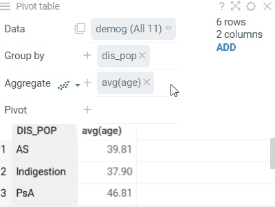    | 
|<h4>[Word cloud](word-cloud.md)</h4>A visual depiction of word frequency.     You can use other aggregation functions to represent the size or color of the specific word.                                                                                                                                                                                |           | 
|<h4>[Density plot](density-plot.md)</h4>Shows density of points for the chosen X and Y columns, unlike [scatter plot](scatter-plot.md) that shows all of them.                                                                                                                                                                                |         | 
|<h4>[Matrix plot](matrix-plot.md)</h4>Shows the relationships between the selected columns using [density plots](density-plot.md) and [histograms](histogram.md).                                                                                                                                                                                                                                                                                                                         |     |                                                                   
|<h4>[Network diagram](network-diagram.md)</h4>Visualizes graphs, with values of the specified two columns as nodes, and rows as edges.     To the right, you see relationships between the _Game of Thrones_ characters. Can you guess what the two clusters are?                                                                                                                                                                                 |      | 
|<h4>[Heatmap](heat-map.md)</h4>A condensed representation of the grid, where it shows all dataset at once with the color-coded cells                                                                                                                                                                                                                                                                                                                        |              | 
|<h4>[Filters](filters.md)</h4>Let you quickly filter and select rows based on the column values.     Filters automatically adjust to the data type and semantics. Built-in filters: numerical, categorical, molecular, sequences, calendar, free text, lists, etc.                                                                                                                                                                                 |              |
|<h4>[Statistics viewer](correlation-plot.md)</h4>Provides descriptive statistical measures for selected columns in your dataset:  average, median, standard deviation, min/max values, and unique and missing value counts. Use it to get a quick numerical summary of your data's distribution and characteristics.                                                                                                                                  |     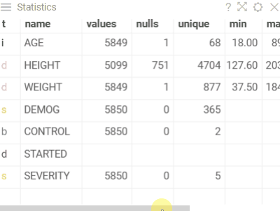|
|<h4>[Correlation plot](correlation-plot.md)</h4>Lets you see correlations between all columns at once. Cells are color-coded by the [Pearsson correlation coefficient](https://en.wikipedia.org/wiki/Pearson_product-moment_correlation_coefficient).     Histograms along the diagonal show the corresponding distribution. Hover over the cell to see the corresponding scatter plot. The grid is sortable.                                                                                                                                                                             |     |                                    
|<h4>[Markup Viewer](markup.md)</h4>Use to host any text, arbitrary HTML content, or markdown-formatted text. In most cases, the viewer will auto-detect content type. Use the "Content Type" property to explicitly specify it.                                                                                                                                                                                   |  |
|<h4>[Scripting viewer](scripting-viewer.md)</h4>Creates custom visualizations using scripts written in R, Python, Julia, or other supported languages.     The viewer automatically generates UI controls for script parameters based on the script's input annotations.                                                                                                                        | 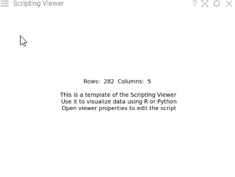 |
|<h4>[Radar](radar.md)</h4>Displays multivariate data on axes starting from the same point, useful for plotting groups of values over several common variables.     Is a part of the [Charts](https://github.com/datagrok-ai/public/tree/master/packages/Charts)   package.                                                                                                                       | 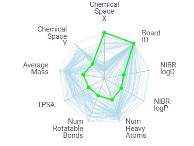 |
|<h4>[Sunburst](sunburst.md)</h4>Shows hierarchical data as concentric rings, where each ring represents a level in the hierarchy.    Is a part of the [Charts](https://github.com/datagrok-ai/public/tree/master/packages/Charts)   package.                                                                                                                            | 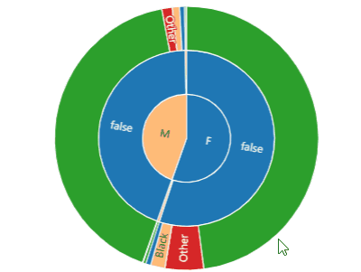 |
|<h4>[Tree viewer](tree.md)</h4>Shows hierarchical data as a tree structure with nodes and connections. Supports color-coding and size-coding.     Is a part of the [Charts](https://github.com/datagrok-ai/public/tree/master/packages/Charts)   package.                                                                                                                             | 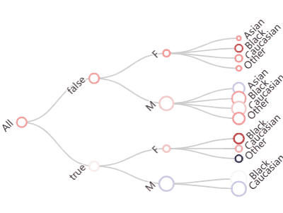 |
|<h4>[Scaffold tree](scaffold-tree.md)</h4>A chemical analysis tool that organizes molecules into a hierarchical tree based on their scaffolds. Supports automatic generation, manual sketching, or loading from a file. Enables color-coding of scaffolds and highlighting of matching molecules.     Is a part of the [Chem](https://github.com/datagrok-ai/public/tree/master/packages/Chem) package.                                                                                                                               | 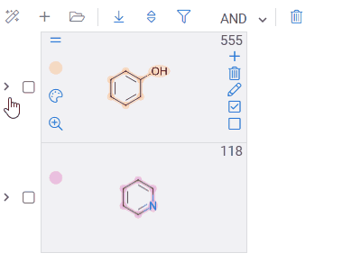 |
|<h4>[Forms viewer](forms.md)</h4>Shows multiple rows as customizable forms positioned side-by-side. Supports color-coding and substructure highlighting.     Is a part of the [Power Grid](https://github.com/datagrok-ai/public/tree/master/packages/PowerGrid) package.                                                                                                                          | 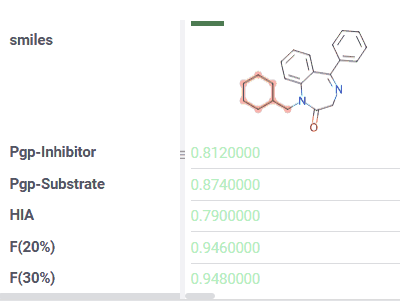 |
|<h4>[Multi curve viewer](multi-curve-viewer.md)</h4>Superimposes multiple in-cell fitted curves onto a single chart for comparative analysis. Supports logarithmic scales and series merging. Particularly useful for dose-response analysis and as an inner viewer in trellis plot.     Is a part of the [Curves](https://github.com/datagrok-ai/public/tree/master/packages/Curves) package.                                                                                                                          | 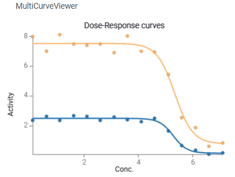 |
|<h4>[Biostructure viewer](biostructure.md)</h4>Mol*-based 3D viewer for molecular visualization and docking analysis. Supports interactive exploration of macromolecules, multiple rendering modes, and opens PDB, CIF, MOL2, and XYZ formats.     Is a part of the [Biostructure Viewer](https://github.com/datagrok-ai/public/tree/master/packages/BiostructureViewer) package.                                                                                                                          |  |
|<h4>[NGL viewer](ngl.md)</h4>Specialized 3D viewer for formats not supported by Mol* (MMTF, PLY, OBJ, CCP4). Use it for these file types or when NGL’s unique rendering capabilities are required.     Is a part of the [Biostructure Viewer](https://github.com/datagrok-ai/public/tree/master/packages/BiostructureViewer) package.                                                                                                                          |  |
|<h4>[Web Logo](web-logo.md)</h4>Visualizes a graphical representation of multiple sequence alignment for amino acids, nucleotides, or modified residues with multi-character labels. Each logo consists of stacks of symbols, one for each position in the sequence.     Is a part of the [Bio](https://github.com/datagrok-ai/public/tree/master/packages/Bio) package.                                                                                                                          | 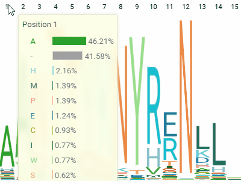 |
|<h4>[Sequence variability map viewer](sequence-variability-map.md)</h4>A matrix-style viewer that displays positions as columns and monomers as rows, operating in two distinct modes: Mutation Cliffs and Invariant Map. It is used in the Peptides SAR analysis.    Is a part of the [Peptides](https://github.com/datagrok-ai/public/tree/master/packages/Peptides) package.                                                                                                                          | 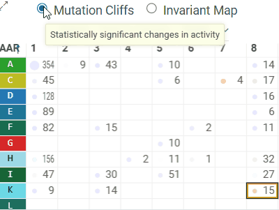 |