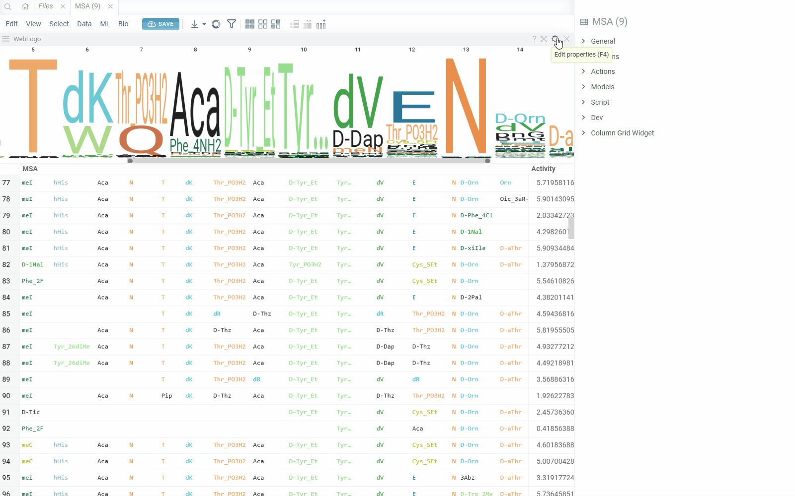

Web Logo is used to visualize a graphical representation of multiple sequence alignment (amino acids or
nucleotides). Each logo consists of stacks of symbols, one stack for each position in the sequence.
The overall height of the stack indicates the sequence conservation at that position,
while the height of symbols within the stack indicates the relative frequency of each amino at that position.

In general, a sequence logo provides a richer and more precise description of, for example, a binding site,
than would a consensus sequence.

You must specify the tag `semType` with value `AminoacidsMultipleAlignment` or
`NucleotidesMultipleAlignment` for the data column with multiple alignment sequences, it is mandatory to
select the palette for monomers' colors.

You can customize the look of the viewer with properties. Properties `startPosition` and `endPosition`
allow to display multiple alignment partially. If property `startPosition` (`endPosition`)
is not specified, then the Logo will be plotted from the first (till the last) position of sequences.

## General

|             |                     |
| ----------- | ------------------- |
| Right click | Context menu        |
| Alt+F       | Show in full screen |

## Properties

| Property name         | Default                    | Description                                                                                                                                            |
| --------------------- | -------------------------- | ------------------------------------------------------------------------------------------------------------------------------------------------------ |
| Sequence              | First Macromolecule column | Source sequence column                                                                                                                                 |
| Value                 | First numeric column       | Column with values used in aggregation for position heights                                                                                            |
| Value Aggr Type       | _count_                    | Aggregation function of the value column                                                                                                               |
| startPositionName     | null                       | name of the first position to display Logo partially                                                                                                   |
| endPositionName       | null                       | name of the last position to display Logo partially                                                                                                    |
| Skip Empty sequences  | true                       | Skip empty sequences in analysis                                                                                                                       |
| Skip Empty positions  | false                      | Do not consider empty positions in aggregations                                                                                                        |
| Shrink Empty tail     | true                       | Skip empty tail (if found for all sequences within a subset) in WebLogo                                                                                |
| Background Color      | white                      | Background color of WebLogo canvas                                                                                                                     |
| Position Height       | Entropy                    | Monomer-Position height mode. Entropy of 100%(full height)                                                                                             |
| Position Width        | 20                         | Width of position in WebLogo. If "Fit Area" is enabled, width will be calculated to fit horizontal space                                               |
| Vertical Alignment    | middle                     | Vertical elignment of weblogo                                                                                                                          |
| Horizontal Alignment  | center                     | Horizontal elignment of weblogo                                                                                                                        |
| Fix Width             | false                      | Fix the width of webLogo without adaptive changes                                                                                                      |
| Fit Area              | true                       | Fit WebLogo to the horizontal space. Calculates position width as maximum between provided width value and value needed to fit whole horizontal space. |
| Min Height            | 25                         | Minimum height of WebLogo                                                                                                                              |
| Max Height            | 300                        | Maximum height of WebLogo                                                                                                                              |
| Max Monomer Letters   | 5                          | Maximum monomer letters to display before shortening                                                                                                   |
| Show Position Labels  | true                       | Show position labels on top of the weblogo                                                                                                             |
| Position Margin State | auto                       | Calculate optimal margins between positions or turn it on/off                                                                                          |
| Position Margin       | 4                          | Margin between positions in WebLogo                                                                                                                    |
| Filter Source         | Filtered                   | Data source for weblogo. Selected or filtered rows.                                                                                                    |

## See also

- [Table view](../../datagrok/navigation/views/table-view.md)
- [Viewers](viewers.md)
