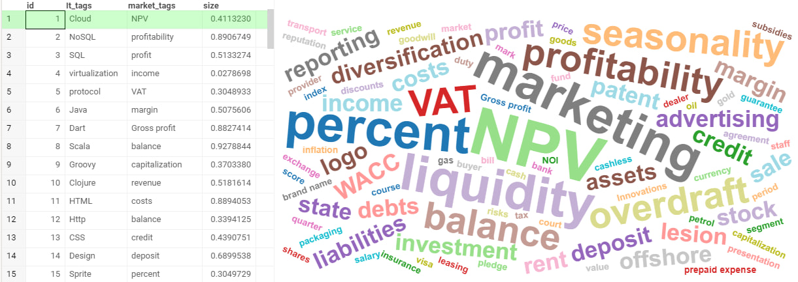
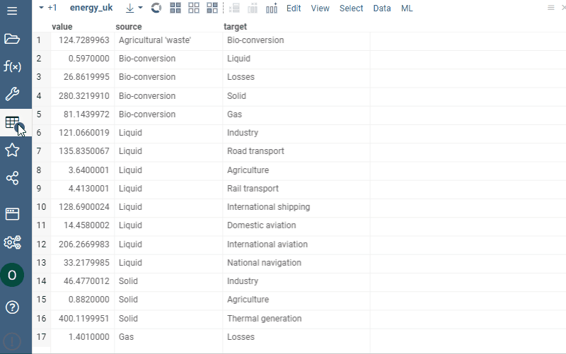

<!-- TITLE: Word cloud -->
<!-- SUBTITLE: -->

# Word cloud

Word cloud (a tag cloud) shows the frequency of individual words using font size
and color. Use it to see the most popular concepts, highlight important textual
data points, compare data, etc.

## Adding

1. Go to **Tables** and expand the **Viewers** panel.
1. Locate the **Word Cloud** icon and click it.

Initially, the viewer picks up the first string column in the corresponding
table and builds a word cloud.

## Settings

To configure a word cloud, click the **Gear** icon on top of the viewer and use
the info panels on the **Context Pane**. For example, you can:

* **Select the word column** using the `Word` property
* **Size-code words** using `Size` and `Size Column Aggr Type` properties
* **Color-code words** using `Color` and `Color Column Aggr Type` properties
* **Limit the number of words to appear in a cloud** using the **Max Words**
  setting.

## Interactivity

A word cloud viewer doesn’t respond to the row selection and data filtering. You
can use it to filter other viewers.

## See also

* [Viewers](../viewers.md)
* [Table View](../../datagrok/table-view.md)
* [JS API: Word cloud](https://public.datagrok.ai/js/samples/ui/viewers/types/word-cloud)
