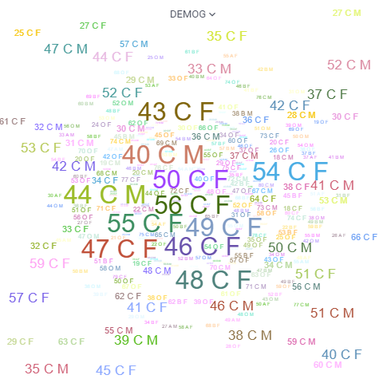

<!-- TITLE: Word cloud -->
<!-- SUBTITLE: -->

# Word cloud

A word cloud is a graphical representation of word frequency. Any other aggregation function can be used as well for
representing size or color of the particular word. On the example of the demographics dataset, to visualize races by
indicating size as number of subjects, and color as average age, use the following settings (open up properties by
pressing F4 or by clicking on the gear icon in the top right corner):

Properties:

|           |         |
|-----------|---------|
| Word      | RACE    |
| Size      |         |
| Size Aggr | #values |
| Color     | AGE     |
| Color     | avg     |

General:

|             |              |
|-------------|--------------|
| Right click | Context menu |

## Videos

See also:

* [Viewers](../viewers.md)
* [Table View](../../overview/table-view.md)
* [JS API: Word cloud](https://public.datagrok.ai/js/samples/ui/viewers/types/word-cloud)
