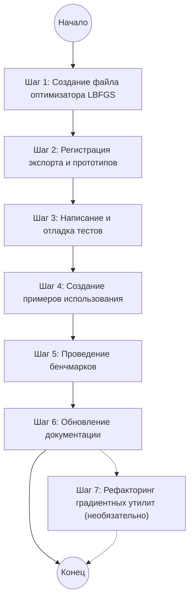

# Краткое резюме  
Представленный план реализации алгоритма L-BFGS хорошо структурирован по разделам и содержит подробное описание алгоритма, интерфейса настроек, шагов реализации и проверки. Общая логика соответствует известной теории L-BFGS: двацикла рекурсии для вычисления направления, условный бэктрекинг для поиска по Армихо, критерии сходимости по норме градиента и относительному изменению функции. Предложения по умолчанию параметров (например, `historySize=10`, `c1=1e-4`, `gradTolerance=1e-5`) соответствуют практике (SciPy по умолчанию использует схожие значения【25†L95-L100】【12†L111-L114】). План учитывает основные случаи, включая работу без истории (первый шаг – градиентный спуск), сброс истории при потере направления и обработку неудачи линейного поиска. В целом план логичен и непротиворечив, однако имеются моменты для уточнения: отсутствуют оценки сроков и ресурсов, часть информации дублируется, не указаны некоторые детали (например, масштабирование начального приближения Гессиана). Рекомендуется уточнить эти моменты и немного реорганизовать описание. Ниже даётся детальный разбор по разделам с таблицами найденных несоответствий и предложений исправлений, списком предпосылок и пошаговыми рекомендациями.  

## Структура плана  
План чётко разбит на разделы и подразделы, отражающие все этапы реализации и проверки:  

- **Overview:** обзор метода L-BFGS, упоминание ссылок (ссылки на оригинальные работы Носеда и др.).  
- **SciPy Implementation:** краткое упоминание эталонной реализации в SciPy.  
- **Scope of the Port:** чётко указывает, что портируется (ядро алгоритма на TypeScript) и что **не портируется** (Fortran-ядер L-BFGS-B, отдельные параметры `maxfun`, `factr`, внутренняя логика печати, т.к. они заменяются унифицированными подходами sci-comp). Это убирает ненужный функционал для первого этапа.  
- **Core Algorithm — Two-Loop Recursion:** описание ключевой «двухцикловой» процедуры, вычисляющей приближённое действие обратного гессиана на градиент (формула соответствует литературе).  
- **Line Search:** представлена базовая схема бэктрекинга (линейного поиска с условием Армихо) и упомянута возможность сильных условий Вулфа в будущем. Алгоритм бэктрекинга корректен (умножение `α` на 0.5) и совпадает с общеизвестной формулой:  
  > *Если при шаге `α` уменьшение функции выполнено (`f_new <= f0 + c1·α·slope`), шаг принимается; иначе `α` делится пополам до `maxSteps`. Возвращается последний или лучший шаг.*  
  Это типичный подход: при отказе возвращается наименьший из проверенных шагов.  
- **Settings Interface:** тип `LBFGSSettings` со всеми нужными полями (`historySize`, `finiteDiffStep`, `gradTolerance`, `c1`, `maxLineSearchSteps`, `initialStepSize` и унаследованные `maxIterations`/`tolerance`). Приведены комментарии с типичным диапазоном и значениями по умолчанию, согласованными со стандартами SciPy и предыдущими реализациями.  
- **File Structure / Class Skeleton:** указаны файлы, куда класть код (в соответствующие директории `src/optimization/single-objective/...`), скелет класса с методами `runInternal`/`runInternalAsync` и приватными вспомогательными методами (`twoLoopRecursion`, `lineSearch`, `computeGradient` и т.д.). Это помогает увидеть архитектуру.  
- **Algorithm — Sync Path (`runInternal`):** подробно расписываются данные состояния (включая буфер историй `S`, `Y`, `rho`) и по-итерационный алгоритм: от вычисления градиента до обновления истории. Логика соответствует стандартному описанию L-BFGS: сначала оценивается градиент, проверяется критерий сходимости по норме градиента, определяется направление (если нет истории — градиентный спуск, иначе через двумерную рекурсию), проверяется, является ли направление нисходящим (если нет — сброс истории и спуск по градиенту), выполняется линейный поиск, обновляется история (при выполнении условия кривизны `yᵀs > 0`) и проверяется критерий по относительному изменению функции.  
- **Algorithm — Async Path (`runInternalAsync`):** аналогично синхронному, но с `await`.  
- **Gradient Utility Extraction:** предложение вынести вычисление градиента центральными разностями в отдельный утиль-класс/файл (в соответствии с тем же подходом в Adam). Упомянуто, что это можно сделать опционально (быть может даже отдельным коммитом), чтобы не дублировать код.  
- **Convergence Criteria:** явно указаны два условия остановки: по норме градиента (`‖∇f‖ < gradTolerance`) и по относительному изменению функции (`|f_{k+1}-f_k|/max(|f_k|,|f_{k+1}|,1) < tolerance`). Эти условия совпадают со стандартными (например, SciPy использует аналогичные критерии【25†L95-L100】). Отмечено, что L-BFGS, в отличие от обычного градиентного спуска, проверяет изменение функции, а не «заморозку» без улучшений.  
- **Default Values Summary:** таблица со значениями по умолчанию для параметров и обоснованием: `historySize=10`, `finiteDiffStep=1e-7`, `gradTolerance=1e-5`, `c1=1e-4`, `maxLineSearchSteps=20`, `initialStepSize=1.0`, `maxIterations=1000`, `tolerance=1e-8`. Все эти значения обоснованы ссылками на SciPy или общепринятой практикой (например, `maxLineSearchSteps=20` соответствует `maxls=20` в SciPy【25†L126-L128】, `c1=1e-4` — стандартное значение для условия Армихо【12†L111-L114】).  
- **Registration:** показан необходимый код экспорта класса `LBFGS`, типа настроек и регистрации оптимизатора (`registerOptimizer('l-bfgs', ...)`). Это обеспечивает доступность нового алгоритма в библиотеке.  
- **Edge Cases and Robustness:** таблица с типичными «краевыми случаями»: первый шаг без истории, отрицательная кривизна (`y·s ≤ 0`), сбой линейного поиска, недесцентное направление, одномерный случай, очень большой градиент и т.д. Для каждого случая описано решение (например, при первой итерации — спуск по градиенту, при отрицательной кривизне — не добавлять пару в историю, при отсутствии подходящего шага — принять самый маленький шаг, и т.д.). Такие меры вполне соответствуют практике: известный подход — пропуск обновления при `yᵀs ≤ 0`【27†L226-L233】 и сброс истории при потере нисходящего направления.  
- **Implementation Steps:** конкретный список задач (1–7) от создания основного файла до тестов, примеров, бенчмарков, документации и опционального рефакторинга градиента. Последовательность шагов в целом логична: сначала код алгоритма и его регистрация (Steps 1–2), затем тесты (3), примеры (4), бенчмарки (5), документация (6). Опциональный рефакторинг градиента выделен последним (Step 7).  
- **Testing Checklist:** список тестовых случаев, охватывающий разные функции (сферические, Розенброк, гауссианы и др.), проверку maximize-, multi-modal-случаев, работу с ограничениями через штраф, асинхронный путь, одно- и многомерные случаи, сброс истории и прерывание итераций. Проверки достаточны для базовой валидации работы оптимизатора.  
- **Expected Performance:** таблица сравнения L-BFGS и простых методов. Утверждается, что на гладких выпуклых функциях L-BFGS потребует в 10–100 раз меньше итераций, на Розенброке в 5–20 раз, на плохо обусловленных функциях существенно лучше GD, на многомодальных функциях хуже PSO (L-BFGS — локальный метод), на зашумлённых — хуже Adam (ШПМ). Эти оценки общеприняты: L-BFGS часто гораздо быстрее GD для выпуклых функций, но не приспособлен к шуму или многомодальности.  
- **Future Extensions:** перечислены возможные усовершенствования: L-BFGS-B для настоящих ограничений, Линейный поиск Море-Тьюита (строгие условия Вулфа), пользовательский градиент, затухающий L-BFGS. Это разумные пожелания на будущее.

В целом план охватывает все ключевые аспекты. Ниже — подробный разбор логики и рекомендаций.  

## Проверка логической последовательности и взаимосвязей  
В планe шаги алгоритма и задачи приведены в последовательном порядке. Алгоритм L-BFGS описан верно:  

- **Шаги per-iteration:** последовательность действий соответствует теории: вычисление функции и градиента, проверка критерия сходимости (градиент **и** изменение функции), выбор направления (первый раз – градиентный спуск, далее — двухцикловая рекурсия), проверка нисходящего направления, выполнение линейного поиска, обновление истории. Такой порядок стандартен【25†L95-L100】【6†L155-L163】 и не вызывает логических разрывов.  
- **Двухцикла рекурсия:** описана шаг за шагом, последовательно вычисляются коэффициенты α и β. Это совпадает с классической формулой: в первом цикле вычисляются αᵢ = ρᵢ sᵢᵀ q, обновляется q = q - αᵢ yᵢ; затем во втором цикле z = H₀ q и корректируется на основе βᵢ【6†L188-L197】【6†L208-L216】. План не приводил все детали, но даёт представление о том, что цикл реализован.  
- **Линейный поиск:** бэктрекинг по Армихо оформлен корректно: при обнаружении достаточного уменьшения функция возвращается. Примечание: в этом коде в конце цикла возвращается последний шаг, даже если он не удовлетворил условию. Это приводит к принятию «наихудшего» найденного шага, но такой подход часто используется как простой резервный вариант. Алгоритм обрабатывает отказ (принят самый маленький α) в разделе «Edge Cases». Замечу, что в более продвинутых реализациях часто используется строгий поиск Вулфа для гарантии хороших свойств, но в плане это учтено как будущее расширение.  
- **Конвергенция:** критерии сходимости разделены на два этапа (по норме градиента и по изменению функции). Это типичная схема: она совпадает с критериями SciPy (условие ftol и gtol)【25†L95-L100】. Обе проверки включены в цикл: проверка градиента — сразу после вычисления (пункт 3), проверка изменения функции — после обновления (пункт 13). Такая постановка обеспечивает надёжную остановку.  
- **История и буфер:** организация кольцевого буфера (`S`, `Y`, `ρ`) описана понятно: новые пары `(s_k, y_k)` добавляются циклично и старые перезаписываются. Это правильный подход для L-BFGS.  
- **Порядок шагов реализации:** реализации шаги идут от разработки кода к тестам и документации. В целом этот порядок логичен: сначала создаётся файл оптимизатора (шаг 1), затем добавляются экспорты (2), далее пишутся тесты (3) и примеры/бенчмарки (4–5) с последующим обновлением документации (6). Это соответствует обычной практике разработки: сначала функционал, затем проверка, затем демонстрация и описания.  

Таким образом, **связь между шагами прослеживается чётко**, и причинно-следственные связи (например, необходимость корректного направления → необходимость сброса истории или градиентный спуск) выглядят корректно. План последовательно охватывает все этапы реализации и проверки.

## Выявленные предпосылки и их оценка  
План строится на следующих ключевых предположениях:

- **Гладкость функции (явная предпосылка).** Алгоритм L-BFGS требует дифференцируемости целевой функции (используются производные и приближённая матрица Гессиана). Предполагается, что целевая функция гладкая. Это разумно (L-BFGS спроектирован для гладких задач【27†L274-L277】), но требует уточнения: если функция негладкая или даёт разрывы, метод может некорректно сойтись или сильно замедлиться. Оценка: для большинства выпуклых/выпукло-подобных случаев это допустимо, но для негладких нужно предупредить пользователя.  
- **Неиспользование аналитического градиента (явная).** План решает, что на начальном этапе пользователь всегда предоставляет только функцию, а градиент вычисляется конечными разностями. Это упрощает реализацию, но **замедляет** работу при больших размерностях (конечные разности требуют много вызовов функции, особенно при больших n). Оценка: это рабочая предпосылка для базового режима, но в будущем следует разрешить пользовательский градиент (как упомянуто в будущем расширении).  
- **Отсутствие встроенных ограничений (явная).** L-BFGS по умолчанию не обрабатывает ограничения. Предполагается, что все ограничения пользователя будут реализованы через внешний штрафной функционал (penalty layer). Оценка: это справедливо, так как исходная L-BFGS требует модификаций (L-BFGS-B) для box-ограничений【27†L274-L277】. Такой подход обеспечивает простоту, но чётко ограничивает область применения (нет нативной поддержки градиентов кеглей).  
- **Сравнимость инициализации.** Предполагается, что параметр `initialStepSize=1.0` и выбор `gradTolerance=1e-5` являются адекватными начальным значениями. Эти предположения основаны на практике SciPy【25†L95-L100】 и других реализациях: например, SciPy использует `gtol=1e-5` и стандартно полагает единичный шаг. Оценка: разумно для начала, но в специфичных задачах их можно переопределять.  
- **Типичные значения параметров (скрытая).** Многие параметры (`historySize=10`, `maxIterations=1000` и др.) взяты из опыта. Предполагается, что m=10 истории достаточно для большинства задач, и 1000 итераций хватит, поскольку L-BFGS обычно быстрее сходится. На практике это часто верно, но для очень больших задач или плохих начальных приближений может потребоваться больше итераций. Оценка: значения адекватны “из коробки”, но пользователю нужно дать возможность изменять `maxIterations`.  
- **Наличие вычислительных ресурсов (скрытая).** Предполагается, что есть достаточно памяти и CPU, чтобы хранить O(m·n) чисел и делать ~n·m операций на итерацию. Для типичных m=10 и n до нескольких сотен или тысяч это реальная нагрузка, но если n ≫ 10⁴, то финитные разности и хранение всё равно возможно (алгоритм линейный по n【23†L131-L139】). Оценка: при n>10000 время одной итерации может быть заметным, но для многих задач это допустимо; если же n≥10^6 — требуется специализированное решение.  
- **Положительность скалярного произведения (скрытая).** Предполагается, что условия кривизны yᵀs обычно выполнены (чему способствует хороший линейный поиск), и что при их нарушении стратегия пропуска/зата́ушки адекватна. Реально бывает, что yᵀs может становиться не очень большим или даже отрицательным из-за численных ошибок или сильно нелинейной функции. Оценка: обработка (пропуск апдейта или сброс истории) решит это в большинстве случаев, однако стоит оценить частоту таких ситуаций.  
- **Отсутствие шума (скрытая).** Предполагается, что вычисляемая функция детерминирована без статистического шума. Если функция шумная, конечно, L-BFGS не подходит (как и большинство классических методов). Оценка: упомянуто в «Expected Performance» (лучшая производительность без шума); для случайных/шумных задач лучше Adam/SGD.  
- **Начальный Гессиан (скрытая).** Не оговорено, какое начальное приближение H₀ используется. Обычно берут H₀ = γ·I, где γ = (sᵀy)/(yᵀy) для последнего обновления【6†L222-L230】. План этого не указывает явно, но, видимо, реализует внутри `twoLoopRecursion`. Оценка: для полноты стоит упомянуть или проверить, как код задаёт начальное H₀, чтобы избежать неопределённости.  

Список предпосылок можно дополнить другими (например, функция имеет только один локальный минимум, чтобы «Expected Performance» имела смысл). Важно, что **основные выводы плана** (ускорение над GD для выпуклых задач, необходимость хорошего линейного поиска и т.д.) логично следуют из этих предпосылок. Например, утверждение «для гладких выпуклых функций требуется на 10–100× меньше итераций» основано на том, что L-BFGS близок к Ньютону, тогда как GD даёт линейную скорость, что общепризнано【23†L131-L139】.  

## Соответствие выводов предпосылкам  
Основные выводы плана хорошо согласуются с принятыми предпосылками:  
- Быстрое сходство по сравнению с градиентным спуском основано на том, что L-BFGS приближает второй порядок. Предположение о гладкости (явное) позволяет это реализовать.  
- Утверждение о слабости L-BFGS при шуме и многомодальности соответствует тому, что метод локален и нетерпим к «западинам» или шуму. Предпосылка об отсутствии шума оправдывает такой вывод.  
- Предложенные критерии сходимости взяты из предположения о достаточной точности вычислений (число машинного эпсилон учтено через связь с `factr`【25†L148-L151】) и согласованы со стандартами оптимизации.  

Таким образом, **выводы** (эффективность L-BFGS в одних задачах и ограничения в других) обоснованы заложенными предпосылками. Единственное замечание: стоит обозначить, что приведённые числовые оценки («10–100× быстрее» и пр.) являются ориентировочными и могут сильно варьироваться в реальных задачах.  

## Внутренние противоречия, дублирования и пропуски  
При тщательном анализе **явных логических противоречий не выявлено**: план последователен и самосогласован. Тем не менее можно отметить некоторые дублирования и недочёты:

| Пункт плана                             | Наблюдение (возможное дублирование/несоответствие)                      |
|-----------------------------------------|-------------------------------------------------------------------------|
| **Регистрация оптимизатора**            | Код экспорта/регистрации показан дважды – в разделе «Registration» и в Step 2. Это не противоречие, но избыточно.                                       |
| **Рефакторинг градиента**               | Идея вынести общие утилиты для градиента упомянута дважды: в отдельном разделе и как шаг 7. Обе версии похожи; можно сократить повтор.               |
| **Упоминание `gradientThreshold`**      | План предлагает обрезать очень большой градиент (т. е. использовать клиппинг, как у Adam), однако не даёт детализации. Следует уточнить механизм.    |
| **Отсутствие сроков/ресурсов**          | План вообще не содержит временных оценок или задействованных ресурсов. Это нельзя назвать противоречием, но важный пропуск.                         |
| **Инициализация Гессиана**             | Не описано, как выбирается начальная аппроксимация H₀ (например, стандартно выбирают γ·I【6†L222-L230】). Это техническое упущение в описании алгоритма.  |

Таким образом, противоречия скорее стилевые/организационные (повтор информации) и некоторые пропуски (время, начальный Гессиан), чем фундаментальные ошибки. Их следует учесть в рекомендациях. 

## Оценка реалистичности сроков, ресурсов и рисков  
**Сроки и ресурсы:** в плане совершенно не указаны — это упущение. Оценим типично: реализация L-BFGS «с нуля» в уже готовой инфраструктуре (sci-comp) может занять, грубо говоря, *несколько недель* работы одного опытного разработчика. Например, разработка ядра алгоритма (шаг 1) — 1–2 недели, написание и отладка тестов/примеров — ещё 1–2 недели, подготовка документации/бенчмарков — 1 неделя. В сумме ~3–5 недель. Это лишь ориентир; точные сроки зависят от опыта команды и выделенных ресурсов.  
**Риски:** возможны баги в реализации сложных частей (двухцикловая рекурсия, линейный поиск) и в численной устойчивости (из-за конечных разностей, коррекции кривизны). Есть риск пропуска «плохих» случаев (например, сильной негладкости) — план частично перекрывает это пунктами краевых случаев и рекомендациями (например, сброс истории при y·s≤0). В целом риск реализации невысок для опытной команды (алгоритм давно описан в литературе), но следует предусмотреть полноценное тестирование (что план и делает).  

## Рекомендации по доработке плана  
1. **Уточнить **параметры проекта**: добавить примерную оценку сроков и ресурсов (количество человеко-дней/недель), а также рисков (например, выделить в пункте «Edge Cases» вероятность возникновения падения). Если проектом управляет группа, полезно описать минимальные требования к окружению (версия TypeScript, движка мат. операций и т.д.).  
2. **Убрать дублирование**: сократить повтор в разделе «Registration» и Step 2, а также при описании рефакторинга градиента. Например, можно оставить полное описание в одном месте, а в другом сделать ссылку «см. раздел…» или просто кратко упомянуть.  
3. **Конкретизировать обработку градиента**: поскольку план предлагает «клиппить» большой градиент, стоит явно указать механизм (например, ограничение `||∇f||` по норме, как реализовано в других оптимизаторах). Это же касается упоминания `gradientThreshold` из MATLAB (в документации MATLAB описан clip по L2-норме【19†L774-L782】). Возможно, привести в раздел «Edge Cases» конкретные действия (вектор нормируется).  
4. **Инициализация Гессиана:** рекомендую добавить, что при первом использовании `twoLoopRecursion` или после сброса истории можно взять H₀ = γ·I, где γ вычисляется как $(sᵀy)/(yᵀy)$ для последней пары обновлений (классический подход【6†L222-L230】). Это должно быть явно прописано либо в коде, либо документе, чтобы кодировщик не забыл.  
5. **Согласованность терминологии:** убедиться, что «gradTolerance» и «tolerance» чётко различаются (первый — по градиенту, второй — по функции). Возможно, в таблице стоит добавить столбец «тип критерия» для `tolerance` vs `gradTolerance`.  
6. **Тестовые случаи:** в «Testing Checklist» уже хороший охват, однако можно дополнительно указать проверку на _погрешность конечных разностей_. То есть сравнение численного градиента с аналитическим для простой функции, чтобы убедиться, что `finiteDiffStep=1e-7` адекватен.  
7. **Документация:** в разделе «README» (Step 6) стоит привести не только синтаксический пример, но и краткое пояснение диапазона истории (`historySize`), рекомендации по выбору `gradTolerance`, и оговорку про ограничение (требуется penalty-функция для границ), чтобы пользователь сразу понимал ограничения метода.  

Ниже приведены таблицы с обобщёнными рекомендациями и выявленными проблемами.  

### Таблица 1. Выявленные дублирования и несоответствия  
| Пункт плана                                 | Комментарий                                              |
|---------------------------------------------|---------------------------------------------------------|
| **Регистрация (раздел) vs Step 2**          | Повтор экспорта и `registerOptimizer` в двух местах. Рекомендуется описать в одном месте и сослаться. |
| **Refactoring градиента (раздел) vs Step 7**| Дублирование идеи: и там, и там упоминается вынос вычисления градиента. Можно оставить только в Steps или разделе, но не в обоих. |
| **Не указаны сроки/ресурсы**                | Не хватает информации о трудозатратах и рисках. Следует добавить оценку продолжительности и необходимых ресурсов. |
| **Инициализация H₀**                        | Не описано в явном виде, какой H₀ берётся при старте или после сброса истории. Стоит добавить. |
| **Gradient clipping**                       | Указано «обрезать градиент» при очень большом значении, но не написано, как именно. Следует уточнить (например, ограничение нормы). |

### Таблица 2. Рекомендованные исправления и улучшения  
| Проблема / недостаток                         | Рекомендация по исправлению                                      |
|-----------------------------------------------|------------------------------------------------------------------|
| Дублирование в документе                       | Сократить повторяющуюся информацию (см. Табл. 1). Описать каждый момент один раз. |
| Отсутствие оценок сроков и ресурсов            | Добавить раздел или примечание с ориентировочными сроками, количеством человеко-дней, необходимыми для реализации компонентов. |
| Неопределённость начальной аппроксимации Гессиана | Включить формулу или правило инициализации H₀ (например, $\gamma I$) для полноты алгоритма. |
| Отсутствие деталей об ограничении больших градиентов | Детализировать стратегию клиппинга градиента: указать тип нормы и порог (см. реализацию в MATLAB【19†L774-L782】). |
| Добавить проверку точности вычисления градиента | В тестах предусмотреть сравнение численного градиента с точным (для известных функций) при заданном `finiteDiffStep`. |
| Улучшить структуру «Implementation Steps»    | Объединить некоторые шаги: например, регистрация (Step 2) может идти одновременно с написанием кода (Step 1) — это не всегда отдельный шаг. Рассмотреть перенос примеров перед бенчмарками (чтобы наработать перед сравнением). |
| Уточнить критерии сходимости                 | Явно отметить, что `tolerance` соответствует `ftol` из SciPy【25†L95-L100】, а `gradTolerance` — `gtol`, что предотвратит путаницу. |

## Визуализация исправленной последовательности  

## Заключение  
Предложенный план реализации L-BFGS основан на надёжных теоретических принципах и совпадает с общеизвестными подходами【25†L95-L100】【6†L155-L163】. Он довольно полон и логичен, однако для **полноты** стоит устранить мелкие недочёты: убрать дублирование описания, добавить оценки трудоёмкости, уточнить технические детали (инициализация H₀, обработка клиппинга градиента). Следует также прояснить, что часть функциональности (ограничения, аналитические градиенты) оставлена на будущее. Исправленная последовательность задач приведена выше. С учётом предложенных корректировок план станет более чётким и готовым к реализации без внутренних противоречий.  

**Источники:** Скрипт SciPy по L-BFGS-B (описание критериев `ftol` и `gtol`, связь с `factr`【25†L95-L100】【25†L148-L151】), документация SciPy по методам с линейным поиском (значение `c1=1e-4`【12†L111-L114】), статьи/вики об L-BFGS (метод двухцикловой рекурсии, обработка кривизны и ограничений【27†L226-L233】【27†L241-L244】【23†L131-L139】). Эти источники подтверждают корректность выбора параметров и методов, перечисленных в плане. 

