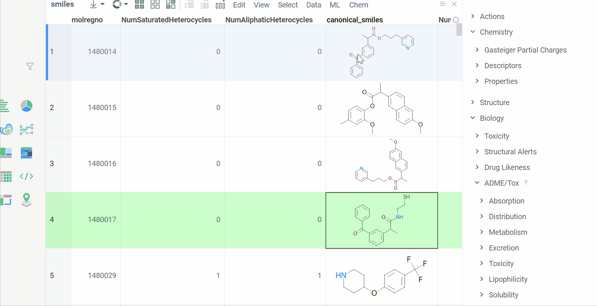
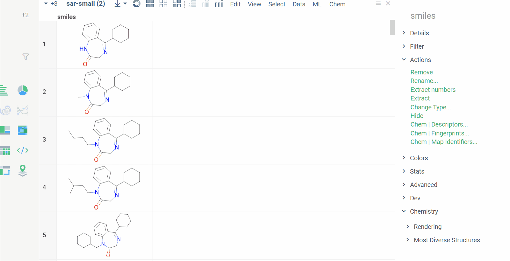
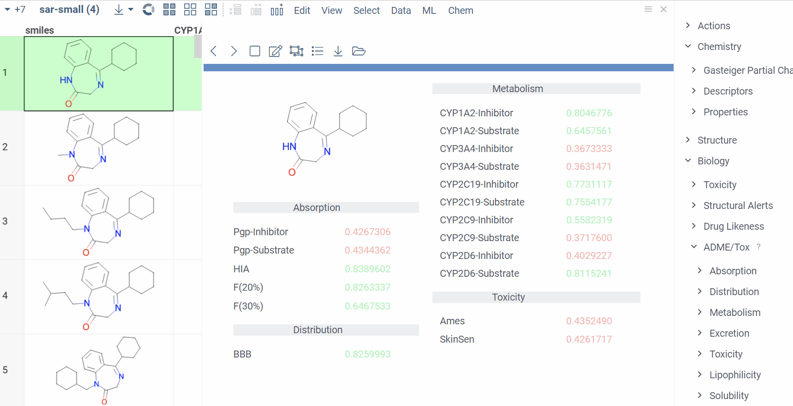

# ADMETox

The ADMETox package provides an outstanding opportunity to evaluate such molecule properties as absorption, distribution, metabolism, excretion and toxicity, also known as ADMET. The main purpose of this package is to make it possible to filter molecules and select those that satisfy a specific criteria of the research.

Models binary files have been taken from the [ADMETlab](https://github.com/ifyoungnet/ADMETlab) repository and are open-source.
 
With this package/tool you can:
* Obtain predictions both for a single structure and for the column
* Get a well designed and comfortably organized form for every structure of your dataset
* Get a deeper understanding of what each of values mean with the help of our tooltips and color coding tools

In order to evaluate predictions for a single molecule, click on it, go to the Context Panel and expand the ADME/Tox pane.

To calculate the properties for the whole column, go to the top-menu and select Chem | ADME/Tox | Calculations… After that molecules with desired properties can be simply filtered using standard tools the platform provides. 

In addition to this, you can add the form with all the computations. Form is a powerful tool for the analysis as it is perfectly structured and well-designed. 
Just go to the top-menu and select Chem | ADME/Tox | Add form…

See also: 
  * [ADMETlab](https://github.com/ifyoungnet/ADMETlab)
  * [Docker Containers](https://datagrok.ai/help/develop/how-to/docker_containers)