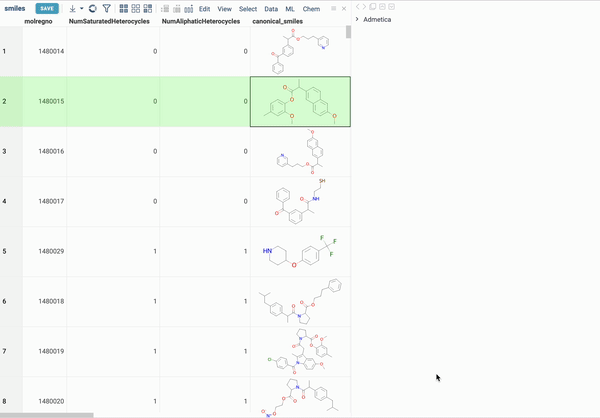

# Admetica

The Admetica package integrates [Admetica](https://github.com/datagrok-ai/admetica), an open-source tool that provides an outstanding opportunity to evaluate ADMET properties. The main objective of this package is to allow researchers to filter molecules and select those that satisfy a specific criteria of the research.
 
With this package you can:
* Get predictions for both individual structures and entire columns in your dataset.
* Obtain a well-designed form and a VlaaiVis pie chart for each structure of your dataset to visualize your data effectively.
* Gain a deeper understanding of each value with the help of tooltips and color-coding features.

To evaluate predictions for a single molecule:
* Select the molecule of interest.
* Navigate to **Context Pane > Admetica**.
* Expand the relevant panes (Absorption, Distribution, Excretion, Toxicity, Summary) to view detailed results.

To calculate the properties for the whole column:
* Go to the **Top menu > Chem > Admetica > Calculate…**
* In the dialog select:
  - **Table**: Select the table you want to work with.
  - **Molecules**: Select the column with molecules.
  - **Template**: Select the template that defines how to interpret the results.
  - **Properties**: Select the properties you want to calculate.
  - **Add piechart**: Select to include a pie chart visualizing the data.
  - **Add form**: Select to include a form.
* Click **OK** to get the results

After that molecules with desired properties can be simply filtered using standard tools the platform provides. 

See also: 
* [Docker Containers](https://datagrok.ai/help/develop/how-to/docker_containers)