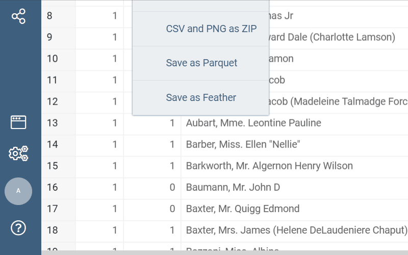
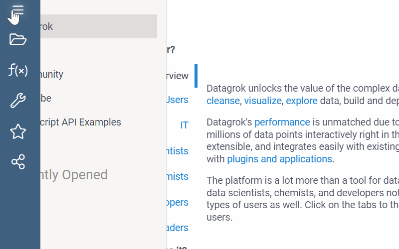

# Arrow

Arrow is a [package](https://datagrok.ai/help/develop/#packages) for the [Datagrok](https://datagrok.ai) platform that provides us with the opportunity to work with parquet and feather file formats.

It is based on such excellent libraries as:

* [apache-arrow](https://www.npmjs.com/package/apache-arrow) library developed by Kouhei Sutou and others.
* [parquet-wasm](https://www.npmjs.com/package/parquet-wasm) library developed by Kyle Barron.

## File exporters

This package implements [custom file exporters](https://datagrok.ai/help/develop/how-to/file-exporters) for parquet and feather file types. This is how it looks in action:

## File handlers

This package implements [custom file handlers](https://datagrok.ai/help/develop/how-to/file-handlers) for parquet and feather file types. This is how it looks in action:

See also:

* [apache/arrow](https://github.com/apache/arrow/tree/4b3f4677b995cb7263e4a4e65daf00189f638617)
* [Parquet API Documentation](https://kylebarron.dev/parquet-wasm/modules/bundler_arrow1.html)
