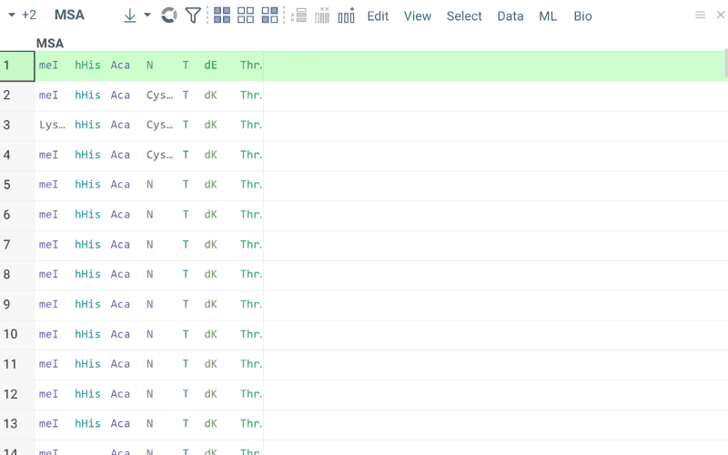
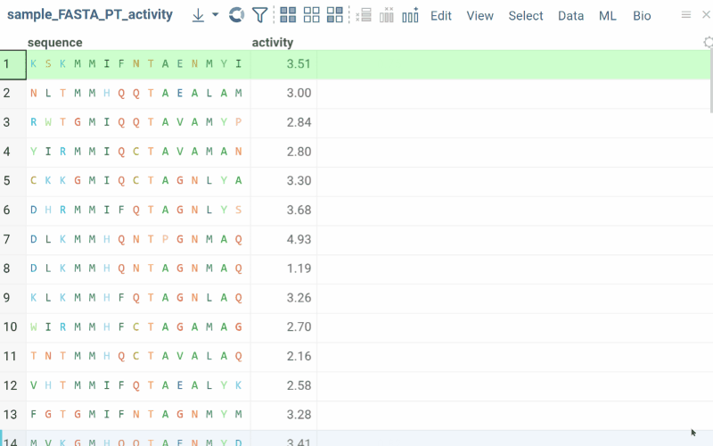
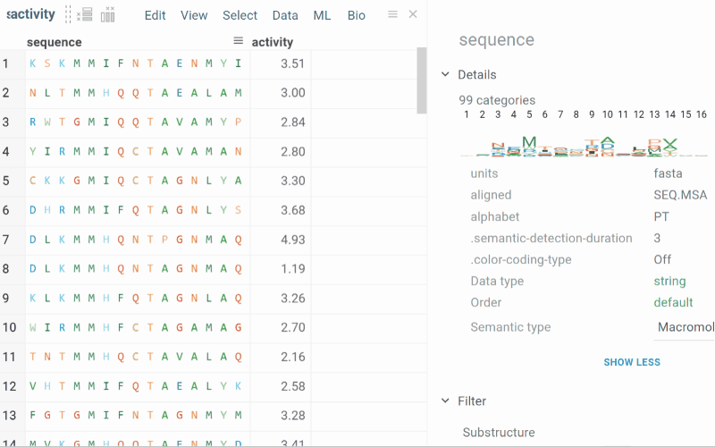
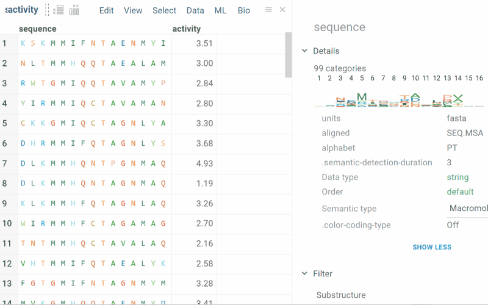
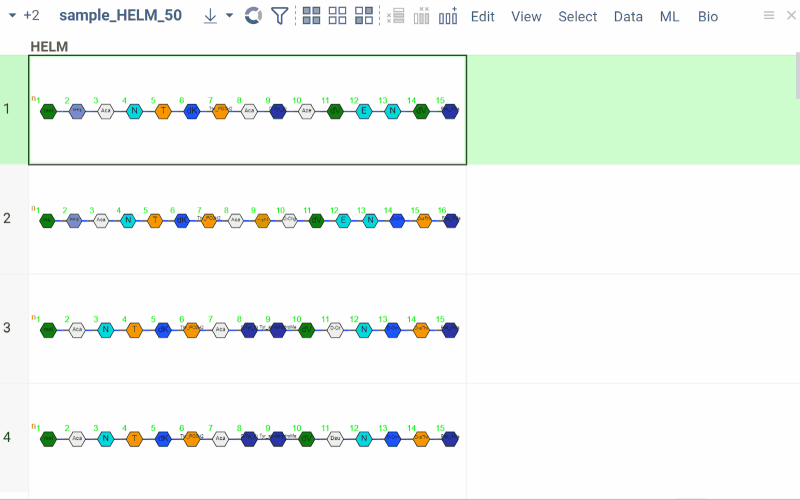
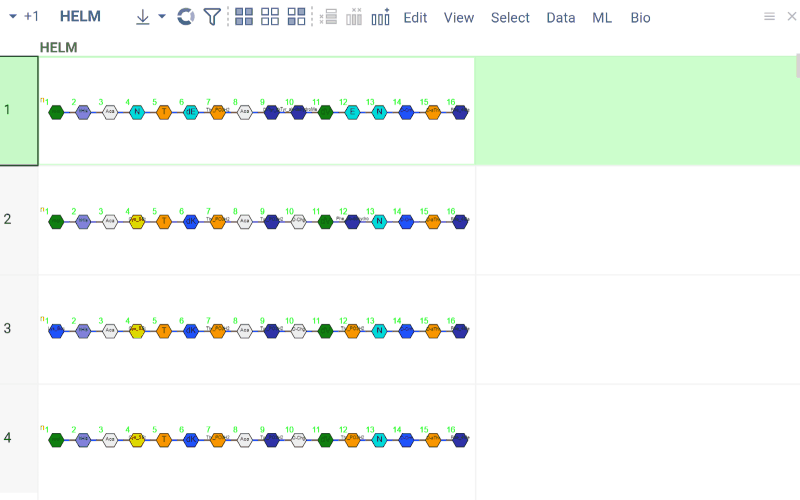

# Bio

Bio is a bioinformatics support [package](https://datagrok.ai/help/develop/#packages) for the
[Datagrok](https://datagrok.ai) platform with an extensive toolset supporting SAR analysis for small molecules
and antibodies.

## Notations

[@datagrok/bio](https://github.com/datagrok-ai/public/tree/master/packages/Bio) can ingest data in multiple file
formats (such as fasta or csv) and multiple notations for natural and modified residues, aligned and non-aligned forms,
nucleotide and amino acid sequences. The sequences are automatically detected and classified while preserving their
initial notation. Datagrok allows you to convert sequences between different notations as well.

To convert sequences, go to **Bio** > **Convert** > **Notation...** and configure the parameters:

- **Data**: Select the table containing the sequences.
- **Sequences**: Choose the column with sequence data.
- **Target Notation**: Select the desired output format (fasta, helm, separator).
- **Separator**: If converting to **separator**, specify the delimiter (e.g., `-`, `.`, `/`).


See: 

* [detectMacromolecule()](../Bio/detectors.js)
* [class SeqHandler](../../libraries/bio/src/utils/seq-handler.ts)

## Atomic-Level structures from sequences

For linear sequences, the linear form (see the illustration below) of molecules is reproduced. This is useful
for better visual inspection of sequence and duplex comparison. Structure at the atomic level could be saved in available
notations.


You can easily run this feature for any sequence data using the Bio package and accessing it from the top menu.


See:

* [getMolfilesFromSeq()](./src/utils/atomic-works.ts)

## MSA

For multiple-sequence alignment, Datagrok uses the “kalign” that relies on the Wu-Manber string-matching algorithm
[Lassmann, Timo. _Kalign 3: multiple sequence alignment of large data sets._ **Bioinformatics** (2019).pdf](https://academic.oup.com/bioinformatics/advance-article-pdf/doi/10.1093/bioinformatics/btz795/30314127/btz795.pdf).
“kalign“ is suited for sequences containing only natural monomers. Sequences of a particular column can be analyzed using the MSA algorithm available at the top menu. Aligned sequences can be inspected for base composition
at the position of the  MSA result. User is also able to specify custom gap open, gap extend and terminal gap penalties for alignment.


See:

* [runKalign()](src/utils/multiple-sequence-alignment.ts)

## Splitting to monomers

Splitting to monomers allows splitting aligned sequences in separate monomers.



See:

* [splitAlignedSequences()](../../libraries/bio/src/utils/splitter.ts)

## Web Logo

Web Logo visualizes a graphical representation of multiple sequence alignment (amino acids or nucleotides or
modified residues with multi-char labels). Each logo consists of stacks of symbols, one for each position
in the sequence. The overall height of the stack indicates the sequence conservation at that position,
and the symbol height within the stack indicates the relative frequency of each residue at that position.
In general, a sequence logo provides a more detailed and precise description of, for example, a binding site
than would a consensus sequence.
The most helpful feature for exploration analysis with WebLogo in Datagrok is its ability to control selection
on a dataset. Mouse click on a particular residue in a specific position will select rows of the dataset
with sequences containing that residue at that position.

You must specify the tag `semType` with the value `Macromolecule` and tag `alphabet` of choice ('PT', 'DNA', 'RNA')
for the data column with multiple alignment sequences, it is mandatory to select the palette for monomers' colors.

You can customize the look of the viewer with properties. Properties ```startPosition``` and ```endPosition```)
allow to display multiple alignments partially. If property ```startPosition``` (```endPosition```)
is not specified, then the Logo will be plotted from the first (till the last) position of sequences.

### General

|             |              |
|-------------|--------------|
| Right click | Context menu |

### Properties

| Property name        | Default  | Description                                                                                                             |
|----------------------|----------|-------------------------------------------------------------------------------------------------------------------------|
| positionWidth        | 16       | Width of one position stack [px]                                                                                        |
| minHeight            | 50       | Minimum height of Logo [px]                                                                                             |
| maxHeight            | 100      | Maximum height of Logo [px]                                                                                             |
| considerNullSequence | false    | Should logo consider null seqences of data                                                                              |
| sequenceColumnName   | null     | source of multiple alignment sequences (column name)                                                                    |
| startPositionName    | null     | name of the first position to display Logo partially                                                                    |
| endPositionName      | null     | name of the last position to display Logo partially                                                                     |
| fixWidth             | false    | Plot takes full width required for sequence length                                                                      |
| verticalAlignment    | 'middle' | choices: ['top', 'middle', 'bottom']                                                                                    |
| horizontalAlignment  | 'center' | choices: ['left', 'center', 'right']                                                                                    |
| fitArea              | true     | Should control to be scaled to fit available area for viewer                                                            |
| shrinkEmptyTail      | true     | Shrink sequences' tails empty in filtered sequences                                                                     |
| skipEmptyPositions   | false    | Skip positions containing only gap symbols in all sequences                                                             |
| positionMarginState  | 'auto'   | choices: ['auto', 'enable', 'off'] Margin between positions. auto - enables margins for sequences of multichar monomers |
| positionMargin       | 0 or 4   | 4 - for sequences of multichar monomers, 0 - single char                                                                |
| positionHeight       | '100%'   | choices: ['100%', 'Entropy'] The way to calculate overall monomers stack height at position                             |


See also:

* [WebLogo](../../help/visualize/viewers/web-logo.md)
* [Viewers](../../help/visualize/viewers/viewers.md)
* [Table view](../../help/datagrok/concepts/table.md)

## Sequence space

Datagrok allows visualizing multidimensional sequence space using a dimensionality reduction approach.
Several distance-based dimensionality reduction algorithms are available, such as UMAP or t-SNE.
The sequences are projected to 2D space closer if they correspond to similar structures, and farther
otherwise. The tool for analyzing molecule collections is called 'Sequence space' and exists in
the Bio package. Depending on the sequence type, different distance functions will be used, like [Levenstein](https://en.wikipedia.org/wiki/Levenshtein_distance) for DNA/RNA, [Needleman-Wunsch](https://en.wikipedia.org/wiki/Needleman%E2%80%93Wunsch_algorithm) for Proteins and [Hamming](https://en.wikipedia.org/wiki/Hamming_distance) for already aligned sequences. The process is conducted by web-workers and is parallelized, which yields very fast and non-interrupting computing.

To launch the analysis from the top menu, select Bio | Structure | Sequence space.



See:

* [sequenceSpace()](src/analysis/sequence-space.ts)

## Sequence activity cliffs

Activity cliffs tool finds pairs of sequences where small changes in the sequence yield significant
changes in activity or any other numerical property. Open the tool from the top menu by selecting.
Similarity cutoff and similarity metrics are configurable. As in Sequence space, you can select
from different dimensionality reduction algorithms.
A custom scatter plot with cliffs will be added to the right side of the grid. The user has the option to show only cliffs and also to inspect them and highlight differences between similar sequences.  

To launch the analysis from the top menu, select Bio | SAR | Sequence Activity Cliffs.


See:

* [getActivityCliffs()](../../libraries/ml/src/viewers/activity-cliffs.ts)

## Similarity Search

Similarity Search tool allows users to find sequences that are most similar to the target sequence. The tool can be accessed from the top menu of bio. It first constructs the distance matrix for all sequences and then uses it to find the most similar ones to the selection. Upon selecting similar sequences from the docked grid below, detailed differences will be shown in the context panel.

To launch the search from the top menu, select Bio | Search | Similarity Search



## Diversity Search

Diversity Search tool allows users to find sequences that are most diverse in the given dataset. The tool can be accessed from the top menu of bio. By default, the number of diverse sequences will be 10.

To launch the search from the top menu, select Bio | Search | Diversity Search



## Sequence scoring

Sequence scoring allows users to calculate sequence identity and similarity scores, given the reference sequence and add the results as a column. Sequence scoring functionality can be found in the top menu: Bio → Calculate.

### Identity

The identity score represents a fraction of the identical monomers in corresponding positions.

Identity scoring can be found in the top menu: **Bio → Calculate → Identity...**.



### Similarity

The similarity score represents the sum of fingerprint similarity of monomers in corresponding positions.

Similarity scoring can be found in the top menu: **Bio → Calculate → Similarity...**.


