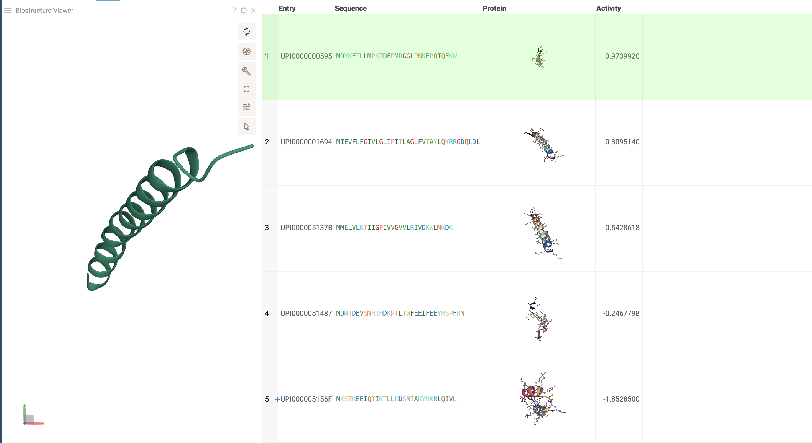

# BioNeMo

The BioNeMo package integrates advanced models for protein structure prediction and molecular docking. It features **EsmFold**, which predicts 3D protein structures from amino acid sequences, and **DiffDock**, which predicts molecular interactions with proteins.

## EsmFold model

EsmFold predicts 3D structures of proteins based on their amino acid sequences.

To apply EsmFold to an **entire column**:
* Navigate to the top menu and select `Bio > BioNemo > EsmFold`.
* In the dialog:
  - **Choose the dataframe**: Select the dataframe containing your sequences.
  - **Select the column with sequences**: Choose the column that contains the amino acid sequences.
* Click `OK` to process the sequences.

EsmFold will generate 3D structure predictions for all sequences in the selected column and save them in a new column.

To use EsmFold for a **single sequence**:
* Select the specific sequence in your dataset.
* The EsmFold panel will appear, showing the 3D structure prediction for that sequence.

## DiffDock model

DiffDock predicts molecular interactions with proteins by generating 3D poses of these interactions.

To apply DiffDock to an **entire column**:
* Navigate to the top menu and select `Chem > BioNemo > DiffDock`.
* In the dialog:
  - **Choose the dataframe**: Select the dataframe with your data.
  - **Specify the column with ligands**: Choose the column containing the ligands for docking.
  - **Select the target**: Choose the protein target for the interaction.
  - **Set the number of poses**: Specify how many poses DiffDock should generate for each ligand.
* Click `OK` to start the process.

DiffDock will generate multiple poses for each ligand, identify the best one, and add them along with confidence values to a new column.

To view generated poses:
* Click on a pose in the dataset. The Mol* viewer will open to display the selected pose.
* In the Mol* viewer, use the combo popup to see additional poses and their confidence levels. Select a pose to view it.

To use DiffDock for a **single cell**:
* Select the structure in your dataset. The DiffDock panel will appear.
* Specify the target and number of poses.
* The Mol* viewer will show the generated poses and their confidence values.