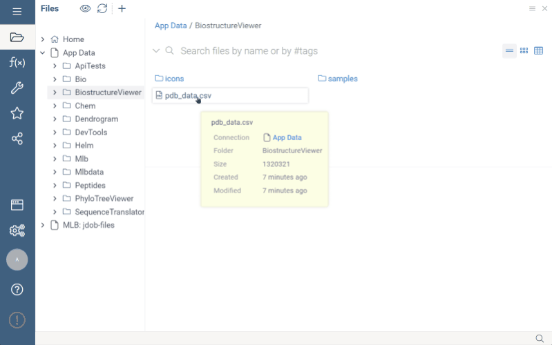
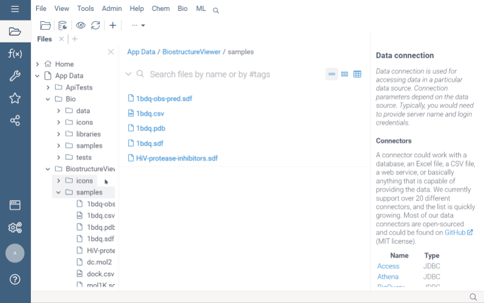
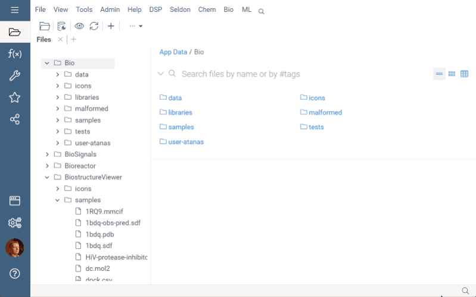

# Biostructure Viewer

BiostructureViewer is a [package](https://datagrok.ai/help/develop/#packages) for
the [Datagrok](https://datagrok.ai/) platform that enables visualization of biological structures.

## Supported Formats

The following file formats are supported:

- Molecular structures (mmCIF, PDB, PQR, GRO, MMTF)
- Density volumes (MRC/MAP/CCP4, DX/DXBIN, CUBE, BRIX/DSN6, XPLOR/CNS)

Note: The [Chem](../Chem/README.md) package opens formats 'mol2', 'sdf', 'mol' for small molecules.

## Semantic Types

The BiostructureViewer package enables detection and handling of the Molecule3D semantic type.

## Cell Renderers

Grid cells of columns with the Molecule3D semantic type are drawn using a designated NGL-based cell renderer. Clicking
on a cell opens a BiostructureViewer to explore the structure details.

## Viewers

Both [BiostructureViewer](#BiostructureViewer) and [NglViewer](#NglViewer) use the same method to obtain
a structural data into the viewer from different sources (in order of priority) controlled by
properties of the 'Data' category:

1. A PDB string value of the 'pdb' property.
2. A PDB string value of the data frame tag named of 'pdbTag' property.
3. A PDB string value of the data frame '.pdb' tag in case 'pdbTag' property is not specified.

### NglViewer

[NglViewer](./src/viewers/ngl-viewer.ts) is a Datagrok [DG.JsViewer](../../js-api/src/viewer.ts) derived
component based on the NGL Viewer [nglviewer.org](https://nglviewer.org/) library developed by Alexander Rose.

### BiostructureViewer

[BiostructureViewer](./src/viewers/molstar-viewer/molstar-viewer.ts) is a Datagrok [DG.JsViewer](../../js-api/src/viewer.ts) derived
component based on the [RCSB PDB implementation](https://github.com/molstar/rcsb-molstar) of
[Mol*](https://github.com/molstar/molstar). Documentation for
the Mol project can be found [here](https://molstar.org/docs/).

The 'Style' category properties allow customization of the viewer appearance representation as cartoon, backbone,
ball+stick, licorice, hyperball, and surface.

#### References

1. David Sehnal, Sebastian Bittrich, Mandar Deshpande, Radka Svobodová, Karel Berka, Václav Bazgier, Sameer Velankar,
   Stephen K Burley, Jaroslav Koča, Alexander S Rose:
   Mol Viewer: modern web app for 3D visualization and analysis of large biomolecular structures,
   Nucleic Acids Research, 2021; [doi.org/10.1093/nar/gkab314](https://doi.org/10.1093/nar/gkab314).

## File previews and File handlers

Files with handled extensions are previewed and opened with the [BiostructureViewer](#BiostructureViewer).

This package implements file viewers for supported file types. This is how it looks in action:

See also:

- [NGL Viewer](https://nglviewer.org/)
- [Scripting](https://datagrok.ai/help/compute/scripting)
- [Files](https://datagrok.ai/help/access/databases/connectors/files)
- [File Shares](https://datagrok.ai/help/access/files/#file-sharing-and-access-control)
- [RCSB PDB implementation](https://github.com/molstar/rcsb-molstar)

## Versions

@rcsb/rcsb-molstar v1.8.7 is the last version dependent on rxjs of version 6.x.x,
and it has a dependency on "[molstar](https://github.com/molstar/molstar)": "^2.4.1".
