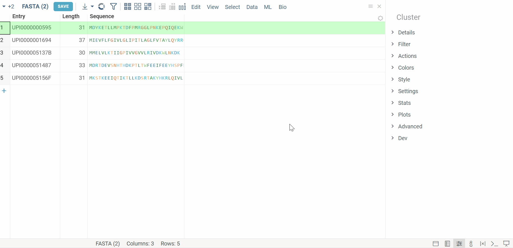
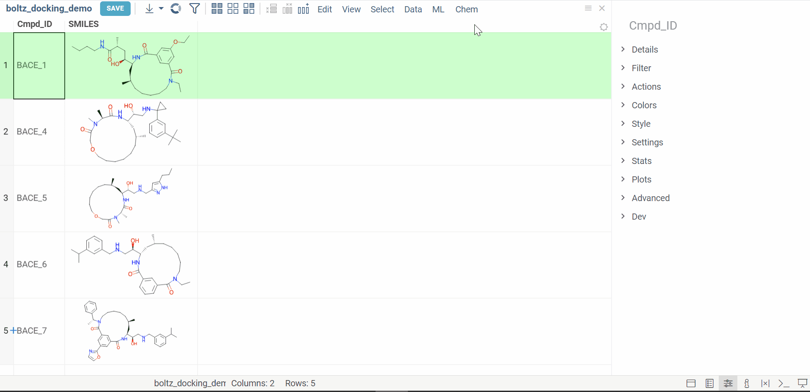

# Boltz1

The [Boltz1 package](https://datagrok.ai/help/develop/develop#packages) 
is a plugin that integrates 
the [Boltz-1](https://github.com/jwohlwend/boltz/tree/main) model
with the [Datagrok](https://datagrok.ai) platform.

## Boltz-1

[Boltz-1](https://github.com/jwohlwend/boltz/tree/main) is the state-of-the-art open-source model to predict biomolecular structures containing combinations of proteins, RNA, DNA, and other molecules. It also supports modified residues, covalent ligands and glycans, as well as conditioning the prediction on specified interaction pockets or contacts.

### How To

#### Prepare the configuration

The Docking plugin comes with several pre-configured [configurations](https://github.com/datagrok-ai/public/tree/master/packages/Docking/files/boltz). To add your own custom configuration, follow the [Boltz-1 setup instructions](https://github.com/jwohlwend/boltz/blob/main/docs/prediction.md).

Once you've prepared your configuration, place the files in a folder under **System:AppData/Docking/boltz**. The folder name will appear as the configuration name in the Datagrok plugin UI.

#### Run Folding

1. Navigate to **Bio > Folding > Boltz-1**. A dialog appears.
2. Configure the parameters:
   - `Table`: Select the table.
   - `Sequences`: Specify the column within the provided dataframe that contains sequences to be folded.
3. Run the calculations.

#### Run Docking

1. Navigate to Chem > Docking > Boltz-1. A dialog appears.
2. Configure the parameters:
   * `Table`: Select the table.
   * `Ligands`: Specify the column within the provided dataframe that contains the small molecules to be docked.
   * `Configuration`: Choose the folder containing the configurations.
3. Run the calculations.

