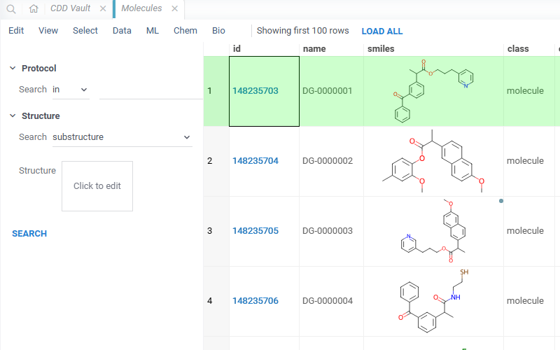
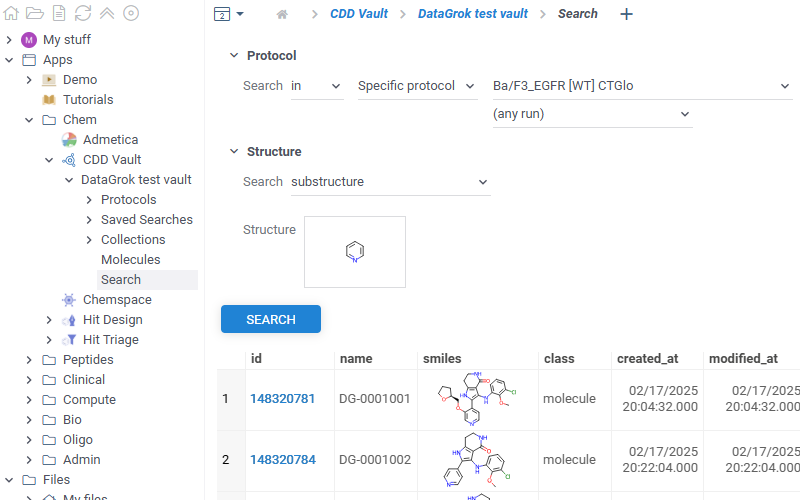
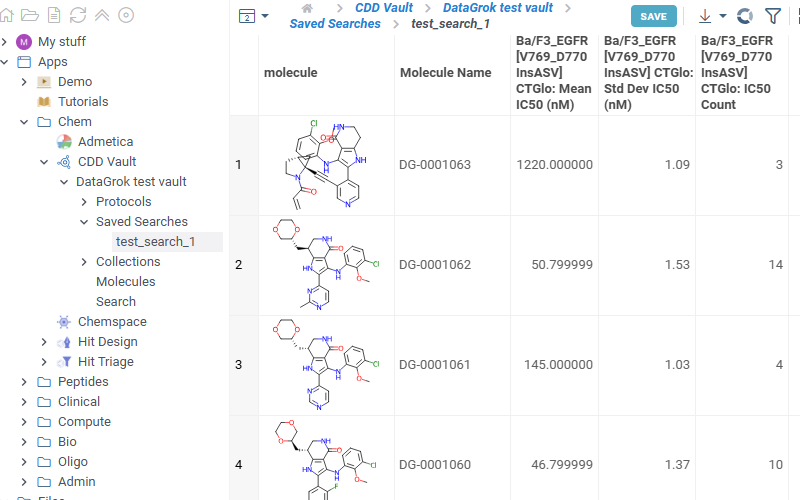
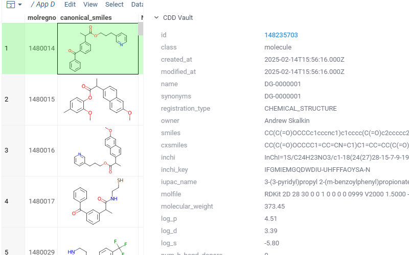

# CDD Vault Link

`CDD Vault Link` is a [package](https://datagrok.ai/help/develop/develop#packages) for the [Datagrok](https://datagrok.ai) platform which
provides integration with [CDD Vault](https://www.collaborativedrug.com/cdd-informatics-platform) registration system.

To use the plugin you need to be registered in the CDD Vault system and have at least one vault set up.
CDD Vault api key should be set in package credentials manager under 'apiKey' key.

To use the application, go to *Browse panel* -> *Apps* -> *Chem* -> *CDD Vault*.
List of all available vaults is opened under *CDD Vault* tab. Each vault contains three tabs:

* *Molecules* - the list of all available molecules in the vault. *Id* column contains links to the corresponding molecules in your vault.

* *Search* - basic search through you vault containing similarity and diversity searches.

* *Saved searches* - open tab to see the list of all saved searches in your vault. Click any search in the list to open the search results.

There is also a tab in the context panel. To use, click or sketch a molecule, and expand the *Databases* -> *CDD Vault* context panel on the right:

