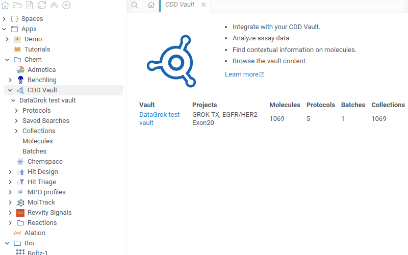
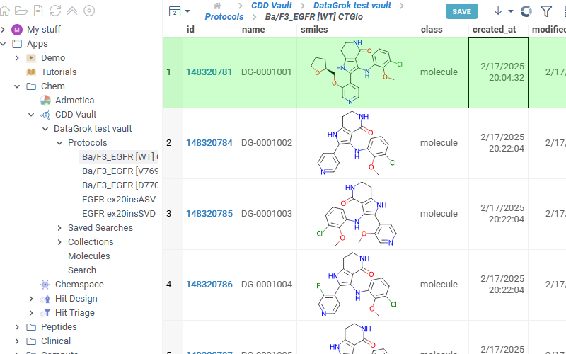
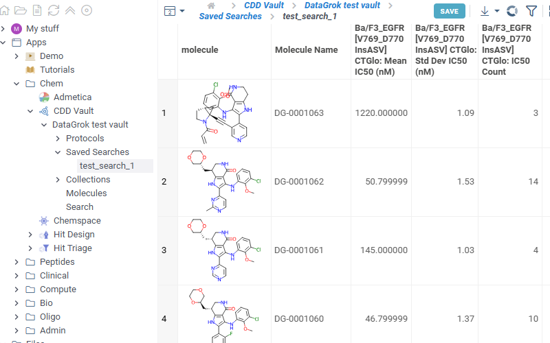
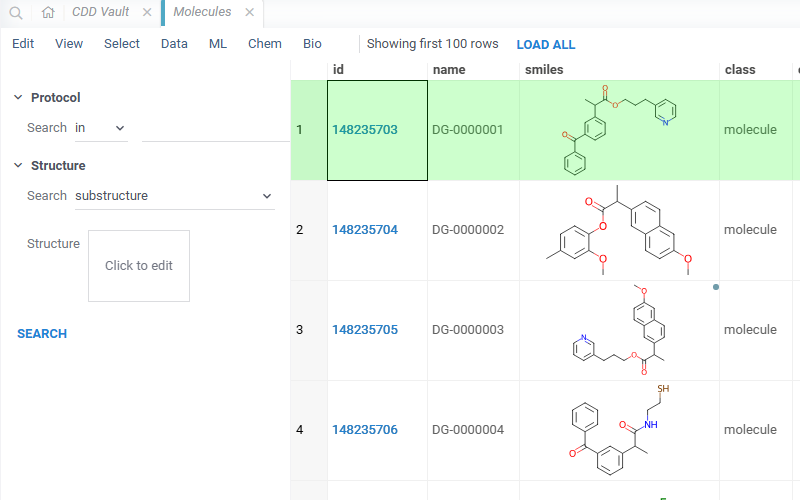
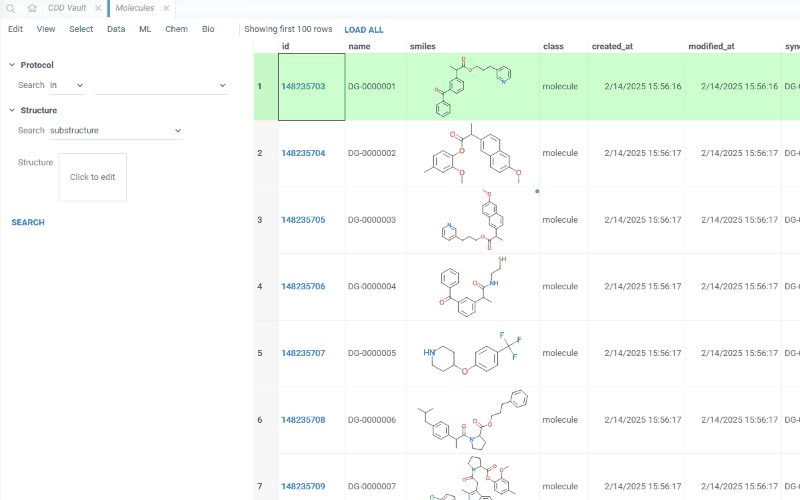
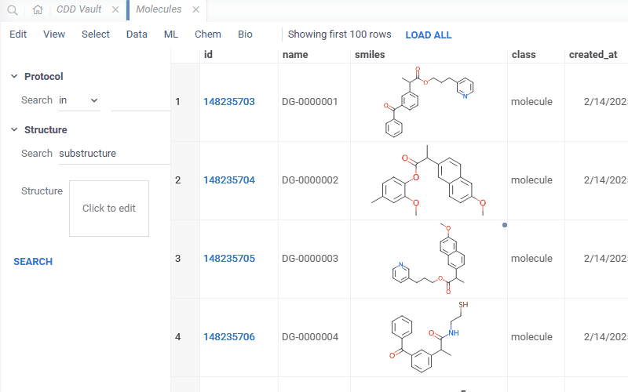
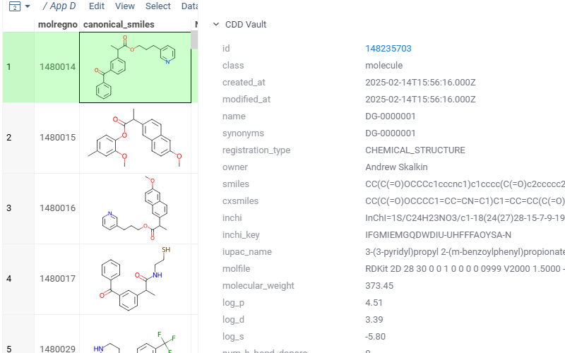

# CDD Vault Link

`CDD Vault Link` is a [package](https://datagrok.ai/help/develop/develop#packages) for the [Datagrok](https://datagrok.ai) platform which
provides integration with [CDD Vault](https://www.collaborativedrug.com/cdd-informatics-platform) registration system.

To use the plugin you need to be registered in the CDD Vault system and have at least one vault set up.
Your CDD Vault API key must be set in the package credentials manager under the `apiKey` key.

## Opening the app

Go to *Browse panel* → *Apps* → *Chem* → *CDD Vault*. The landing view shows a summary of your available vaults (project list, molecule / protocol / batch / collection counts). Each vault expands into its own set of tabs.

## Tabs

Each vault exposes the following tabs:

### Protocols

The list of all protocols defined in the vault. Clicking a protocol opens a table of molecules measured under that protocol; protocol metadata (readout definitions, runs, calculations, category, etc.) is shown in the context panel on the right.

### Collections

The list of collections associated with your vault. Clicking a collection opens its member molecules.

### Saved searches

Server-side searches defined in CDD Vault. Clicking a saved search executes it against the vault and opens the results as a table.

### Molecules

All molecules in the vault. The `id` column links out to the corresponding molecule page in CDD Vault.

The Molecules tab also hosts the **Search side-panel** — an expandable filters panel for structure search (exact / similarity / substructure) combined with optional protocol / run filters. The last search is remembered per vault and restored when you return to the Molecules tab.

### Batches

All batches in the vault — specific physical lots of molecules (salt form, formula weight, stoichiometry, batch-level UDFs). Each row links back to its parent molecule.

## Tab loading: preview + Load all

Every data tab opens with a **first-100-rows preview** so you can start exploring immediately. If more rows exist, a ribbon appears above the table:

> Showing first 100 rows   `[Load all]`

Click **Load all** to fetch the full dataset in the background (a task-bar progress indicator shows progress). When it completes, the view swaps to the full data and the ribbon updates to *"Showing all N rows"*. If you switch tabs before the load finishes, the background request is discarded — no unexpected table swaps.

## Molecule context panel

Click or sketch a molecule anywhere in Datagrok, then expand the *Databases → CDD Vault* section on the right to see the matching CDD Vault record (structure, identifiers, properties, batches, and deep link out).

## Setup

1. Log in to the Datagrok platform.
2. Install the **CDD Vault Link** package.
3. Open the package settings → Credentials and set `apiKey` to your CDD Vault API token. The token is used for all CDD calls made by the plugin.
4. Open *Browse* → *Apps* → *Chem* → *CDD Vault*.
