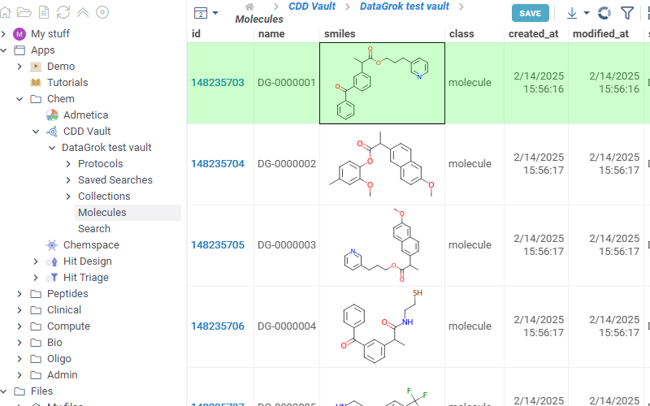

# CddVaultLink

`CddVaultLink` is a [package](https://datagrok.ai/help/develop/develop#packages) for the [Datagrok](https://datagrok.ai) platform which
provides integration with [CDD Vault](https://www.collaborativedrug.com/cdd-informatics-platform) registration system.

To use the app you need to be registered in CDD Vault system and have at least one vault set up.

To use the app go to *Browse panel* -> *Apps* -> *Chem* -> *CDD Vault*.
List of all your available vaults are opened under *CDD Vault* tab. Each vault contains are 3 tabs:

* *Molecules* - the list of all available molecules in the vault. *Id* column contains links to the corresponding molecule in your vault.

* *Search* - basic search through you vault containing similarity and diversity searches

* *Saved searches* - open tab to see the list of all saved searches in this vault. Click any search in the list to open search results.

There is also a tab in the context panel. To use, click or sketch a molecule, and expand the *Apps* -> *CDD Vault* context panel on the right:

