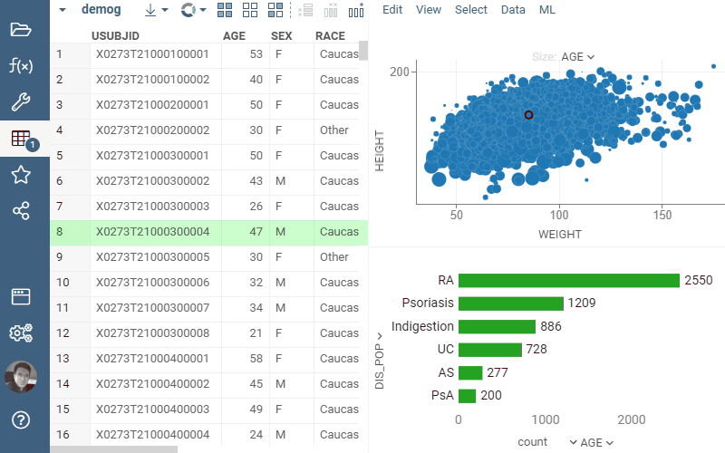

ChaRPy is a [package](https://datagrok.ai/help/develop/develop#packages) for the [Datagrok](https://datagrok.ai) platform.
It extends Datagrok viewers with two commands, "To Python script" and "To R script", which translate a selected veiewer to Python or R code, respectively, along with executing this code for displaying the resulting plot.

The two commands are available via a hamburger menu (a top-left button in a viewer's header), and supported for most of the viewers in Datagrok. The selected command forms a script in R or Python which in turn generates a plot identical or very close to the plot of selected veiwer. The [script](https://datagrok.ai/help/compute/scripting) responsible for the plot becomes available along with resulting plot itself, displayed via a [Scripting Viewer](https://datagrok.ai/help/visualize/viewers/scripting-viewer).

ChaRPy uses [ggplot2](https://cran.r-project.org/web/packages/ggplot2/index.html) for R, and [plotly](https://plotly.com/python/) for Python.

In addition to scripting viewers, the package also showcases the followng Datagrok's facilities:

* Creating and showing a modal dialog, `let d = ui.dialog("Title"); ...; d.showModal(true);`,
* Placing viewers in a modal dialog using splitters, `ui.splitV` and `ui.splitH`,
* Creating a new viewer by viewer type by `DG.Viewer.fromType`, in this case — a regular viewer of a corresponding type, and a scripting viewer,
* Expanding Datagrok's context menu with new items (`grok.events.onContextMenu.subscribe`, `args.args.menu.item`).

Here are the files of particular interest:

  * [src/package.js](https://github.com/datagrok-ai/public/blob/master/packages/ChaRPy/src/package.js): a function that defines and registers script generation logic, driven by templates stored in the below two files.
  * [src/mapPy.json](https://github.com/datagrok-ai/public/blob/master/packages/ChaRPy/src/mapPy.json), [src/mapR.json](https://github.com/datagrok-ai/public/blob/master/packages/ChaRPy/src/mapR.json): templates used in forming Python and R scripts based on selected viewer's type.

See also:

  * [Scripting](https://datagrok.ai/help/compute/scripting)
  * [Scripting Viewer](https://datagrok.ai/help/visualize/viewers/scripting-viewer)
  * [Dialogs](https://github.com/datagrok-ai/public/tree/master/packages/ApiSamples/scripts/ui/dialogs)
  * [ggplot2 R package](https://cran.r-project.org/web/packages/ggplot2/index.html)
  * [plotly Python library](https://plotly.com/python/)