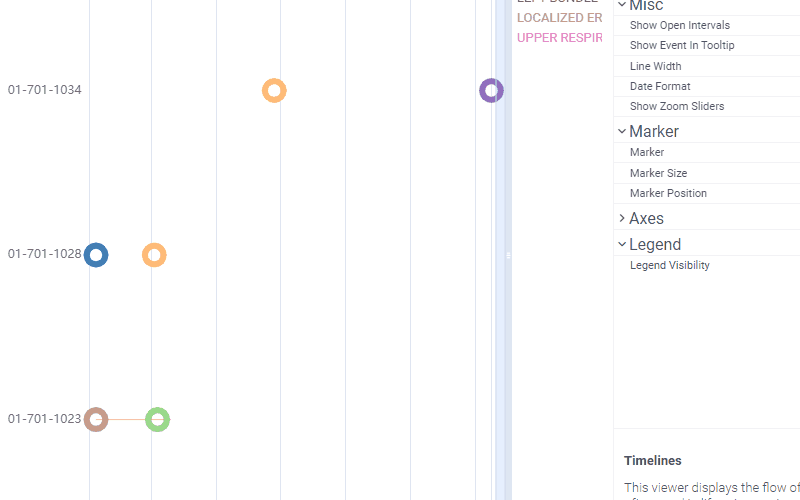
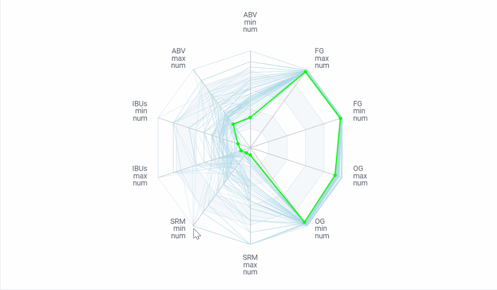
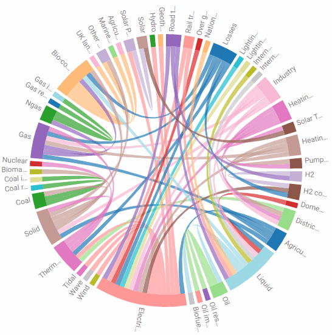
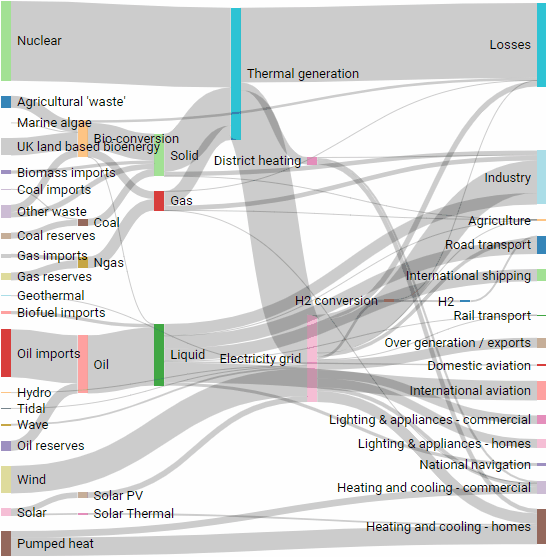
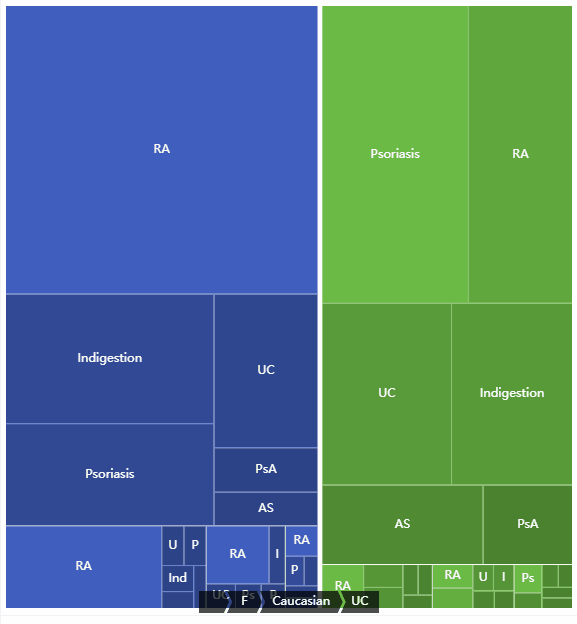
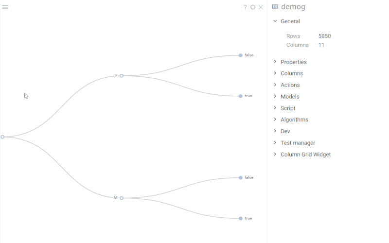

# Charts

Charts is a [package](https://datagrok.ai/help/develop/develop#packages) for the
[Datagrok](https://datagrok.ai) platform. It provides visualizations built using
the [ECharts](https://echarts.apache.org/en/index.html) library.

## Timelines

This viewer displays the flow of events over time. `Timelines` is often used in life sciences,
in particular, for clinical data visualization (see a usage example in the
[Clinical Case](https://github.com/datagrok-ai/public/tree/master/packages/ClinicalCase#timelines) application).



### Properties

```js
grok.shell.v.addViewer(DG.VIEWER.TIMELINES, {
  splitByColumnName: "USUBJID",  // Subject identifier (a categorical column displayed on the Y axis)
  startColumnName: "AESTDY",     // Start date of event (an integer/datetime column)
  endColumnName: "AEENDY",       // End date of event (an integer/datetime column)
  colorByColumnName: "AETERM",   // Color criterion (a categorical column with non-unique values to visually group the events)
  eventColumnName: "AETERM",     // Optional (used when `showEventInTooltip` is set to true)
  eventsColumnNames: ["c1", "c2"], // Adds event columns (integer/datetime) that have only one coordinate (rendered as a point, if [showOpenIntervals] is `false`)
  showOpenIntervals: false,      // Show an event with missing start/end coordinate as continuous
  showEventInTooltip: false,     // Switches between two tooltip modes: (1) the general number of co-occurring events and (2) the event details
  dateFormat: "",                // Optional (used when the start and/or end are represented as datetime).
                                 // Formats: '{yyyy}-{MM}-{dd}', '{M}/{d}/{yyyy}', '{MMM} {d}', '{dd}', '{d}'
  axisPointer: "shadow",         // Axis pointer style ('cross' | 'line' | 'shadow' | 'none')
  showZoomSliders: true,         // Zoom sliders visibility control
  marker: "circle",              // Marker shape ('circle' | 'rect' | 'ring' | 'diamond')
  markerSize: 6,                 // Marker size (the width and height for rectangular shapes, the diameter for circular shapes)
  markerPosition: "main line",   // Marker position ('main line' | 'above main line' | 'scatter')
                                 // Moves all points (non-prolonged events, events without either start or end date, events with the duration
                                 // that converts to a value less than that of the marker size) to a given position on the Y axis within one subject.
                                 // Used for a large number of overlapping events. The 'scatter' option shifts data points up and down in turn
  lineWidth: 3,                  // Line width (the value is not applied to markers)
  legendVisibility: "Auto",      // Legend visibility ('Always' | 'Auto' | 'Never') requires [colorByColumnName]
});
```

It is possible to choose the above options in the property panel and then obtain
a code snippet that adds a new viewer with identical settings into the view. It
is generated by the [DevTools](https://github.com/datagrok-ai/public/tree/master/packages/DevTools)
plugin whenever you call the viewer context menu command `To Script | To JavaScript`.

The dates are typically formatted as `{MMM} {d}` both in tooltips and in the axis labels.
To change a template, use any combination of the following units in the `Date Format` property:

| Symbol   |          Meaning                 |          Example           |
|----------|----------------------------------|----------------------------|
| {yy}     | Year without the century         | 00, 01, ..., 20, ..., 99   |
| {yyyy}   | Year with the century            | 0001, ..., 2020, ..., 9999 |
| {Q}      | Quarter                          | 1, 2, 3, 4                 |
| {M}      | Month                            | 1, 2, 3, ..., 12           |
| {MM}     | Zero-padded month                | 01, 02, 03, ..., 12        |
| {MMM}    | Abbreviated month name           | Jan, Feb, Mar, ..., Dec    |
| {MMMM}   | Full month name                  | January, ..., December     |
| {d}      | Day of the month                 | 1, 2, 3, ..., 31           |
| {dd}     | Zero-padded day                  | 01, 02, 03, ..., 31        |
| {e}      | Week number                      | 1, 2, 3, ..., 54           |
| {ee}     | Abbreviated weekday name         | Mon, ..., Fri, Sat, Sun    |
| {eeee}   | Full weekday name                | Monday, ..., Sunday        |
| {h}      | Hour (12-hour clock)             | 1, 2, 3, ..., 12           |
| {hh}     | Zero-padded hour (12-hour clock) | 01, 02, 03, ..., 12        |
| {H}      | Hour (24-hour clock)             | 0, 1, 2, ..., 23           |
| {HH}     | Zero-padded hour (24-hour clock) | 00, 01, 02, ..., 23        |
| {m}      | Minute                           | 0, 1, 2, ..., 59           |
| {mm}     | Zero-padded minute               | 00, 01, 02, ..., 59        |
| {s}      | Second                           | 0, 1, 2, ..., 59           |
| {ss}     | Zero-padded second               | 00, 01, 02, ..., 59        |
| {S}      | Millisecond                      | 0, 1, ..., 999             |
| {SSS}    | Zero-padded millisecond          | 000, 001, ..., 999         |

### Column selection heuristics

The `Timelines` viewer can choose its parameters by [SDTM](https://www.cdisc.org/standards/foundational/sdtm)
vocabulary. If you are working with a dataset representing an SDTM domain, the
algorithm will first try to match the column names based on the naming
conventions of this standard. In other cases, the columns will be selected
according to the data type and such column statistics as the number of unique
categories.

## Radar

Radar charts are used on multivariate data to plot groups of values over several common variables.
Demo dataset: <https://dev.datagrok.ai/f/Demo.Files/beer.csv>



## Chord

Status: `experimental`
Demo dataset: <https://dev.datagrok.ai/f/Demo.Files/energy_uk.csv>



See also the `Chord` viewer in the [Viewers](https://github.com/datagrok-ai/public/tree/master/packages/Viewers) package.

## Sankey

Status: `experimental`
Demo dataset: <https://dev.datagrok.ai/f/Demo.Files/energy_uk.csv>



## Sunburst

Status: `experimental`
Demo dataset: <https://dev.datagrok.ai/f/Demo.Files/demog.csv>


## TreeMap

Status: `experimental`
Demo dataset: <https://dev.datagrok.ai/f/Demo.Files/demog.csv>



## TreeViewer

`TreeViewer` is used to visualize hierarchical data. The chart builds a tree
structure with up to three levels for a given dataset. The columns are selected
based on a number of categories in them. To change the order of columns, add new
levels to the initial hierarchy or remove the existing ones, edit the
`hierarchy` property.

The chart responds to data filters and rows selection. The only difference with
the native viewers behavior is that the selection of rows in `TreeViewer` has
limited interaction. The selection works on clicks with applied modifier keys
(`Shift` adds to selection, `Ctrl` toggles the selected state, see more in the
[wiki](https://datagrok.ai/help/visualize/viewers#selection)); while a regular
click on a node is reserved for expanding or collapsing branches of the tree.

In the viewer properties, you can adjust marker settings, change a tree layout,
or toggle certain behaviors, such as animation, expanding or collapsing nodes,
etc.

Demo dataset: <https://dev.datagrok.ai/f/Demo.Files/demog.csv>



### Properties

```js
{
  hierarchyColumnNames: ["level_1_column", "level_2_column"], // Ordered list of tree levels
  edgeShape: "curve",       // 'curve' | 'polyline'
  expandAndCollapse: true,  // Enable branch expansion/collapse
  initialTreeDepth: 2,      // The initial depth of the tree (level 0 is the root node, etc., -1 expands all nodes)
  layout: "orthogonal",     // 'orthogonal' | 'radial'
  orient: "LR",             // 'LR' | 'RL' | 'TB' | 'BT'
  symbol: "emptyCircle",    // Tree node symbol shape
  symbolSize: 7,            // Tree node symbol size
}
```

## WordCloud


## Common properties

```js
{
  top: '5px',
  left: '5px',
  bottom: '5px',
  right: '5px',
  animationDuration: 500,
  animationDurationUpdate: 750,
}
```

See also:

- [ECharts](https://echarts.apache.org/en/index.html)
- [Viewers](https://datagrok.ai/help/visualize/viewers)
- [How to Develop Custom Viewers](https://datagrok.ai/help/develop/how-to/develop-custom-viewer)
