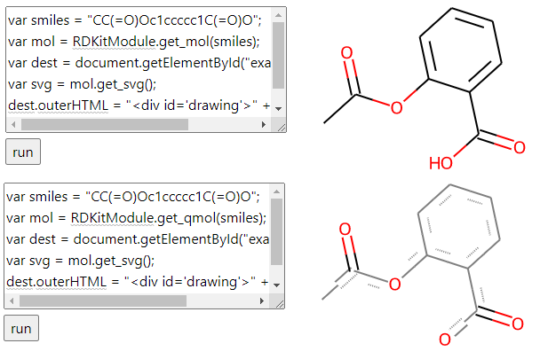

# Contributor's guide for Chem package

* From this document you will learn about the Chem library design and engineering choices

* Contribute to this file if you obtain any knowledge about third-parties used within or
  in any way connected with the `Chem` package, such as:
  * specifics about behavior of a chemical library (RdKit, OpenChemLib, etc.),
  * peculiarities of Chrome (some things in JS or WebAssembly may change over time),
  * any knowledge which isn't explicitly expressed in the code, or isn't yet part of this file

* Maintain this file when changing library internals and architecture

* Contributors from Datagrok should also check the videos we recorded about the design;
ask @dskatov and @StLeonidas for accessing these videos, and a walk-through

* If you are an external contributor, post any question about Chem directly to our github
[issues](https://github.com/datagrok-ai/public/issues) with a label `Question` and
put it under a project `Chem`

## Before you start

### Code contribution guidelines

Make sure to follow our common contributor's guide:

<https://github.com/datagrok-ai/public/blob/master/CONTRIB.md>

### Preparing working environment

Don't just do `npm install & webpack` at the start. This may fail, as explained below.
This is how to build Chem locally, if that works for you skip this section:

```
packages/libraries-link-local.cmd
chem/npm run link-all
chem/npm run build-chem-local
```

The `Chem` library depends on common
Datarok libraries located at `public/js-api`, `public/libraries/utils`, and `public/libraries/ml`.
They have corresponding npm packages at
[`@datagrok-libraries/utils`](https://www.npmjs.com/package/@datagrok-libraries/utils),
[`@datagrok-libraries/ml`](https://www.npmjs.com/package/@datagrok-libraries/ml),
and
['js-api`](<https://www.npmjs.com/package/datagrok-api>).
Often you will be editing both the Chem package and some corresponding functionality in the
mentioned libraries. Publishing these libraries to npm after changing them to let Chem`npm install`
fetch the changes isn't a feasible approach either, as the changes in these packages often
batch together.

The solution is to use `npm` linking of local folders as installable npm packages.

To set up  fully local working environment, you need to link the three packages above to `Chem`.
The script `setup.cmd` does it for you. Call it before starting to work with the `Chem` code
locally, say, on a freshly checked out `public` code.

The script `setup.cmd` must be run with the current directory set to `public/packages/Chem`.

**IMPORTANT:** If you are maintaining two or more copies of a `public` repo on your machine,
remember calling `setup.cmd` when switching with working between them. If you don't, it may happen
that you are using Datagrok libraries from one such folder, linked with `npm`, through another such
folder, thus possibly mixing some parallel implementations.

If you are still experiencing errors on `Chem` when running `webpack`, even if you've already
used `setup.cmd`, here are some hints for troubleshooting:

1. Manually delete `npm_modules` from your `public/libraries/utils`, `public/libraries/ml`,
and `public/js-api` locations, then repeat running `setup.cmd` from inside the `Chem` folder

2. Make sure no specific library from the three above is installed globally in `npm`: `npm list -g`

3. Clean npm cache: `npm cache clean --force`, check `%AppData%/npm-cache` is actually empty

### npm-based setup for the Chem development environment

The npm scripts from `package.json` called `build-chem-local`, `link-all`, and their combination,
are meant to replace the current `setup.cmd` script. In particular, these npm scripts are involved
in CI pipelines in Datagrok. We need to check the status of these scripts for local development
environment use case, and deprecate `setup.cmd` in their favor, when possible.

## API design

## Implementation

### Compute caching

### Renders caching

## Web Workers

### Message passing interface

### TypeScript and Webpack

### Passing raw objects

## RdKit

### Source of the WASM library

@ptosco assembles special builds of RdKit WASM library (called MinimalLib) from his fork:

<https://github.com/ptosco/rdkit/tree/master/Code/MinimalLib>

The reason for it is that this fork ships customer-specific things.

### Specifics of rendering

#### Scaffold rendering offset

In a method
[_drawMolecule]( https://github.com/datagrok-ai/public/blob/ad9bbbfc10347a1947a67762c19c96f4b1a0735f/packages/Chem/src/rendering/rdkit-cell-renderer.ts#L173)
(part of `Chem/src/rdkit-cell-renderer.ts`) an `offscreenCanvas` is used first to draw a
molecule, and only then this canvas contents are brought to the actual canvas
`onscreenCanvas`, which users actually see. There is a reason to such inefficiency.

If we've drawn through an RdKit method directly to the onscreen canvas, it
would've been seen that the molecule scaffold, also drawn by RdKit, is a bit off
the origin structure. This phenomenon is avoided with using an intermediate canvas.
This problem only appears when the molecules are rendered to the Datagrok's
canvas, but isn't _yet_ reproduced "in the wild".

Note that the _drawMolecule_ is only invoked when the molecule appears in the
Datagrok platform context first time, i.e. when it is first rendered to the
screen. After the first appearance, the render is put to the `rendersCache`,
and the corresponding molecule is put to `molCache`. Only when the cache record
for the molecule is evoked, the render will be required again. Therefore,
this double-drawing only takes place on the first appearance.

We need to resolve this part eventually, but the priority isn't the highest.

#### Rendering for mol and qmol

Rendering of both is possible, but will generally look differently for the same SMILES pattern:



### The testbed

The folder `Chem/testbed` offers a standalone web-page for testing RdKit.
This page doesn't require Datagrok in place. This testbed is useful when certain
issues of the RdKit library are identified and a bug report needs to be produced.

To run the testbed:

1. Go to `/testbed` folder, install `npm install http-server'

2. Run `run-server.bat` and go to one of the locations from the console output.
Typically it is `https://localhost:81`

Testbed needs to run through the web server, as it serves WebAssembly.

If you test a new version of RdKit, just replace the locations in the
`GettingStartedJS.html` to the new ones and commit these changes along
with the RdKit library version being tested.

The test code is forked from RdKit's original testbed and adopted to our use case:
[link](https://github.com/ptosco/rdkit/tree/master/Code/MinimalLib#live-demos)

## File formats in RdKit

### MolBlock (MolFile)

Exactly one new line must be present in the beginning of the MolFile.
If there are two or more, RdKit will crash.

**Suggestion:** Introduce a formatter which could verify the new lines
for the case when `.get_mol()` on MolFile crashes.

### Handling SMARTS on the sketchers side

We worked on integrating Chem package with various sketchers. One case we based our design on
is a combination of one of the commercial sketchers with RdKit processing of SMART templates.

We've identified that RdKit was capable of processing both extended MolBlock format (the format
including SMARTS patterns data, but based on MolBlock properties) and a regular SMARTS format.
However, in several cases of SMARTS patterns from the customers, RdKit failed to process these
SMARTS as a search pattern (raising exceptions), yet was able to process them as a MolBlock with
additional [properties](https://cms.gutow.uwosh.edu/gutow/marvin.1/doc/user/mol-csmol-doc.html),
in particular `ALS`.

In addition, the mentioned commercial sketcher was perfectly capable
of returning such an extended MolBlock. Let's call this format MolBlock'. We first thought this
is a block of properties specific to the commercial sketcher we've used, but this doesn't seem
to be the case, as there are also property blocks described specific to this commercial
sketcher.

Here's an example of this MolBlock':

```
  MJ201900

  6  6  1  0  0  0  0  0  0  0999 V2000
   -2.2321    0.8473    0.0000 L   0  0  0  0  0  0  0  0  0  0  0  0
   -2.9465    0.4348    0.0000 C   0  0  0  0  0  0  0  0  0  0  0  0
   -2.9465   -0.3902    0.0000 C   0  0  0  0  0  0  0  0  0  0  0  0
   -2.2321   -0.8027    0.0000 C   0  0  0  0  0  0  0  0  0  0  0  0
   -1.5176   -0.3902    0.0000 C   0  0  0  0  0  0  0  0  0  0  0  0
   -1.5176    0.4348    0.0000 C   0  0  0  0  0  0  0  0  0  0  0  0
  2  3  1  0  0  0  0
  3  4  2  0  0  0  0
  4  5  1  0  0  0  0
  5  6  2  0  0  0  0
  1  2  2  0  0  0  0
  6  1  1  0  0  0  0
  1 F    2   6   7
M  ALS   1  2 F C   N
M  END
```

The line before the last (with `ALS`) is "an addition" to the MDL MolFile.

To let SMARTS-based substructure search work reliably with the above combination, we've
introduced a failover, where two strings representing a molecule are passed. First, main
argument is expected to be a SMARTS molecule format, and the second optional argument
is the one representing the failover MolFile. In this setting, if RdKit fails to process
a SMARTS, we let it process the second argument with MolFile.

This gave us a stable pipeline.

### Special knowledge about RdKit handling of molecule formats

#### Not all SMILES are suitable as `.get_qmol()` patterns

For example, `c1ccccc1` and `C1(=CC=CC=C1)` are the same molecule (check it through
[PubChem](https://pubchem.ncbi.nlm.nih.gov//edit3/index.html)). The first is what's returned
for Benzene from OCL sketcher, the second — Benzene as represented in one of the commercial
sketchers.

However (as of `RDKit_minimal_2022.03_1.wasm`), we _cannot_ construct a search pattern by
`.get_qmol()` from `C1(=CC=CC=C1)`, but we can do a `.get_qmol()` for `c1ccccc1`.

A related question is registered at `RdKit` github:

<https://github.com/rdkit/rdkit/issues/5337>

A workaround is to check if a pattern with `.get_qmol()` is constructed (and `.is_valid()`)
is `true`, but also a `.get_mol()` can be constructed for the same pattern, and the
result of searching by the `.get_qmol()`-constructed molecule in `.get_mol()` molecule
is empty. If that's the case, it means that the search pattern won't really find anything
anywhere and we need to re-construct the pattern with `.get_mol()` instead.

#### SMARTS which isn't SMILES cannot be constructed in `.get_mol()`

Easy to check in RdKit MinimalLib.

#### `.get_qmol()` won't construct a search pattern from MolBlock

On the other hand to the above.

There will be an exception. Use `.get_mol()` instead for MolBlock patterns.

#### SMILES from a SMARTS-based `qmol` can be constructed

For example:

```
smarts = "[!#6&!#7]1:[#6]:[#6]:[#6]:[#6]:[#6]:1";
var qmol = RDKitModule.get_qmol(smarts)
console.warn(qmol.get_smiles());
```

Prints `*1:C:C:C:C:C:1`. In OCL sketcher, this is a SMILES with a `?` in the top-left
corner. It is automatically re-converted by OCL Sketcher to `c1ccccc1`.

#### Commercial sketcers may return obscure SMARTS

For example, returning a `[?]1(=CC=CC=C1)` for a Benzene with top atom excluded `C,N`.
This SMARTS is certainly not correct. This may be happening due to lacking licenses,
but we need to check for sure. For these cases, we implement a failover, receiving
an additional MolBlock value from the sketcher and passing it to Substructure Search
methods.

Generally, for each new sketcher, you need to thoroughly check how anything which it
returns (SMILES, SMARTS, MolBlock, etc.) combines with RdKit parsing inputs.

#### General configuration for handling substructure searches in Chem

Let's see in respect to substructure search, what can be done on the RdKit side
to process all possible peculiarities of sketcher formats when searching on
substructures.

##### Several conditions

`c1`: `s` molString is provided and it is NOT MolBlock
`c2`: a failover MolBlock `mb` is provided (but still need to check `c1` = 1)
`c3`: `qmol = ...get_qmol...` is successfully constructed from `s`
`c4`: `mol = ...get_mol...` is successfully constructed from `s`
`c5`: `c3 = c4 = 1` & nothing is found on `substruct_match` in `mol` by `qmol`

`c1 = 0 => c3 = 0`

By "successfully", we mean that there's no exception and `.is_valid` is `true`.

##### Outcomes

`o1`: search pattern is from `.get_mol(s)`
`o2`: search pattern is from `.get_qmol(s)`
`o3`: search pattern is from `get_mol(mb)`
`o4`: cannot construct a pattern
x   : impossible configuration

Handling of these arguments is reflected in this issue:

<https://github.com/datagrok-ai/public/issues/663>.

## Benchmarks

## Future plans
