# Cheminformatics support

This package provides first-class [cheminformatics support](https://datagrok.ai/cheminformatics) for the Datagrok platform.
See it in action on [YouTube](https://www.youtube.com/watch?v=k1NVdTRpYOM&ab_channel=Datagrok).

The Datagrok platform provides rich exploratory data analysis capabilities, advanced data mining
techniques such as multivariate analysis and stochastic proximity embedding, and out-of-the-box support for
predictive modeling and scientific computations. By providing first-class
[cheminformatics support](https://datagrok.ai/cheminformatics), this package turns Datagrok into
a comprehensive platform for working with chemical and biological data.

Regarding the performance, our goal is to be able to open chemical datasets of up to 10 millions small molecules completely
in the browser, and interactively perform commonly used operations such as substructure and similarity search
without having to rely on a server. In order to hit these goals, we are using a couple of techniques. First of all,
we are leveraging Datagrok's capability to [efficiently work with relational data](https://datagrok.ai/help/develop/under-the-hood/performance).
For cheminformatics, we are relying on the [RDKit library compiled to WebAssembly](http://rdkit.blogspot.com/2019/11/introducing-new-rdkit-javascript.html).
This not only gives us the ability to execute C++ code at the native speed, but also take full advantage of the
modern multicore CPUs by running computations in multiple threads.

Here are some of the features:

* Molecule sketching
  * OpenChemLib
* SAR analysis   
* Chembl integration
* Pubchem integration
* Works completely on the client side where possible.
* [RDKit](https://www.rdkit.org)-based rendering.
  * Highlighting substructures on search (in progress)
  * Aligning to scaffolds (in progress)
  * Rendering options (in progress)
* Fingerprint-based similarity and diversity analyses (see [video](https://www.youtube.com/watch?v=wCdzD64plEo&ab_channel=Datagrok))
* Efficient in-memory substructure and similarity searching

The following features are still in the core, but we plan to move them out to this package:

* Property calculators (server-side)
* 3D: coordinate calculation using RDKit, rendering using [NGL Viewer](http://nglviewer.org/)
* "Sketch-to-predict": run predictive models as you sketch the molecule

## Sketcher

Supports multiple sketchers (MarvinJS, OpenChemLib, Ketcher).

You can set the default Sketcher in the package property so that new users won't have to switch on the first use manually:

1. Go to **Manage > Packages**. A **Package Manager** opens.
2. Locate **Chem** and click it.
3. Go to the **Context Pane > Settings**.
4. Set **Sketcher** to the desired default sketcher.

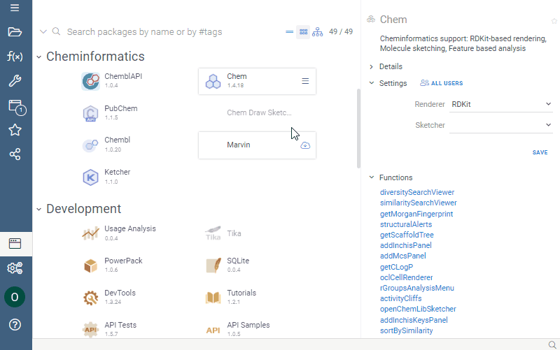

## Favorite and recent structures

Access the recently sketched structures from the `☰ -> Recent` menu.

`☰ -> Favorites` contains your favorite structures. To add current molecule
to the favorites, click on `☰ -> Favorites -> Add to Favorites`.

## Molecule queries

Out-of-the-box, you can paste SMILES, MOLBLOCK, and InChi keys into the input field, and the sketcher
automatically translates it to a structure. In addition to that, you can make sketcher understand
other structure notations (such as from your company's internal database of structures) by registering
a function annotated in a special way. The following example provides support for Chembl. The important
tags are:

* `--meta.role: converter`: indicates that such a function serves as a value converter
* `--meta.inputRegexp: (CHEMBL[0-9]+)`: RegExp that is evaluated to check if this function
  is applicable to the user input. The captured group (in this case the whole input) is then
  passed to this function as a parameter.
* `--output: string smiles { semType: Molecule }`: should return string with the semType `Molecule`

```js
--name: chemblIdToSmiles
--meta.role: converter
--meta.inputRegexp: (CHEMBL[0-9]+)
--connection: Chembl
--input: string id = "CHEMBL1185"
--output: string smiles { semType: Molecule }
select canonical_smiles from compound_structures s
join molecule_dictionary d on s.molregno = d.molregno
where d.chembl_id = @id
```

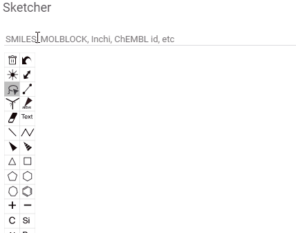

A molecule query does not have to be a database query, any [function](../../help/datagrok/concepts/functions/functions.md)
will do. For instance, InChi query is implemented as a Python script.

## Elemental analysis

Elemental Analysis lets you extract, visualize, and compare atom counts for the molecules in your dataset.

With this tool you can:

* get columns with atom counts (same order as in the periodic table);
* get a radar chart for every single molecule which makes it possible to compare each molecule with the whole dataset.

To run Elemental Analysis, select Chem | Elemental Analysis from the main menu.

Radar chart can be visualized in 2 ways:

1. A new column with radar charts is added.
  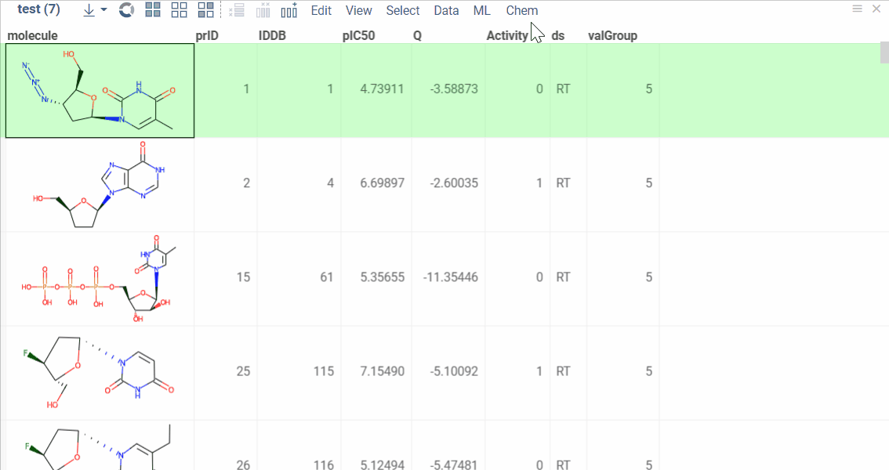
2. Radar chart appears in a new window. It changes automatically when you click on the new row.
  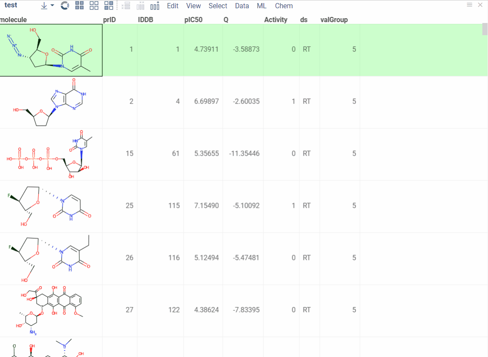

## Similarity/Diversity search

Tool that help scientists analyze a collection of molecules in terms of molecular similarity. It is based on applying different distance metrics (such as Tanimoto) to fingerprints.

Similarity search returns a set of N molecules most similar to the selected one. To run Similarity search select Chem | Search | Similarity search from the top menu.


To change target molecule select the row with required molecule in the initial dataframe. Similarities will be recalculated.
Target molecule can be also changed by using `edit` button in the top left corner of the molecule pane.


Using context panel you can change search metrics like similarity cut off, fingerprints type or distance metric.

By selecting columns from `Molecule Properties` field you can add any fields present in your dataframe to similarity panes. Please note that if color coding is applied to a selected column it will be copied on a similarity pane. You can select to highlight background or text in the corresponding field. Ability to add fields to similarity panes simplifies analysis since multiple molecules characteristics can be easily assessed at once.


Diversity search finds N most distinct molecules. To run Similarity search select Chem | Search | Diversity search from the top menu.
As for Similarity search, you can adjust metrics or add fields to molecule panes using context panel.

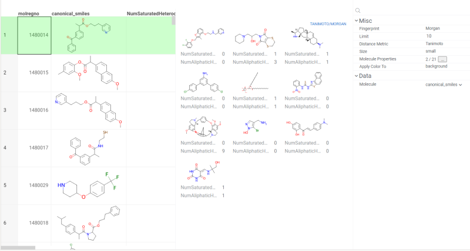

## Substructure search

We offer a highly efficient and fast substructure search capability that can handle datasets of any size, including millions of molecules.

Here are the advantages of our approach:

* Utilizing pattern fingerprints for preliminary filtration to accelerate the search process.
* Caching fingerprints: once a search is performed on a specific column, the fingerprints are calculated, saved, and can be reused without recalculating.
* Returning search results in batches, enabling the first results to appear in less than a second, regardless of the dataset size.
* Displaying a search progress bar for easy tracking of the search process.

There are two ways to run a substructure search:

* Select `Top menu` -> `Chem` -> `Search` -> `Substructure Search...`
* Click **Filter** icon on a toolbox

In both cases, a filter opens on the right side of the table.

To conduct a search:

 1. Click on the `Click to edit` pane for the desired column. The molecule sketcher opens
 2. Sketch some substructure. The search starts immediately.

Clicking **OK** during the active search closes the sketcher, but the search continues. Clicking **Cancel** terminates the active search.
Additionally, you can modify the substructure during an active search, and the results will recalculate instantly.

Here is an example:

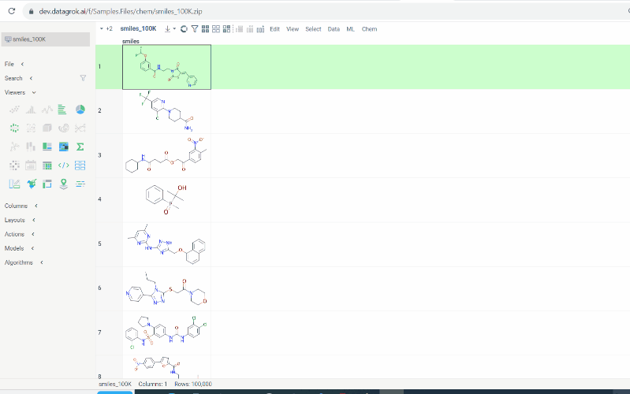

## Other search types

We offer the following search types:

* Contains (search by substructure)
* Not contains
* Included in (search by superstructure)
* Not included in
* Exact (search by exact structure match)
* Similar (search by similarity score)

To run any of above searches:

1. Click **Filter** icon on a toolbox. The filter panel opens. The default search type is `Contains`. Change the search type by selecting from a dropdown list.

2. Click `Click to edit` pane for the desired column. The molecule sketcher opens

3. Sketch some substructure. The search starts immediately.

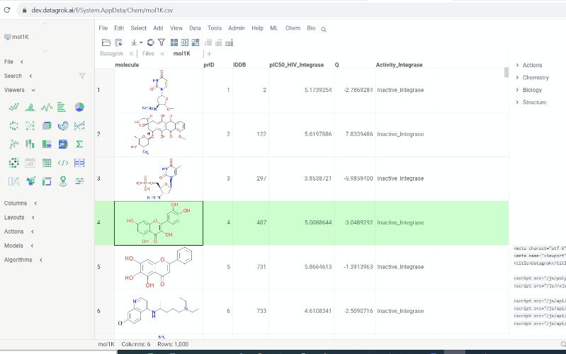

In case of `Contains` the search options are hidden by default. To open them hover over molecule and click the **settings** icon.

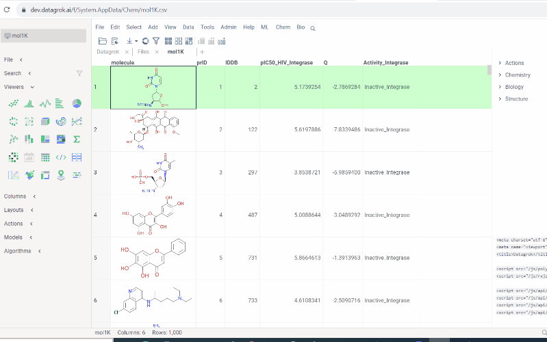

## Molecule fragments highlight

We offer highlighting of multiple molecule fragments inside one molecule structure. Multiple fragments can be highlighted with different colors.

To add a fragment use:

* Context panel

  1. Click molecule column header and go to `context panel`
  2. Go to `Chemistry` -> `Highlight`
  3. To add or modify a fragment click `Click to edit`. Molecule sketcher opens. Sketch some structure. It is highlighted immediately in the column.
  4. To modify color use **color picker**
  5. To save fragment use **+** icon.
  6. To remove saved fragments use **trash** icon.

  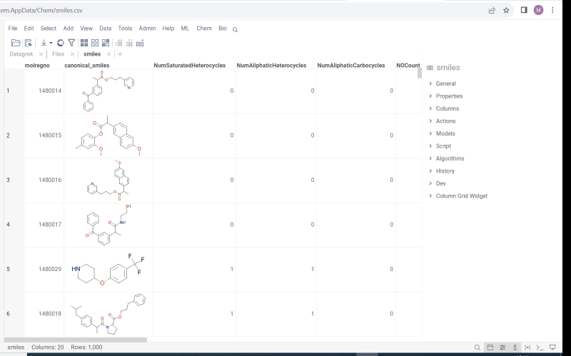

* Structural alerts widget

  1. Select molecule cell and go to `context panel`
  2. Go to `Biology` -> `Structural Alerts`
  3. Hover over alert and click `more` icon. In the popup menu select `Highlight fragment` and choose color. Fragment is highlighted in the column.
  4. To edit or remove fragment use editor from previous 'Context panel' point.
  This feature allows to easily monitor your dataset for structural alerts.

  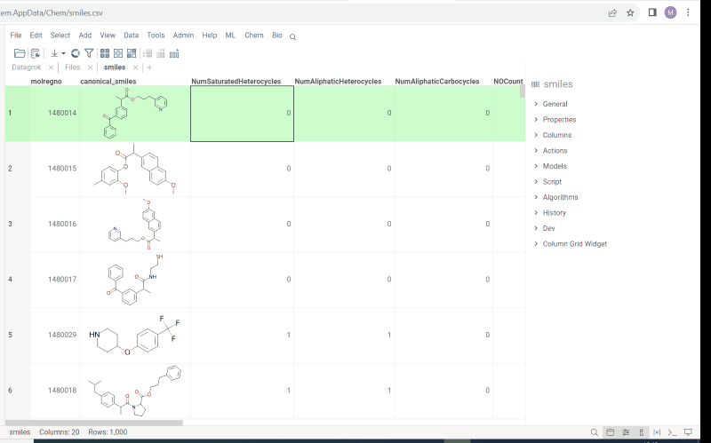

## Scaffold Tree

We have seamlessly integrated Scaffold Tree with molecule fragments highlighting. To utilize this feature, we have introduced two icons:

* **Circle** icon. Click to toggle the color on and off.
* **Palette** icon. Click to open the dialog with color picker. The icon serves for applying and modifying the color.

Here are some important rules:

* When you select a color, it automatically extends to all child nodes. However, note that more specific structures, closer to the leaves, will take precedence.
* When you turn the color off, the node inherits its color from the parent.

Scaffolds are highlighted both in the column and viewer for the convenience.

In addition, we updated and improved the existing functionality:

* When you add a new scaffold to an existing tree, it inherits the parent's node color.
* When you save the tree to disk, the color coding, logical operations and icons state are saved alongside with the tree.
* When you open the saved tree, it retrieves colors, operations etc.

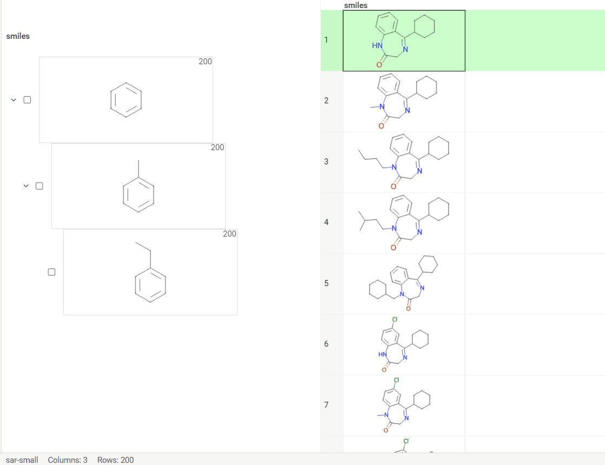

## R Group analysis

R-group analysis decomposes a set of molecules into a core and R-groups (ligands at certain attachment positions), and visualizes the results. The query molecule consists of the scaffold and ligand attachment points represented by R-groups.
R-group analysis runs directly in browser using RDKit JS library.

To run R-Group analysis:

1. Go to **Chem** > **Analyze** > **R-Groups Analysis...**. A sketcher opens.
2. In the sketcher, specify the common core (scaffold) for the selected molecular column using one of these methods:
   * Draw or paste a scaffold in the sketcher. You can define core with custom enumerated R groups.
   * Click **MCS** to automatically identify the most common substructure.
   * Click the **Gear** icon to adjust R group analysis parameters.
3. Click **OK** to execute. The R-group columns are added to the dataframe, along with a trellis plot for visual exploration.

R-groups are highlighted with different colors in the initial molecules in dataframe. Molecules are automatically aligned by core. To filter molecules which have R groups in each enumerated position use **isMatch** column.

The trellis plot initially displays pie charts. To change the chart type, use the **Viewer** control in the top-left corner to select a different viewer.

If you prefer not to use a trellis plot, close it or clear the **Visual analysis** checkbox
during Step 2. You can manually add it later. You can also use other chemical viewers, like scatterplot, box plot, bar chart, and others.

Use **Replace latest** checkbox to remove previous analysis results when running the new one. Or check it to add new analysis results in addition to existing.


## Molecular format conversion

Datagrok enables conversion between molecular formats like SMILES, SMARTS, Molfile V2000, and Molfile V3000, simplifying workflow processes.

To run, go to **Chem** > **Transform** > **Convert Notation...** and configure parameters:
* **Data**: Select table containing the molecules.
* **Molecules**: Specify the column with molecular structures.
* **Target Notation**: Choose the desired output format (e.g. smiles, smarts, molblock, v3Kmolblock).
* **Overwrite**: Decide whether to overwrite the existing column or create a new one.
* **Join**: Add the newly converted column to the dataframe.

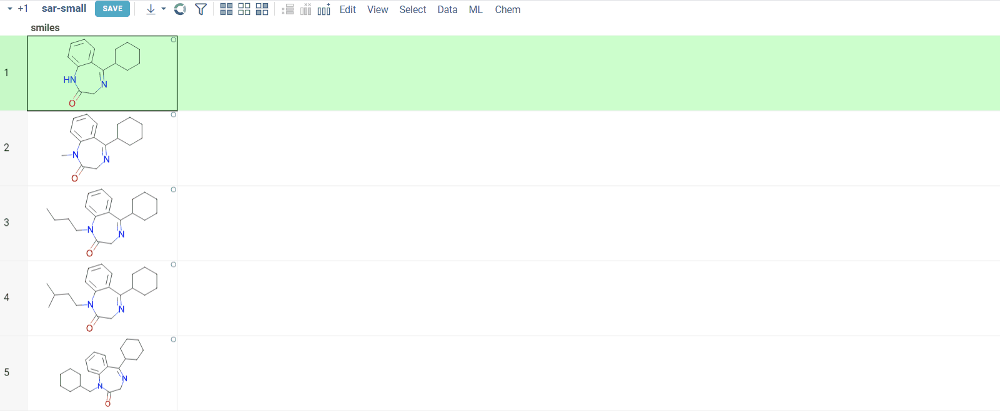

See also:

* [Cheminformatics predictive modeling](https://datagrok.ai/help/datagrok/solutions/domains/chem/#qsar-and-qspr-modeling)
* [Datagrok JS API](https://datagrok.ai/help/develop/packages/js-api)
* [Datagrok Cheminformatics API](https://datagrok.ai/help/develop/domains/chem/cheminformatics#datagrok-js-api)
* [Introducing new RDKit JavaScript wrappers](http://rdkit.blogspot.com/2019/11/introducing-new-rdkit-javascript.html)
* [Webassembly](https://webassembly.org/)
