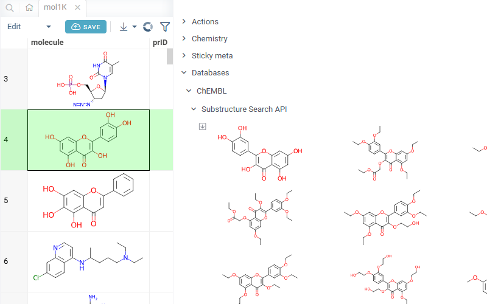
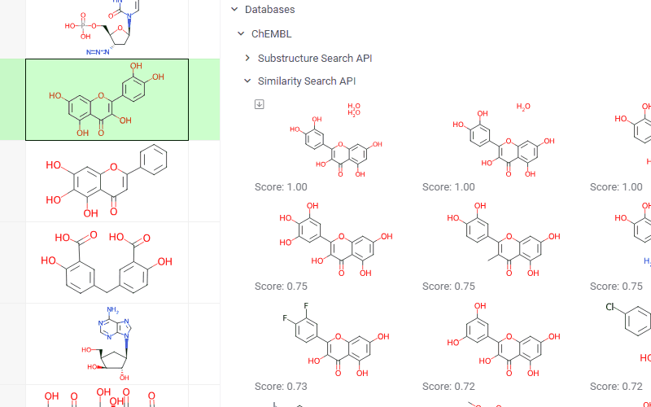

# ChEMBL API

ChEMBL API is a [package](https://datagrok.ai/help/develop/#packages) for the
[Datagrok](https://datagrok.ai) platform that provides search and lookup capabilities against the
[ChEMBL](https://www.ebi.ac.uk/chembl/) and [UniChem](https://www.ebi.ac.uk/unichem/) public REST
APIs at EBI. The package sends each query structure to the external service as a request parameter.

For a richer ChEMBL experience backed by a local PostgreSQL mirror (SQL queries, RDKit cartridge
search, compound browser, identifier converters), see the companion
[Chembl](https://github.com/datagrok-ai/public/tree/master/packages/Chembl) package.

## Features

- **Substructure search panel** — for any molecule shown in the context panel, retrieves ChEMBL
  compounds that contain the given structure as a substructure.
- **Similarity search panel** — retrieves ChEMBL compounds similar to the given structure, with a
  similarity score displayed under each hit.
- **`GetCompoundsIds`** — looks up external source identifiers for a compound by InChI key via
  the UniChem REST API.
- **`Chembl Get by Id`** — returns the full ChEMBL record for a given ChEMBL ID as a dataframe,
  via the ChEMBL REST endpoint `/molecule.json` (exposed through the bundled swagger).

Click any hit in a search panel to open its ChEMBL compound report page; use the download icon
to open the full result set as a table.

## See also

- [ChEMBL database](https://www.ebi.ac.uk/chembl/)
- [UniChem](https://www.ebi.ac.uk/unichem/)
- [Similarity and diversity search](https://datagrok.ai/help/datagrok/solutions/domains/chem/#similarity-and-diversity-search)
- [Info panels](https://datagrok.ai/help/explore/data-augmentation/info-panels)
- [Chem package](https://github.com/datagrok-ai/public/tree/master/packages/Chem)
- [Chembl package](https://github.com/datagrok-ai/public/tree/master/packages/Chembl)
