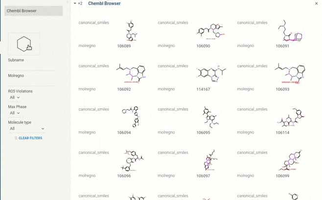

# Chembl Browser
Chembl Browser is a [package](https://datagrok.ai/help/develop/develop#packages) for the [Datagrok](https://datagrok.ai) platfrom.
The goal of the project is to demonstrate opportunities of the platform to build usable apps with a comfortable interface to search and view data. The initial version is based on [Chembl Database](https://www.ebi.ac.uk/chembl/g/#search_results/all) - ChEMBL is a manually curated database of bioactive molecules with drug-like properties.

The package reinforces following functionality from the original UI:
* View molecules structures (rendered based on canonical smiles) in cards
* Search by
    * Molregno - ChEMBL internal identification given to each compound
    * [RO5 Violation](https://en.wikipedia.org/wiki/Lipinski%27s_rule_of_five)
    * [MAX phases](https://en.wikipedia.org/wiki/MAX_phases)
    * molecule types - 'Protein', 'Oligonucleotide', 'Unknown', 'Antibody', 'Oligosaccharide', 'Unclassified', 'Enzyme', 'Cell'
    * Subname and Substructure (which can be written in canonical smiles as String or drawed by datagrok tool `ui.moleculeInput`)
* Routing system (share URL to reproduce search results)

