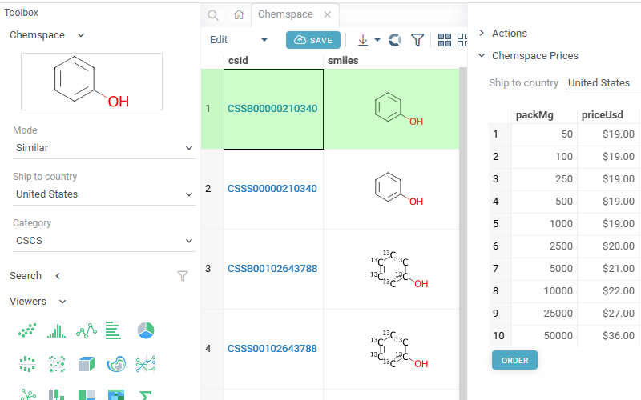
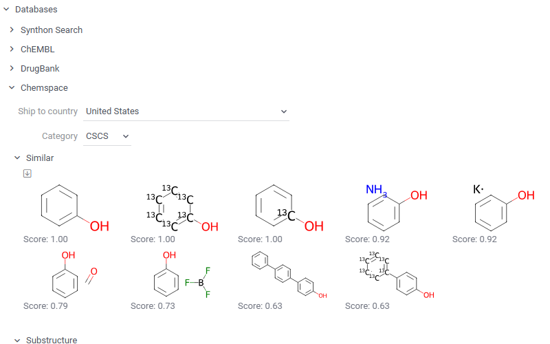

Chamspace is a [package](https://datagrok.ai/help/develop/develop#packages) for the [Datagrok](https://datagrok.ai) 
platform that provides integration with the [Chemspace](https://chem-space.com/), a service for online
shopping for the chemical building blocks.

There are two ways to use it: as an [application](https://datagrok.ai/help/develop/how-to/build-an-app),
or as an [info panel](https://datagrok.ai/help/discover/infopanels) for chemical structures. 
 
# Application

The application allows to search the Chemspace, and show results in the table view. Sketch the
structure using the sketcher in the right panel, and use controls below it to filter results. 

Direct link: [https://public.datagrok.ai/apps/Chemspace](https://public.datagrok.ai/apps/Chemspace)

# Info-panel

This info-panel shows exact, similar and substructure matches found in the Chemspace for the currently
selected molecule. To make a molecule current, either click on it in a table, or sketch it using 
`Chem | Sketch`.

Click on a molecule in the 'Chemspace' panel to open the corresponding page on chem-space.com.

