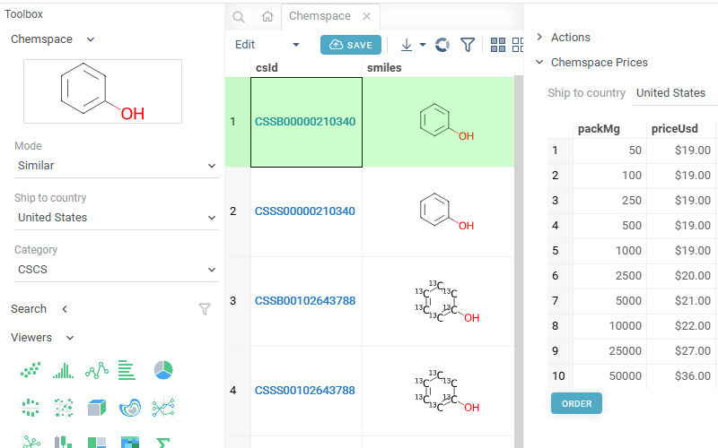
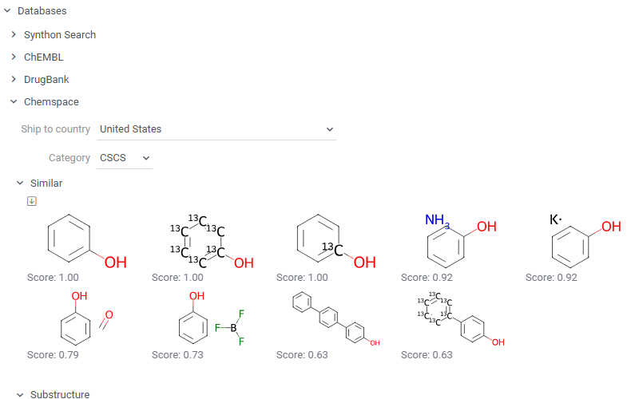
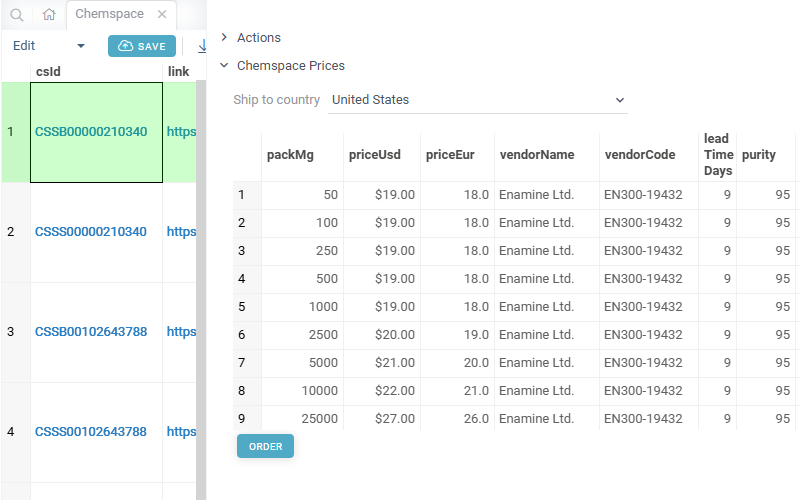

# Chemspace

Chemspace is a [package](https://datagrok.ai/help/develop/#packages) for the [Datagrok](https://datagrok.ai)
platform that integrates the [Chemspace](https://chem-space.com/) catalog — an aggregator of
commercially available building blocks and screening compounds — into your data-analysis workflow.

To get started, set the Chemspace `apiKey` in the package credentials manager.

Note that the package queries an external service. Any structure you search with is sent to
Chemspace as a query parameter.

## Application

The application lets you search Chemspace by **similarity**, **substructure**, **exact match**, or
**text**, and shows the matches in a table view. Sketch a structure on the right, then use the
controls to pick the search mode, category (make-on-demand vs. in-stock, screening vs. building
blocks), and ship-to country.

Direct link: [https://public.datagrok.ai/apps/Chemspace](https://public.datagrok.ai/apps/Chemspace)

## Info panels

Info panels appear in the context panel whenever you select a relevant cell.

### Chemspace (samples)

Shown for any molecule. Displays **similar** and **substructure** matches from Chemspace as a
thumbnail grid, ranked by RDKit similarity for the Similar pane. Click a thumbnail to open the
compound page on chem-space.com.

### Chemspace Prices

Shown for cells carrying a Chemspace compound id (semantic type `chemspace-id`, matching
`CSMS|CSMB|CSCS|CSSB|CSSS` followed by 11 digits). Lists every vendor offer for the compound with
pack sizes, USD / EUR pricing, lead time, and purity, plus an **ORDER** button that opens the
compound page on chem-space.com.

## Add new column

Two helpers enrich an existing dataframe without leaving the grid.

### Get Chemspace Ids

Takes a column of molecules and adds a `csIds` column with the matching Chemspace compound id per
row (empty when no exact match is found). Useful as the first step before pricing.
