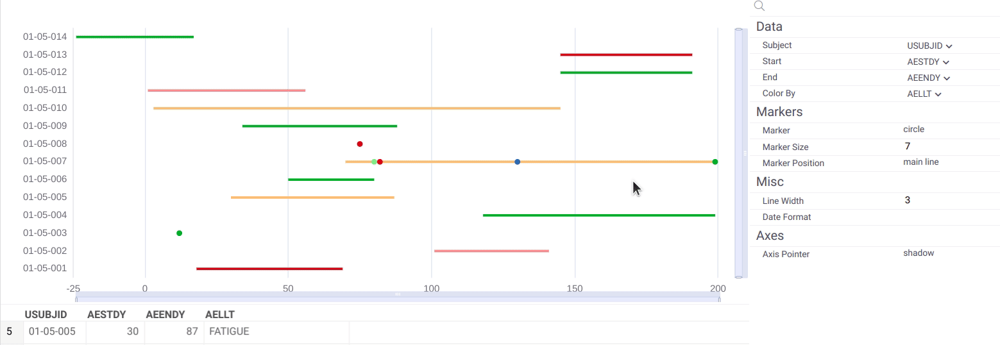

# ClinicalCase

ClinicalCase [package](https://datagrok.ai/help/develop/develop#packages) provides
support for dealing with clinical data, which is often represented in the
[SDTM](https://www.cdisc.org/standards/foundational/sdtm) format.

The project objectives include:

* Working with either databases or file folders 
* Automatic study summary
* Explaining attribute names
    * Domains: `CV` -> `Cardiovascular System Findings`
    * Attributes: `AEMODIFY` -> `Modified Reported Term`
* Content validation
    * Completeness (columns with required variables are present)
    * Data types match
    * Values comply with controlled terminology
    * Out-of-range values
* Pre-defined views
* Subject profile view (in progress)
* `Timelines` viewer for visualizing a flow of events (see the [community forum discussion](https://community.datagrok.ai/t/visualization-related-updates/521/4))

