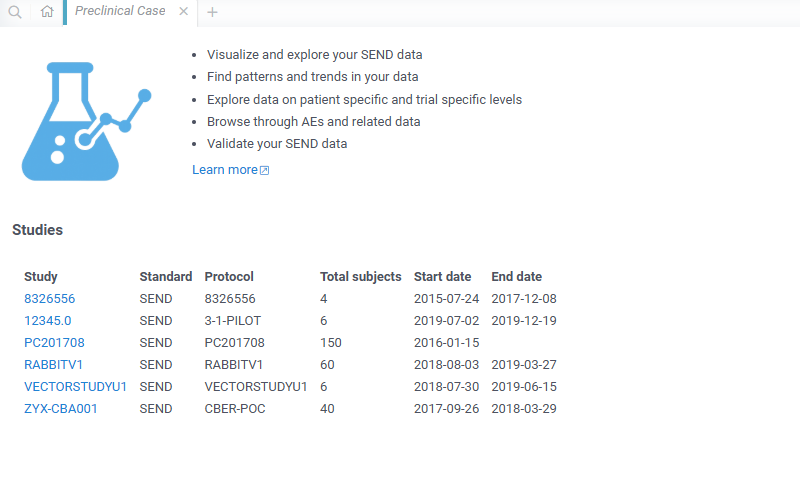
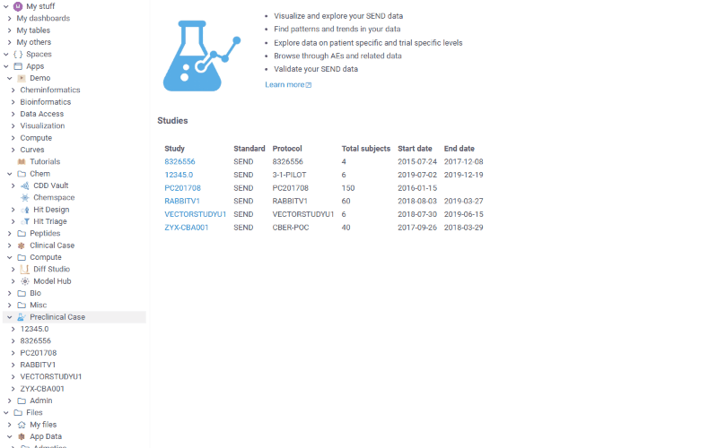
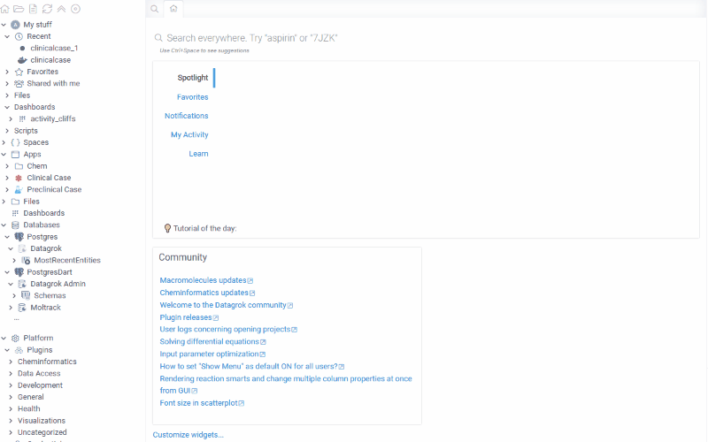
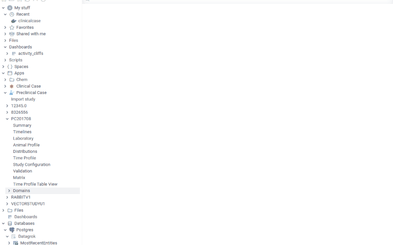
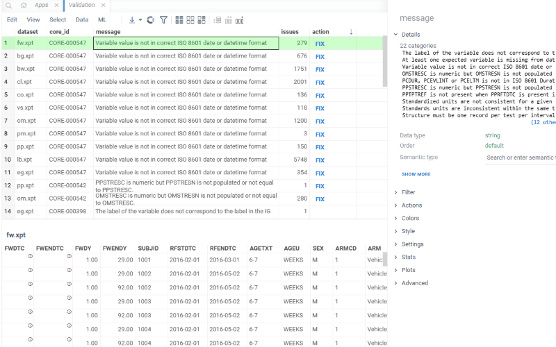
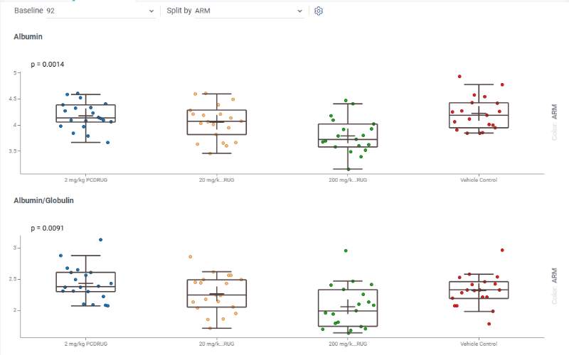
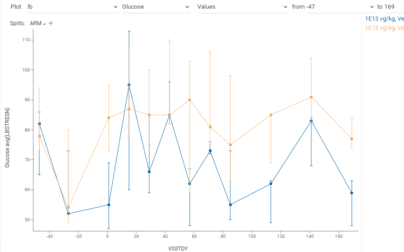
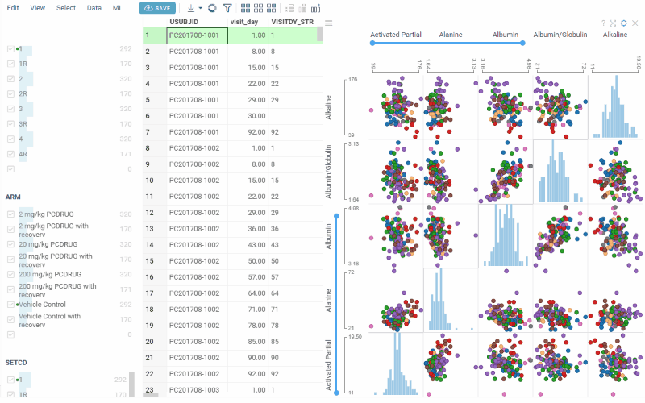

# Preclinical Case

**Preclinical Case** is designed for the analysis and exploration of preclinical study data represented in the [SEND](https://www.cdisc.org/standards/foundational/send).

## Overview

Preclinical Case provides a comprehensive suite of analytical tools specifically tailored for preclinical studies, enabling researchers, toxicologists, and data scientists to:

- Visualize and explore SEND-formatted preclinical data
- Analyze animal study data across multiple domains
- Track laboratory findings, clinical observations, and pathology data over time
- Validate SEND data against CDISC standards
- Identify patterns and trends in preclinical study results
- Explore data at both study-wide and individual animal levels

Initial application page contains the list of pre-loaded studies. Click study name to open it. Study summary page is opened. Also study is opened in a tree browser on the left panel. Navigate through available views using tree nodes.

### Key Features

#### Data Import

To import a preclinical study:

- Launch the **Preclinical Case** application from the Apps menu
- Click **Import study** tree item
- Select SEND data files (`.xpt`, `.csv`, or `.xml` format)
- The application will automatically:
   - Detect the study from `define.xml`
   - Extract study metadata and summary
   - Load all SEND domains
   - Perform initial validation

### Domains

Once imported, domains are easily accessible and can be added to the workspace for further analysis and examination. To select a specific domain, open the **Domains** tree group and choose the required one.
Domains are added as standard Datagrok table views, allowing you to:

- Add viewers and calculated columns
- Run custom scripts on the data
- Filter
- Link tables
- And other Datagrok analytical

### Preclinical Case Views

Preclinical Case provides the following specialized views for analyzing preclinical data:

#### Summary

The Summary view provides an overview of the preclinical study, including key study characteristics and some statistical charts.

### Validation

Validation is performed on study import using [CDISC Rules Engine](https://github.com/cdisc-org/cdisc-rules-engine)

To filter invalid domain rows, select the corresponding rule in a table view. Cells with errors are marked with a red mark. Hover over the mark to see the tooltip with details.
For some of the rules, fixes may be proposed. To apply a fix:

- Select the corresponding rule and click fix in the 'action' column
- Observe fixes preview in the context panel
- If satisfied with the fixes, click 'Apply fixes' on the ribbon panel

#### Laboratory

Comprehensive analysis of laboratory findings from the LB domain and other findings domains:

- **Laboratory Distribution**: Box plots showing the distribution of selected laboratory values at different study days, grouped by treatment arm or other parameters
- **Results Table**: Full laboratory findings table
- **Baseline-Endpoint**: Scatter plot to compare a subject's initial status (baseline) with their condition at endpoint

#### Distributions

Analyzes the distribution of biomarkers and other values like vital signs, etc., across animals:

- **Box Plots**: Shows median, quartiles, outliers, and p-value for selected biomarkers
- **Grouping**: Distributions can be grouped by treatment arm or sex
- **Visit Selection**: Analyze distributions at specific study days
- **Statistical Comparison**: Visually compare distributions between groups

#### Time Profile

Line charts showing biomarker dynamics over time:

- **Grouping**: Split by treatment arm or other parameters
- **Distribution Representation**: Each point shows the median with quartiles (whiskers)

This view helps identify trends and patterns in biomarker changes throughout the study duration.

#### Matrix Table

A comprehensive matrix view that pivots laboratory and findings data:

- **Pivoted Data**: Test results pivoted by animal and study day
- **Matrix Plot**: Interactive matrix visualization showing relationships between tests
- **Filtering**: Easily filter by any parameter, including demographic domain fields

This view is particularly useful for identifying patterns across multiple tests and animals simultaneously.

# Clinical Case

Clinical Case is an application for exploration of clinical data represented in [SDTM](https://www.cdisc.org/standards/foundational/sdtm) format.

The main goal of the application is to provide users who deal with clinical trials data (such as bio-statisticians, clinical trial investigators, data scientists, site managers and other groups of users) with an effective, flexible and user-friendly tool which helps to analyze data from different perspectives and on different levels (such as study, site or patient level). Clinical Case provides such capabilities through a number of predefined views with various visualizations.

For details also refer to introduction [video](https://www.youtube.com/watch?v=lTg_E5xO-iw&ab_channel=Datagrok).

## SDTM data detection

Clinical case automatically detects data represented in SDTM format. For instance, if you have a folder containing a bunch of SDTM domains (csv files), you will be offered to launch the application. Also study ID is shown on a panel below files explorer.
Launch the application by clicking `Run ClinicalCase`.

## Views

### Summary

View contains basic information about the study and subject population.
Here you can find number total number of subjects and sites along with the cumulative enrollment line chart which is useful to assess the enrollment dynamics throughout the study.

'Errors' section contains number of errors revealed by validation process in each domain. Validation of SDTM tables (domains) is performed once at the start of application. By clicking on errors number you will be redirected to Validation view.

Also there is a couple of charts with essential population characteristics – age, race, sex, treatment arm – which can be used to assess their distribution within population. Charts are interactive and linked with each other. For instance, by clicking on 'M' sex the other charts will show the proportion of male subjects.

In case trial is registered on [clinicaltrials.gov](https://clinicaltrials.gov/) context panel on the right will basic study information extracted from database along with the link to the study on [clinicaltrials.gov](https://clinicaltrials.gov/).

### Timelines

Timelines view allows to visualize events flow in time. X axis is time axis reflecting study days. On Y axis there are subjects.
Events are shown either as a point(in case event lased for one day) or as a line (for cases events were prolonged in time)

Adverse events, investigational drug exposure and concomitant medication domains are available for analysis(in case SDTM data contains corresponding tables). Filters can also be applied for each domain.

By zooming in and out you can drill down to particular patient and event or otherwise see the picture of events in general.

Information about particular event is shown in tooltip on mouse hover.

Several domains can be shown simultaneously on the graph. For instance, the following screenshot shows severe general and cardiac disorders VS aspirin intake.

### Patient profile

Patient profile is useful for analyzing events related to particular patient.
You can analyze data from laboratory, adverse events, dug exposure and concomitant medication domains in time and see relations between events. All graphs are linked to the same X axis representing study days and it can be zoomed in and out simultaneously.

Information about events is available in tooltips on mouse hover. For convenience domains can be collapsed or extended.

* **Lab values chart**

By clicking on settings button you can choose laboratory values to show on chart. List of available values is extracted from 'lb' domain in provided SDTM data.

Values within normal ranges are colored green, values outside normal ranges are red.

* **Lab values line chart**

You can also choose laboratory values by clicking settings button.

Laboratory line chart provides the following of calculating values dynamics:

1. Relative changes from baseline
2. Relative values between min and max contained in dataset
3. Relative changes between normalized normal ranges

### Adverse events

View to explore Adverse events domain. Contains couple of charts along with Adverse events table view.

* **All events**

Plots all adverse events registered during the study. Detailed information is available in tooltip. Also when selecting Adverse event on the plot corresponding row becomes current in Adverse event table. So Adverse event of interest can easily be analyzed in details. Selection also works vice versa - when selecting a row in a table corresponding Adverse event is selected on a scatter plot.

Scatter plot can be zoomed in and out to drill down to particular patient or see picture in general.

Color indicates severity of an Adverse event.

* **Events per week**

Histogram with number of Adverse events occurred per week throughout the study. Can help to analyze overall dynamics of Adverse events occurrence.

Color corresponds to severity of an Adverse event.

* **Barcharts**

There are barcharts plotting events distribution by Type, Body system, Causality and Outcome.

Color corresponds to treatment arm. So you can visually assess proportion of each treatment group.

Barcharts are also interactive. By selecting one of the groups in a barchart (for instance, adverse events related to study drug for patients who took placebo) corresponding rows will be selected in the table and 'All events' scatter plot.

### Laboratory

This view contains several specific charts for analyzing laboratory results.

* [**Hy's law**](https://en.wikipedia.org/wiki/Hy%27s_law)

Scatter plot for analyzing possible risk of a fatal drug-induced liver injury.

Shows peak bilirubin values versus peak ALT/AST values across the study. Reference lines are shown at 3*ULN for ALT and AST and 2*ULN for Bilirubin. Possible Hy's law is defined as AST or ALT >= 3*ULN with bilirubin >=2*ULN.

Color corresponds to treatment arm.

* **Baseline endpoint**

Scatter plot which shows ratio between laboratory values at some selected baseline and endpoint timepoints.

Scatter plot is divided to 9 parts each of which is annotated with corresponding ration. For instance 'Normal-High' quadrant corresponds to subject who had laboratory value within normal ranges baseline visit but ended up with increased value at endpoint. Thus it can be useful, for example, to identify groups of subjects who developed increasing of some laboratory values compared to baseline or vice versa who started with values out of range but ended within normal ranges.

Baseline, endpoint visits as well as laboratory value can be selected using dropdown lists above the scatter plot.

Color corresponds to treatment arm.

* **Laboratoty distribution**

This box plot shows distribution of selected laboratory value among all subjects depending on study day.
In particular you can analyze median, min and max values, upper and lower quartiles and detect outliers. Additionally you can evaluate difference between distributions on different study days.

Laboratory value as well as study visit can be selected via dropdown lists above box plots.

* **Results**

This tab contains laboratory domain table.

### Survival analysis

This view is designed to create Kaplan-Meier curves and perform covariates analysis.

Steps to perform survival analysis:

* create dataset (`Dataset` tab)

Choose endpoint for which you want to create Kaplan-Meier curve. Optionally you can include basic covariates(age, sex, race, treatment arm) into dataset. Click `Create dataset` button.

Dataset can be further filtered.

* go to `Survival` tab. You will see Kaplan-Meier curve. You can modify confidence interval or choose strata(stratas will be available in dropdown list in case covariates for dataset are selected). After modifying parameters curve will be updated.

In case you want to perform covariates analysis you should go to `Covariates` tab and check one or several covariates.

### Distributions

The view shows distribution of selected biomarker values for all subjects at selected visit splitted by selected parameter. It is useful to evaluate median, upper and lower quartiles and outliers. And since distributions in each boxplot can be grouped by certain parameter it is also possible to evaluate difference in biomarker values distribution between different groups.

By default 4 biomarkers with min p-value at the earliest study visit splitted by treatment arm are shown. Baseline visit, split parameter as well as biomarkers can be further changed via dropdown lists and settings button above the boxplots.

### Correlations

Correlation matrix showing relations between biomarkers values for all subjects at the selected visit.

On diagonal you can see histograms showing biomarker distribution. Cells at the intersection of certain biomarkers contains correlation coefficient for that pair of biomarkers. By hovering mouse over correlation coefficient you will see scatter plot with corresponding biomarkers values in a tooltip.

By default correlation matrix is created for whole list of biomarkers at the earliest study visit. Visit as well as biomarkers can be further changed via dropdown list and settings button above the boxplots.

### Time profile

This view contains line chart which allows to evaluate laboratory dynamics in time. X axis is time axis showing days of study. Y axis is biomarker level scale.

There are 2 types of chart representation:

* Non-normalized biomarkers results
* Relative changes from baseline

Type of graph and required visits can be selected in the ribbon panel above chart.

Line chart is splitted by treatment arm by default. But parameter to split by can be changed as well as biomarker itself.

Each value on the line is drawn in form of distribution. By default points represents median, whiskers represent upper and lower quartiles. Type of distribution can also be changed in context panel.

### AE browser

This view is useful for exploring adverse events in details including preceding events from domains other then ‘ae’.

The view is basically 'ae' domain table which contains list of all registered adverse events. The table can be filtered.

By selecting row in a table the following information will be displayed on a context panel:

* subject ID (in a tooltip on mouse hover you will see basic demographic characteristics - age, sex, race, treatment arm)
* AE name preceded by AE severity
* Days of study in which AE occurred (in a tooltip on mouse hover you will see real AE dates)
* input with number of days before AE for which you want to analyze events in other domains (by default it's 5)
* list of expandable domain panels which contains rows with events occurred during selected period before the AE (by default adverse event, drug exposure and concomitant domains are selected, but you can add other domains by clicking on `+` button)

### Validation

The view contains results of SDTM tables validation performed at the start of the application.

In the upper table there is a whole list of violated rules. In the lower table there are tabs with domains in which rules have been violated. Table in each ta contains rows with violated rules.

By selecting a row in the upper table the lower table will be filtered by the selected violated rule.

