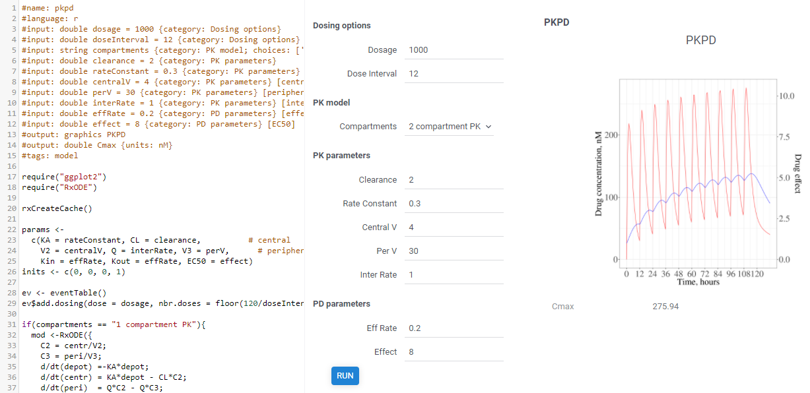

# Compute

A next-generation environment for scientific computing. 
It leverages a number of the core Datagrok features, such as 
[in-memory data engine](../../help/develop/performance.md#in-memory-database),
[interactive visualizations](../../help/explore/exploratory-data-analysis.md),
[data access](../../help/home.md#access),
[machine learning](../../help/home.md#learn),
and [enterprise features](../../help/home.md#deploy-and-integrate)
to enable developing, publishing, discovering, and using scientific applications:

1. [Cross-language support](#cross-language-support)
2. [Scalable computations](#scalable-computations)
3. [Web-based UI](#user-interface) that could be [autogenerated](#autogenerated-ui), 
[customized](#custom-ui), and [templates]
4. [One-touch deployment]
   1. [Model versioning]
5. [Data sources]
6. [Metadata]
7. [Integration]: [API], [embedding]
8. [Logging, audit, and traceability]
9. [Leveraging the platform]
   1. [Privileges and visibility]
   2. [Usage analysis]
   3. [Exploratory data analysis]
10. [Roadmap]
    1. [Repository of curated scientific methods]

* Composable (an output of one function becomes an input to the other)
* Could be connected to any data source (db, web service, file, etc)
* Logging, audit, traceability
* Privileges and visibility

`Compute` package:

* Enables a full lifecycle of models: create, tune, share, use, validate
* Provides for easy to use and highly automated evaluation and computation environment
* Enables contextual process for the Design of Experiment (sensitivity analysis and more)

In addition, Datagrok platform supports a UI layout markup, so that the model function becomes
a GUI-rich application with no manual coding.

Project planning board: [link](https://github.com/datagrok-ai/public/projects/8).

## Cross-language support

The basic unit of execution is a [function](https://datagrok.ai/help/overview/functions/function),
which could be written in [any language that Datagrok supports](https://datagrok.ai/help/develop/scripting)
, such as `Python`, `R`,
`Julia`, `Matlab/Octave`, `JavaScript`, and others. No matter which language is used, 
each function has the following properties:
* Advanced support for input and output parameters
  * Typed (cross-language support for scalars, vectors, dataframes, images)
  * Intraspectable
  * Metadata-annotated
* Dynamic discovery
* Polymorphic execution (platform doesn't care which language the function is implemented in)
* Function-level [metadata]

These properties unlock plenty 
of interesting features covered below, such as 
[scalable computations](#scalable-computations), 
[reproducibility],
[automatic UI generation](#autogenerated-ui),
[audit], 
[sensitivity analysis], 
[optimization], and others.

## Scalable computations

Depending on the underlying language, a function could be executed on the client side,
server side, both, or either.

`JavaScript` and `C++` (compiled to [WebAssembly](https://webassembly.org/)) could be executed
right in the browser. The upside to that is unmatched responsiveness, data locality, and 
computation locality. The downside is that many of the popular statistical and modeling
methods are not currently available in these languages yet. Note that while the computations are
performed locally, the proper audit and traceability still works (both input and output
parameters could be sent to the server for historic reasons).

`R`, `Python`, `Julia`, `Matlab`, and `Octave` are powerful languages with the mature
ecosystem of scientific libraries, and existing models implemented previously inside the
organization. They could only be executed on a server, and as such
the question of scalable computation arises. Datagrok takes care of that by using the
`message queue` architecture. When each server-based function is invoked, its parameters
are saved to a queue; one of the worker processes then picks a task (such as running a Python
function), executes it, and puts the results back. This architecture guarantees the following:

* The platform won't get overloaded by trying to execute too many tasks at once
* Scaling is as simple as adding more workers (which could be hosted externally if necessary)
* A queue serves as a basis for [audit] and [traceability]

## One-touch deployment

## User interface

Our goal is not computations for the sake of it, but
rather helping **users** derive actionable insights, and support the decision-making process.
The UI should be as easy to use as possible, tailored to the user needs, and 
be specific for the tasks. On the other hand, it should be clean, universal, and easy enough
to be developed by a scientist without a deep understanding of the Datagrok platform.
To satisfy these seemingly contradictory requirements, we developed a hybrid approach to
building the UI, where the model author has full control over choosing how custom the UI
for the speficic model should be. In the most standard case, there is no need to write 
a single line of code, as the UI is 
[automatically generated](#autogenerated-ui) based on the function signature.
On the other end of the spectrum, you have the possibility to take everything in your own
hands and develop a completely [custom UI](#custom-ui). Anything in between is also possible.

### Autogenerated UI

Very often, a UI for the model is nothing more than the input fields for the 
corresponding function's parameters. When this is the case, Datagrok generates the UI automatically
by constructing the corresponding input fields and output area with graphics and results, 
and bringing it to life by making it interactive. Additional parameters' metadata, such
as units, category, description, input type (slider/combo box/etc), and others 
are also taken into account.

The following picture demonstrates a working PK/PD model implemented in R 
with the autogenerated UI (look at the script header area for details). While it looks
very similar to the traditional Shiny app, the R script does not have to deal with 
the UI at all, which not only simplifies the development and maintenance, but also
provides for the uniform experience.

A visual tool for annotating function parameters is 
[currently in the development](#https://github.com/datagrok-ai/public/issues/184).

Learn more: [function parameters](https://datagrok.ai/help/overview/functions/func-params-enhancement)

### Custom UI

On the other side of the spectrum, if necessary the UI could be developed 
from scratch without any limitations, using either vanilla JavaScript, 
a framework of your choice such as React, or 
[Datagrok UI toolkit](../../help/develop/js-api.md#ui). No matter what 
you choose, Datagrok [JS API](https://datagrok.ai/help/develop/develop) could always be used.

## One-touch deployment

## Analytical blocks

No matter which domain you are working with, which language your program in, 
or what type of model you build, quite often you need the same set of tools (including visual tools) to
efficiently work with data. Naturally, it makes sense to implement these algorithms 
just once, and then use them everywhere. Here are some examples:    

1. Imputation of missing values
2. Outlier detection
3. Time series analysis
4. Validators

The fact that the typical analysis is an introspectable workflow consisting of functions
passing the data helps us deal with that in a declarative manner. 

## Privileges and visibility

Datagrok has the built-in [role-based privileges system](https://datagrok.ai/help/govern/authorization)
that is used to define who can see, execute, or edit models.

## Roadmap

1. **UI markup**

    Annotate function inputs and outputs to produce highly interactive, visually reach GUI:
    
    * arrange inputs and outputs in blocks and tabs
    * add captions, units of measure and other information to inputs and outputs
    * automatically produce additional plots with Datagrok
    [viewers](https://datagrok.ai/help/visualize/viewers)

2. **Input providers**

    Produce inputs to functions in-place as outputs of other functions (aka input providers),
    including:
    
    * queries to databases
    * dialog-based functions (outlier detection, data annotation)
    * queries to OpenAPI and REST endpoints
    * other computing functions with or without GUI

    These may include UI parts as well. The input provider is specified as part of the Universal UI
    markup.

3. **Persistent, sharable historical runs**

    It is already possible to provide a link to a function (with specified input parameters in
    the URI), which will open a function view and run it.
    
    Once a certain version of a specific function is run with specific inputs, the result should
    be stored in the immutable database log along with the inputs. Later it will be used to verify
    the grounds for decisions made from these calculations.

4. **Sensitivity analysis**

    * Sample inputs:
      * by specified number of samples
      * by a specified distribution or within a range
      * for a specified set of scalar inputs and/or columns of the matrix input
    * Produce variability analysis for outputs based on the sampled inputs
    * Visualize the results of analysis with Datagrok viewers

5. **Modeling input parameters**

    Solve an inversion problem: identify input conditions leading to specified output constraints.

6. **Outlier detection and annotation**

    * Automatic outliers detection
    * Manual outliers markup and annotation
    * Used as an input provider in other functions

7. **Model Repository and discoverability**

8. **Scaling on demand**

9. **Asynchronous computation**

10. **Export and reporting**

11. **REST endpoints**

12. **Data annotation**

13. **Test data for functions**

14. **Functions versioning**

15. **Audit**

Most of the features are implemented in this package, some of them are part of the platform.